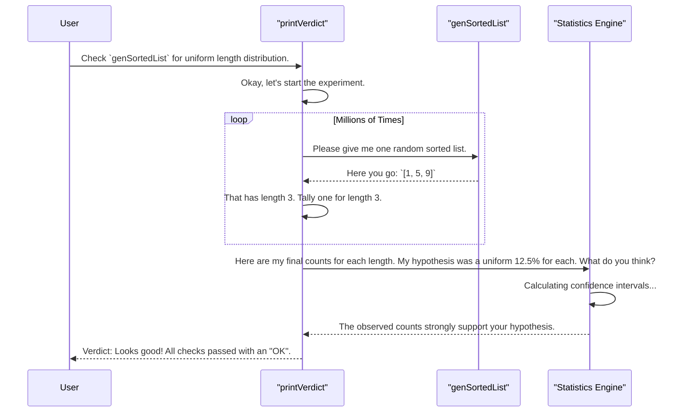

# Chapter 5: Statistical Distribution Checking

In the [previous chapter](04_generator_coverage_analysis_.md), we learned how to use [Generator Coverage Analysis](04_generator_coverage_analysis_.md) to get a "report card" on our generators. This report card tells us if we are generating all the different *shapes* of our data, like `Nil` and `Cons` for a list.

But what about the *values* inside those shapes? A generator might create lists of all possible lengths, but what if it creates a list of length 1 a million times more often than a list of length 10? Our tests would be heavily biased towards simple cases.

Welcome to Statistical Distribution Checking, the "quality control inspector" for our random generators. This tool verifies that the generated data is not just structurally complete, but also statistically "fair".

## The Problem: The Unfair Dice

Imagine you're testing a game that uses a six-sided die. You have a generator that produces a number from 1 to 6. But unknown to you, the die is weighted. It lands on "1" 90% of the time, and the numbers 2 through 6 only appear rarely.

Your tests will run, but they'll mostly test what happens when the player rolls a "1". You'll have a major blind spot for all other outcomes. We need a way to check if our dice are fair.

The same problem applies to our data generators. When we ask `DepTyCheck` to create a `SortedList` with a maximum length of 7, we expect to see lists of length 0, 1, 2, 3, 4, 5, 6, and 7 appear with roughly equal probability. How can we verify this?

## The Solution: Running a Million-User Survey

The solution is to do what statisticians do: collect a very large sample and analyze it. `DepTyCheck`’s distribution checking tools do exactly this:

1.  **Define Expectations:** You state your hypothesis, like "I expect lists of length 3 to occur about 12.5% of the time."
2.  **Run the Generator (a lot):** The tool runs your generator thousands or even millions of times to collect a huge amount of data.
3.  **Perform Statistical Tests:** It compares the observed results against your expectations using statistical formulas.
4.  **Give a Verdict:** It tells you if your generator is behaving as expected ("OK") or if it's exhibiting statistical bias ("FAIL").

Let's check the fairness of the `genSortedList` generator we've been using.

### Step 1: Define Your Test Conditions

First, we need to tell the checker what we're looking for. We want to check the `length` of the generated lists. For a generator with a maximum depth of `depth`, there are `depth + 1` possible lengths (from 0 to `depth`). If the distribution is uniform, each length should appear with a probability of `1 / (depth + 1)`.

We express this expectation using `coverWith`.

```idris
-- From: examples/sorted-list-so-full/tests/gens/distribution-length/CheckDistribution.idr

import DistrCheckCommon -- Provides `printVerdict` and other helpers

-- Check that lengths are uniformly distributed for a given max depth.
mainFor : (depth : Nat) -> IO ()
mainFor depth = printVerdict (genSortedList $ limit depth) conditions
  where
    conditions = fromList
      [ coverWith (ratio 1 (S depth)) ((== n) . length)
      | n <- [0 .. depth] ]
```

Let's zoom in on that `coverWith` line. It's the heart of our test.

```idris
-- A single test condition
coverWith (ratio 1 (S depth)) ((== n) . length)
```

This creates one test condition. It has two parts:
*   **The Expectation:** `ratio 1 (S depth)` says "I expect this property to be true for 1 out of every `depth + 1` items." For `depth = 7`, this is `1/8`, or 12.5%.
*   **The Property Checker:** `(== n) . length` is a function. It takes a list, gets its `length`, and checks if it's equal to `n`.

The list comprehension `[ ... | n <- [0 .. depth] ]` creates one of these conditions for each possible length `n`, from 0 to `depth`.

### Step 2: Run the Check and Print the Verdict

The `mainFor` function wraps everything up. The `printVerdict` function is the workhorse. It takes our generator and our list of conditions and does all the hard work.

```idris
main : IO ()
main = do
  putStrLn "Checking depth = 7:"
  mainFor 7
```

When you run this program, `printVerdict` will:
1.  Call `genSortedList (limit 7)` millions of times.
2.  For each generated list, it will check its length.
3.  It will tally how many times each length (0, 1, ..., 7) appeared.
4.  It will perform a statistical analysis comparing the observed counts to our expected `1/8` ratio for each.
5.  Finally, it will print a report.

### Step 3: Interpret the Results

The output will look something like this. It shows the result for each of our 8 conditions (lengths 0 through 7).

```
Checking depth = 7:
[
(Observed: 12.50% [95% CI: 12.49% .. 12.51%], Expected: 12.50% -> OK),
(Observed: 12.50% [95% CI: 12.49% .. 12.51%], Expected: 12.50% -> OK),
(Observed: 12.50% [95% CI: 12.49% .. 12.51%], Expected: 12.50% -> OK),
(Observed: 12.50% [95% CI: 12.49% .. 12.51%], Expected: 12.50% -> OK),
(Observed: 12.50% [95% CI: 12.49% .. 12.51%], Expected: 12.50% -> OK),
(Observed: 12.50% [95% CI: 12.49% .. 12.51%], Expected: 12.50% -> OK),
(Observed: 12.50% [95% CI: 12.49% .. 12.51%], Expected: 12.50% -> OK),
(Observed: 12.50% [95% CI: 12.49% .. 12.51%], Expected: 12.50% -> OK)
]
```

This is fantastic news! Let's break down one line:
*   `Expected: 12.50%`: This was our `ratio 1 8`.
*   `Observed: 12.50%`: After millions of runs, the generator produced lists of this length almost exactly 12.5% of the time.
*   `[95% CI: ...]` The 95% Confidence Interval tells us that even with randomness, we're very sure the true probability is within this tiny range.
*   `-> OK`: Because the expected value falls within the confidence interval of what we observed, the test passes.

The verdict is clear: our `genSortedList` generator is statistically fair and unbiased with respect to list length!

## How It Works Under the Hood

The magic behind `printVerdict` is a combination of massive-scale generation and proven statistical methods. Think of it as conducting a clinical trial on your generator.



The actual implementation is in a shared helper file that many examples use.

--- File: `DistrCheckCommon.idr` ---
```idris
-- A simplified view of the main logic
verdict : ... -> Gen em a -> ...
verdict getProperty conditions gen =
    -- 1. Generate millions of sample values
    let samples = unGenTryN 10000000 someStdGen gen

    -- 2. Extract the property we're testing (e.g., length)
        properties = mapMaybe getProperty samples

    -- 3. Run the statistical analysis
    in find $ checkCoverageConditions conditions properties
```

1.  **`unGenTryN 10_000_000`**: This is the brute-force step. It runs the [Random Value Generator (Gen)](01_random_value_generator__gen__.md) a whopping ten million times, producing a lazy list of sample data.
2.  **`mapMaybe getProperty samples`**: It then goes through this enormous list and applies the function you care about (in our case, `length`) to each item, creating a new list of just the properties.
3.  **`checkCoverageConditions`**: This is the brain. It takes the list of observed properties and your list of `coverWith` conditions. It uses functions from a `Statistics` library to perform a formal hypothesis test (specifically, checking if the expected proportion falls within the Clopper-Pearson confidence interval of the observed proportion).
4.  **`find`**: The statistical check actually produces a lazy list of results over time, allowing the check to "settle". The `find` helper just waits until the statistics stabilize and then returns the final verdict.

## Conclusion

In this chapter, we've added the final and most rigorous layer of quality control to our testing toolkit.

*   **Statistical Distribution Checking** verifies that your generators are "fair" and not biased towards certain kinds of values.
*   You define your expectations with **`coverWith`**, specifying an expected **ratio** and a **property** to check.
*   The **`printVerdict`** function automates the entire process: running the generator millions of times, collecting data, and performing a statistical hypothesis test.
*   The final report gives you a clear **"OK" or "FAIL"** verdict, giving you high confidence in the quality of your test data.

We have now seen how `DepTyCheck` can generate complex, valid, structurally complete, and statistically fair *data*. But what if we want to test something even more complex, like a compiler or an interpreter? For that, we would need to generate not just data, but entire *programs*.

In the next chapter, we'll shift gears and explore how `DepTyCheck` can be used to generate random programs in an embedded Domain-Specific Language (DSL).

Next: [Chapter 6: Embedded DSL Program Generation (PIL)](06_embedded_dsl_program_generation__pil__.md)

---

Generated by [AI Codebase Knowledge Builder](https://github.com/The-Pocket/Tutorial-Codebase-Knowledge)