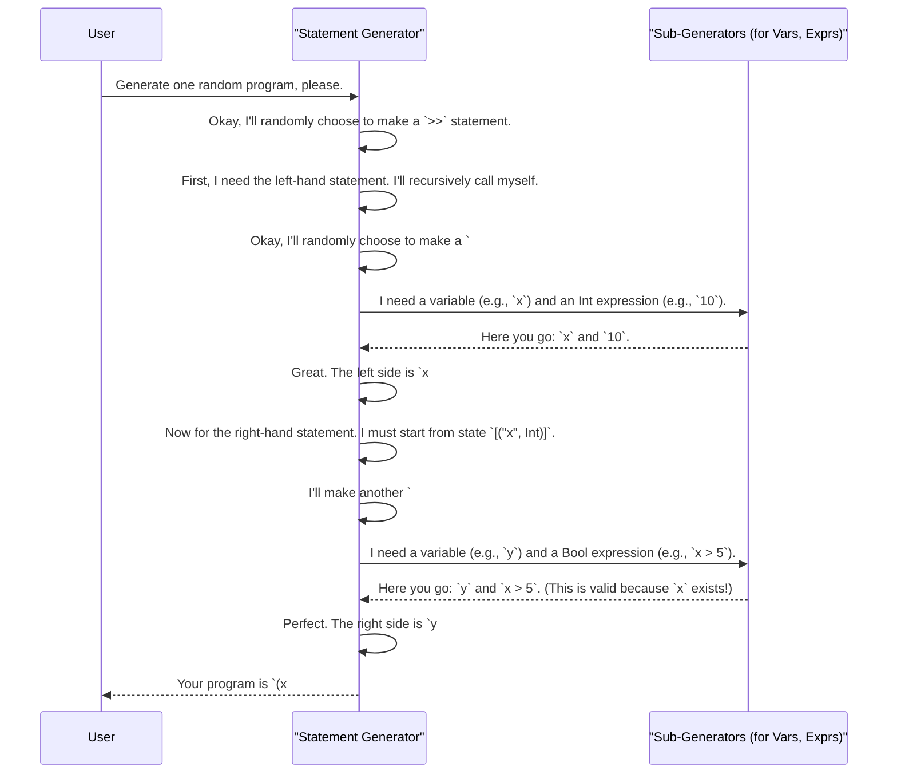

# Chapter 6: Embedded DSL Program Generation (PIL)

In the [previous chapter](05_statistical_distribution_checking_.md), we became quality control inspectors, using [Statistical Distribution Checking](05_statistical_distribution_checking_.md) to ensure our random data generators were "fair" and unbiased. We have mastered generating all sorts of complex *data*.

But what if we need to test something more complex than a data structure? What if we're building a compiler or an interpreter for a new programming language? To test it properly, we don't just need random data; we need an endless supply of valid, random *programs*.

Welcome to the world of embedded Domain-Specific Languages (DSLs) and program generation, one of the most powerful applications of `DepTyCheck`.

## The Problem: How to Test a Compiler?

Imagine you've just created a brand-new, simple programming language. You've written a compiler that turns your new language into JavaScript. How do you test it?

You could write a few test programs by hand:
*   A "hello world" program.
*   A program that does some simple math (`x = 5; y = x + 10;`).
*   A program with an `if` statement.

But this is slow and error-prone. What if you forget to test a case where an `if` statement is nested inside another `if` statement? Or what if you make a typo and write a program that's not even valid in your own language? You'd be testing your compiler with broken code.

What you really want is a "program factory" that can automatically generate thousands of different, syntactically and semantically *correct* programs for you to use as test cases.

## The Solution: Make the Type System Your Grammar

The core idea in `DepTyCheck` is to define your mini-language—which we'll call a **Primitive Imperative Language (PIL)**—directly inside Idris. You do this in such a way that the Idris type system itself acts as the **grammar and rule-checker** for your language.

If a piece of Idris code "type-checks" as a program, it is guaranteed to be a valid program. If it has a syntax error (like `x = 1 +;`) or a type error (like `x = 5 + true;`), the Idris compiler will give you an error.

Let's see how this works with a simple example language.

### A Mini-Language for Variables and Math

Let's define a tiny language that has variables and can do assignment. The state of our program will just be a list of variables and their types. For example: `[("x", Int), ("y", Bool)]`.

In our language, a `Statement` is a command that can change the state. The Idris type for a statement cleverly tracks the state *before* it runs and the state *after* it runs.

```idris
-- Simplified from: examples/pil-reg/src/Example/Pil/Lang/Statement.idr

-- A program statement that transforms `preV` (variables before)
-- into `postV` (variables after).
data Statement : (preV : Variables) -> (postV : Variables) -> Type where
  -- ...
```
Here, `Variables` is just a list of `(Name, Type)` pairs.

Now, let's define a variable assignment statement. The `(#=)` operator assigns a value to an existing variable.

```idris
-- A variable assignment statement
(#=) : (n : Name) -> -- The variable name
       (0 _ : Lookup n vars) => -- A proof that `n` exists in `vars`
       (v : Expression vars lk.reveal) -> -- The value to assign
       Statement vars vars -- The variables list doesn't change
```

This type says:
1.  You must provide a variable name `n` that already exists in the current variable context `vars`.
2.  The expression `v` you assign must have the same type as the variable `n`.
3.  An assignment statement doesn't add or remove variables, so the input state `vars` and output state `vars` are the same.

The Idris compiler enforces these rules for you! You simply *cannot construct* an invalid assignment statement.

Here is a statement for sequencing (`>>`), which runs one statement after another.

```idris
-- A sequencing statement
(>>) : Statement preV midV -> -- The first statement
       Statement midV postV -> -- The second statement
       Statement preV postV -- The combined statement
```

Notice the beautiful flow encoded in the types: the first statement takes you from `preV` to `midV`. The second statement *must* start from that same `midV` and takes you to the final `postV`. The Idris type checker guarantees you can't "plug in" a second statement that doesn't match the state left by the first.

## Generating Programs with `DepTyCheck`

Since our `Statement` is just a regular (though dependently-typed) Idris data type, we can write a [Random Value Generator (Gen)](01_random_value_generator__gen__.md) for it!

This is where things get really exciting. We are no longer just generating data; we are generating code. The generator will explore all the valid ways to combine our statements, creating a huge variety of correct programs.

Let's look at a simplified generator for our `(#=)` assignment statement.

```idris
-- Simplified from: examples/pil-reg/src/Example/Pil/Gens.idr

-- Generates a valid assignment statement
v_ass_gen : Statement_..._Gen -- A function that returns a Gen Statement
v_ass_gen fuel preV preR = do
  -- 1. Pick a random existing variable `n` from `preV`.
  (n ** lk) <- lookupGen preV

  -- 2. Generate a random expression of the correct type.
  expr <- external_gen

  -- 3. Build the assignment statement.
  pure (preV ** preR ** n #= expr)
```
Let's break this down:
1.  `lookupGen preV`: This helper generator randomly picks a variable that exists in the current context `preV`. This satisfies the first rule of `(#=)`.
2.  `external_gen`: This is a placeholder for a generator that can create a random expression of the right type. `DepTyCheck` ensures the type matches what the variable `n` expects.
3.  `pure (...)`: Finally, it bundles it all up into a valid `(#=)` statement.

The generator for sequencing (`>>`) is even more elegant, showing the power of dependent generation.

```idris
-- Simplified generator for `stmt1 >> stmt2`
seq_gen : Statement_..._Gen
seq_gen fuel preV preR = do
  -- 1. Generate the first statement and get its output state (`midV`, `midR`).
  (midV ** midR ** stmt1) <- statement_gen fuel preV preR

  -- 2. Generate the second statement, starting from the first one's output state.
  (postV ** postR ** stmt2) <- statement_gen fuel midV midR

  -- 3. Combine them and return the final state.
  pure (postV ** postR ** stmt1 >> stmt2)
```
This is the magic right here. The generator first creates a random statement `stmt1`. It gets back the state that `stmt1` produces (`midV`, `midR`). It then **feeds that state** into another recursive call to `statement_gen` to produce a `stmt2` that is guaranteed to be valid in that context. The final result is a perfectly-formed `stmt1 >> stmt2` program.

## What's Happening Under the Hood?

When you ask `DepTyCheck` to generate a random program, it's like a creative writer following a very strict set of grammar rules.

Let's trace the generation of a simple program like `x = 10 >> y = x > 5`.



This recursive process, guided at every step by the Idris type system, allows `DepTyCheck` to build up complex, nested programs that are always valid. The generators (like `v_ass_gen` and `seq_gen`) are often hand-written, as seen in `examples/pil-reg/src/Example/Pil/Gens.idr`, to give the programmer fine-grained control over the *kind* of programs they want to generate (e.g., "generate more `if` statements than loops").

## Conclusion

In this chapter, we've made a huge leap from generating data to generating entire programs.

*   You can define a small programming language (**PIL**) as an embedded **DSL** in Idris.
*   The Idris **type system** acts as the language's grammar, guaranteeing that any program you can construct is valid.
*   You can then use `DepTyCheck`'s [Random Value Generator (Gen)](01_random_value_generator__gen__.md) to **automatically generate a vast number of diverse, correct programs**.
*   This is an incredibly effective technique for **testing compilers, interpreters**, or any tool that processes code.

We've seen the general concept of how to generate programs that manipulate variables. But what about more machine-level concepts like registers and memory?

In the next chapter, we will dive deep into a complete, concrete example called `PIL-Reg`, an imperative language that includes registers, and see how these generation techniques are applied in a full-scale testing scenario.

Next: [Chapter 7: PIL-Reg: An Imperative Language with Registers](07_pil_reg__an_imperative_language_with_registers__.md)

---

Generated by [AI Codebase Knowledge Builder](https://github.com/The-Pocket/Tutorial-Codebase-Knowledge)