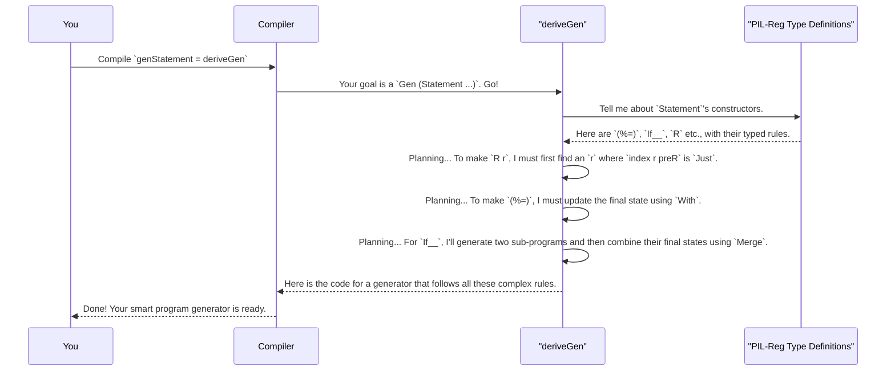

# Chapter 7: PIL-Reg: An Imperative Language with Registers

In the [previous chapter](06_embedded_dsl_program_generation__pil__.md), we took a big leap from generating random data to generating random *programs*. We learned how to define a small language (a "PIL") inside Idris so that the type system itself would guarantee our programs were correct.

Now, we're going to dive into a complete, powerful example of this technique. We'll explore `PIL-Reg`, a tiny, type-safe "assembly language" that models a program with both named variables and a fixed set of CPU-like registers. Its a perfect showcase for `DepTyCheck`, as we'll see how `deriveGen` can automatically generate valid programs that obey a truly complex set of rules.

## The Problem: Testing a Language with Registers

Imagine you are building a compiler for a language like C or Rust. Your compiler translates high-level code into low-level instructions that use a fixed number of CPU registers (like `%eax`, `%ebx` on x86). How do you test this part of your compiler?

You need to generate thousands of small programs that use registers, but you must follow strict rules:
*   You can't read a value from a register that you haven't written to first.
*   You can't treat a number in a register as if it were a string.
*   After an `if/else` block, you have to be careful about what you assume is in a register, because either the `if` branch or the `else` branch could have changed it.

Writing a generator that respects all these rules by hand would be a nightmare. We need a way to make the compiler enforce them for us.

## The Solution: Tracking Register State in the Type System

`PIL-Reg` solves this by encoding the state of all registers directly into the types of our program. We extend the `Statement` type from the last chapter to track not just `Variables`, but also `Registers`.

```idris
-- From: examples/pil-reg/src/Example/Pil/Lang/Statement.idr

data Statement : (preV  : Variables) -> (preR  : Registers rc) ->
                 (postV : Variables) -> (postR : Registers rc) ->
                 Type
```

This type now says: a `Statement` is a program that transforms an initial state (`preV`, `preR`) into a final state (`postV`, `postR`).
*   `preV`/`postV`: The variables available before/after the statement.
*   `preR`/`postR`: The state of the registers before/after the statement.

A `Registers rc` value is essentially a list of length `rc` (our register count), where each element tells us `Maybe` the `Type'` of data stored in that register. For example, `[Just Int', Nothing, Just String']` means register 0 holds an `Int`, register 1 is empty, and register 2 holds a `String`.

### Writing to a Register

Let's define a statement to write a value into a register. We'll use the `(%=)` operator.

```idris
-- From: examples/pil-reg/src/Example/Pil/Lang/Statement.idr
(%=) : (reg : Fin rc) -> Expression vars preR ty ->
       Statement vars preR vars (preR `With` (reg, Just ty))
```

This type signature is incredibly precise:
1.  You give it a register number (`reg`) and an expression of some type `ty`.
2.  It produces a statement that doesn't change variables (`vars` -> `vars`).
3.  The final register state is `preR `With` (reg, Just ty)`—the old state, but updated to show that `reg` now definitely holds a value of type `ty`.

### Reading from a Register

Now for reading. The `R` constructor creates an expression that represents the value in a register.

```idris
-- From: examples/pil-reg/src/Example/Pil/Lang/Expression.idr
R : (r : Fin rc) -> (0 _ : IsJust (index r regs)) =>
    Expression vars regs (fromJust (index r regs))
```

This is the safety net. It says you can only create `R r` (an expression to read register `r`) if you can provide a **proof** that the register is not empty (`IsJust (index r regs)`). The Idris type checker will refuse to compile any program that tries to read from an uninitialized register!

For example, this program is valid:

```idris
-- A valid program that writes then reads a register
validProgram : Statement vars (AllUndefined {rc=4}) ...
validProgram = do
  -- Put the integer 42 into register 2
  2 %= C 42
  -- Declare a variable 'x' and assign it the value from register 2
  Int'. "x" !#= R 2
```
The type system tracks that after `2 %= C 42`, register 2 is `Just Int'`, so the `R 2` on the next line is allowed.

This program, however, would be a compile-time error:
```idris
-- AN INVALID PROGRAM!
invalidProgram : Statement vars (AllUndefined {rc=4}) ...
invalidProgram = do
  -- This is not allowed, register 2 is 'Nothing' (empty)
  Int'. "x" !#= R 2
```

## The Trickiest Part: Merging State in `if/else`

What happens to register state after an `if/else` block? Consider this:

```idris
if (someCondition) then
  1 %= C 100  -- Here, register 1 holds an Int
else
  1 %= C "hello" -- Here, register 1 holds a String
```
After this block, what can we say about the type of data in register 1? We can't be sure if it's an `Int` or a `String`. `PIL-Reg` handles this with a `Merge` operation.

```idris
-- From: examples/pil-reg/src/Example/Pil/Lang/Statement.idr
If__ : (cond : Expression ...) ->
       (thenBranch : Statement ... regsThen) ->
       (elseBranch : Statement ... regsElse) ->
       Statement ... (Merge regsThen regsElse)
```

The `Merge` rule is conservative:
*   If a register holds `Just Int'` in the `then` branch and `Just Int'` in the `else` branch, its state after the `if` is `Just Int'`.
*   But if the types are different (`Just Int'` vs `Just String'`), or if one branch doesn't touch the register (`Just Int'` vs `Nothing`), the final state of that register becomes `Nothing` (uninitialized).

This perfectly models the static analysis a real compiler must perform. The type system is doing the hard work of reasoning about program state for us!

## Automatic Program Generation with `deriveGen`

The rules for `PIL-Reg` are powerful, but they make writing a random program generator by hand even harder than before. The generator needs to track which registers are initialized, what their types are, and how to merge them.

This is the perfect job for `deriveGen`. Because we have encoded all the rules of our language into the Idris types, we can ask `DepTyCheck` to figure out how to generate valid programs for us.

In the example's test suite, a generator for `PIL-Reg` programs is created with a single line:

```idris
-- Simplified from the test suite of the 'pil-reg' example

-- A generator for a random, valid PIL-Reg program
genStatement : Fuel -> Gen MaybeEmpty (Statement vars regs postV postR)
genStatement = deriveGen
```

That's it! At compile-time, `deriveGen` will analyze the `Statement` data type and all its related rules (`(%=)`, `R`, `If__`, `Merge`, `With`, etc.) and automatically construct a sophisticated generator that knows how to build valid programs.

When this generator runs, it will:
*   Randomly choose between creating an assignment, an `if`, a loop, etc.
*   When it chooses to read a register `R r`, it will only ever pick an `r` that the type system knows is initialized.
*   When it builds an `if` statement, it will correctly calculate the `Merge`d state and use that for generating the rest of the program.

## What's Happening Under the Hood?

`deriveGen` is acting like an incredibly smart puzzle-solver. It sees the goal (`generate a Statement`) and works backward, figuring out how to satisfy all the type-level constraints.



The macro uses Idris's reflection capabilities to inspect the types you've defined in files like `examples/pil-reg/src/Example/Pil/Lang/Statement.idr` and `.../Expression.idr`. It learns the rules of your language directly from your type definitions and transforms that knowledge into a working generator. It's a powerful demonstration of how a rich type system can automate incredibly complex tasks.

## Conclusion

In this chapter, we've explored a complete and realistic example of using `DepTyCheck` to generate programs for a DSL.

*   **`PIL-Reg`** is a mini-language that uses dependent types to safely model **variables and CPU registers**.
*   It tracks the state of registers (what type they hold) directly in the type-level, preventing errors like reading from an uninitialized register.
*   It uses a **`Merge`** operation to correctly and conservatively model how program state changes across `if/else` control flow.
*   Finally, we saw that **`deriveGen`** is powerful enough to **automatically create valid program generators** for such a complex language, making it a fantastic tool for testing compilers and interpreters.

We've now seen how to generate programs for an imperative, assembly-like language. But what about a more high-level, functional language?

In the next chapter, we'll explore `PIL-Fun`, a small functional language that can be compiled to different backends, and see how `DepTyCheck` can be used to test its correctness.

Next: [Chapter 8: PIL-Fun: A Functional Language with Backends](08_pil_fun__a_functional_language_with_backends_.md)

---

Generated by [AI Codebase Knowledge Builder](https://github.com/The-Pocket/Tutorial-Codebase-Knowledge)