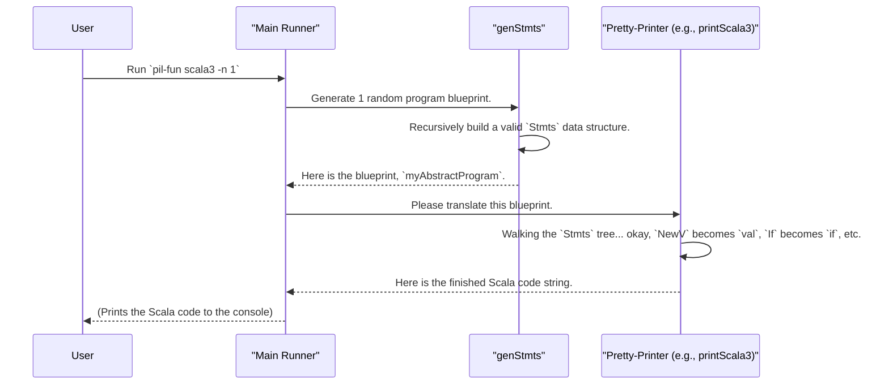

# Chapter 8: PIL-Fun: A Functional Language with Backends

In the [previous chapter](07_pil_reg__an_imperative_language_with_registers_.md), we explored [`PIL-Reg`](07_pil_reg__an_imperative_language_with_registers_.md), a powerful example of using `DepTyCheck` to generate programs for a mini-assembly language. We saw how the type system could enforce complex rules about registers and program state.

Now, we'll look at a different kind of challenge. What if you're not just testing one program, but a compiler that targets *multiple* different programming languages? How do you ensure your compiler generates correct-looking code for Scala, Lua, *and* Idris?

This is where `PIL-Fun` comes in. It's not just a language; it's a "mini-compiler" toolkit. It showcases how `DepTyCheck` can generate abstract programs and then "pretty-print" (translate) them into concrete, runnable code for several different backends. This is a powerful technique for compiler testing.

## The Problem: Testing a Multi-Target Compiler

Imagine you've built a "universal translator" for code. You've created a simple functional language, and your compiler can translate it into Scala, Lua, or Idris.

How would you test this? You could:
1.  Write a test program in your language by hand.
2.  Compile it to Scala.
3.  Compile it to Lua.
4.  Run both versions and check that they produce the same result.

This works, but it's slow, and you're limited by the test cases you can think of. What if you could automatically generate thousands of abstract programs and then check that your compiler can successfully translate them to *all* target languages without crashing or producing nonsense? This is called "differential testing," and it's a fantastic way to find bugs in compilers.

## The Solution: Generate Once, Translate Everywhere

The `PIL-Fun` example shows exactly how to do this. It consists of three main parts, working together like a factory assembly line:

1.  **The Abstract Language (`PIL-Fun`):** We define a simple, functional language inside Idris. A program in this language is just a data structure—an "abstract syntax tree" (AST).
2.  **The Program Generator:** We use `DepTyCheck` to create a [Random Value Generator (Gen)](01_random_value_generator__gen__.md) that produces millions of different, *valid* abstract programs.
3.  **The Pretty-Printers (Backends):** We write a suite of "translators" that can take one of these abstract programs and turn it into a string of formatted code for a specific language, like Scala 3 or Lua 5.4.

Let's see how each part works.

### 1. The Abstract Language: `PIL-Fun`

Unlike the imperative [`PIL-Reg`](07_pil_reg__an_imperative_language_with_registers_.md), `PIL-Fun` is a functional language. Instead of mutating variables, it uses immutable `let` bindings. We represent programs using the `Stmts` data type.

```idris
-- Simplified from: examples/pil-fun/src/Language/PilFun.idr

data Stmts : (funs : Funs) -> (vars : Vars) ... -> Type where
  -- `let x = initial in cont`
  NewV : (initial : Expr ... ty) ->
         (cont : Stmts funs (vars :< ty) ...) ->
         Stmts funs vars ...

  -- `if (cond) { th } else { el }; cont`
  If   : (cond : Expr ... Bool') ->
         (th, el : Stmts ...) ->
         (cont : Stmts ...) ->
         Stmts ...

  -- `return x`
  Ret  : Expr ... retTy -> Stmts ... (Just retTy)

  -- The end of a block that returns nothing
  Nop  : Stmts ... Nothing
```

An instance of `Stmts` is not code you can run; it's a blueprint for a program. The types `funs` and `vars` are lists that the type system uses to track which functions and variables are in scope, guaranteeing we can't write a program that uses an undefined variable.

### 2. The Program Generator: `genStmts`

Because `Stmts` is just a complex Idris data type with a lot of rules, it's a perfect candidate for automatic generator derivation. The example defines the *type* of the generator we want...

```idris
-- From: examples/pil-fun/src/Language/PilFun/Derived.idr

genStmts : Fuel -> ... -> Gen MaybeEmpty (Stmts funs vars retTy)
```

...and then lets `DepTyCheck` do the hard work. In the actual example code, `genStmts` is created using the techniques from [Chapter 2: Automatic Generator Derivation (deriveGen)](02_automatic_generator_derivation__derivegen__.md). The framework analyzes the `Stmts` data type and automatically writes a generator that can produce random, valid program blueprints.

### 3. The Pretty-Printers: Translating to Real Languages

This is where the magic happens. A "pretty-printer" is a function that walks through the abstract `Stmts` data structure and translates each piece into concrete syntax for a target language.

The example defines a generic interface for these printers:

```idris
-- Simplified from: examples/pil-fun/src/Language/PilFun/Pretty.idr

PP : SupportedLanguage -> Type
PP lang = ... -> Stmts ... -> Gen0 (Doc opts)
```

This says that a `PP` for a given language is a function that takes a `Stmts` blueprint and produces a `Doc` (a formatted document representing code).

The project then provides specific implementations, like `printScala3` and `printLua5_4`.

Let's look at a tiny piece of the Scala 3 printer to see how it works.

```idris
-- Simplified from: examples/pil-fun/src/Language/PilFun/Pretty/Scala3.idr

printStmts : ... -> Stmts ... -> Gen0 (Doc opts)
printStmts (NewV initial cont) = do
  -- ... generate a new variable name `nm` ...
  rhs <- printExpr initial
  rest <- printStmts cont
  -- Translate to "val nm = <rhs>"
  pure $ ("val" <++> nm <++> "=" <++> rhs) `vappend` rest

printStmts (If cond th el cont) = do
  -- Translate to "if (cond) { th } else { el }"
  -- ... recursively call printStmts on th, el, cont ...
```

As you can see, `printStmts` is a big function that pattern-matches on the `Stmts` blueprint.
*   When it sees a `NewV`, it creates a Scala `val` declaration.
*   When it sees an `If`, it creates a Scala `if-then-else` block.
*   It does this recursively until the entire abstract program has been translated into a string of Scala code.

## Putting It All Together

The main executable in the `pil-fun` example ties this whole process together. When you run it with a command like `pil-fun scala3`, it performs the following steps:

1.  **Generate an Abstract Program:** It calls `genStmts` to generate a random, valid program blueprint. Let's call it `myAbstractProgram`.
2.  **Select a Translator:** It sees you asked for `scala3`, so it picks the `printScala3` function.
3.  **Translate:** It calls `printScala3 myAbstractProgram`.
4.  **Print the Result:** It prints the resulting Scala code to your terminal.

If you run it again, you get a *different* random program. If you run `pil-fun lua5.4`, you get the same kind of random program, but translated into Lua!

For example, a single abstract program blueprint might be translated into these two different outputs:

**Generated Scala 3 Code:**
```scala
@main
def main(): Unit = {
  val x = 10
  val y = 20
  if (x < y) {
    Console.println(x)
  } else {
    Console.println(y)
  }
}
```

**Generated Lua 5.4 Code:**
```lua
local x = 10
local y = 20
if x < y then
  print(x)
else
  print(y)
end
```
Both programs do the same thing, but are written in different languages. By generating thousands of these and ensuring all our backends can produce code without crashing, we can gain huge confidence in our "universal translator" compiler.

## What's Happening Under the Hood?

The process is a clean, multi-stage pipeline.



The core logic for this pipeline is in `examples/pil-fun/src/Runner.idr`. The `run` function fetches the generator `genStmts` and the chosen pretty-printer `pp`. It then uses `unGenTryN` to create a lazy list of generated and translated programs.

```idris
-- Simplified from: examples/pil-fun/src/Runner.idr

run : Config -> ... -> (pp : PP language) -> IO ()
run conf ... pp = do
  seed <- conf.usedSeed
  -- 1. Generate a program, then (>>=) 2. pretty-print it.
  let vals = unGenTryN conf.testsCnt seed $
               genStmts ... >>= pp ...
  -- 3. Print each result.
  Lazy.for_ vals $ \val => putStrLn val
```
This elegantly chains the generation (`genStmts`) and translation (`pp`) steps together inside the generator monad, creating a new "recipe" that knows how to produce a fully-formed string of code in the target language.

## Conclusion

In this chapter, we've seen one of the most advanced applications of `DepTyCheck`: testing a multi-target compiler.

*   **`PIL-Fun`** is a simple, abstract functional language defined as an Idris data type.
*   We use `DepTyCheck` to **generate random program blueprints** (abstract syntax trees).
*   A suite of **pretty-printers** act as compiler "backends," translating these abstract blueprints into concrete code for languages like Scala, Lua, and Idris.
*   This approach allows for powerful **differential testing**, where we generate a program and ensure it can be compiled to all targets successfully.

We have now seen how to generate both simple data and complex programs, and how to create generators both manually and automatically. But how does the automatic process—the powerful `deriveGen` macro—actually work? What intelligent steps does it take to analyze your types and build a valid generator?

In the next chapter, we will pull back the curtain and dive deep into the fascinating internal workings of the generator derivation system.

Next: [Chapter 9: Generator Derivation Internals](09_generator_derivation_internals_.md)

---

Generated by [AI Codebase Knowledge Builder](https://github.com/The-Pocket/Tutorial-Codebase-Knowledge)