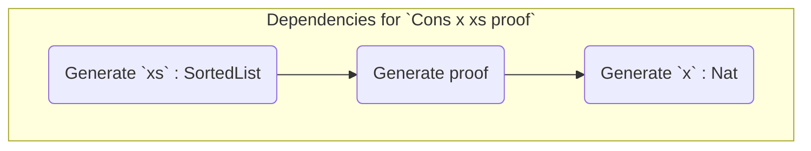
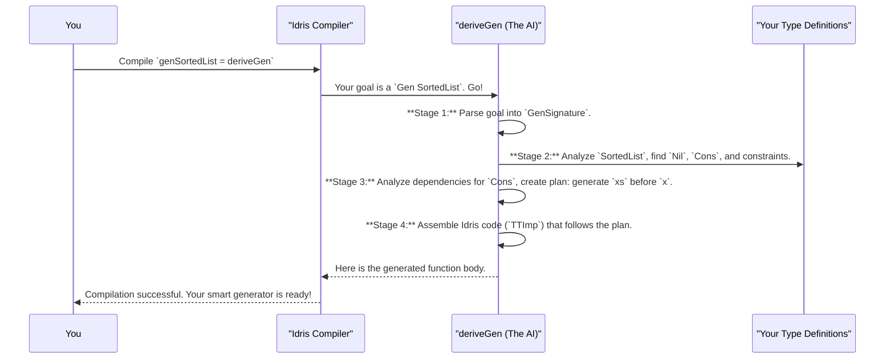

# Chapter 9: Generator Derivation Internals

In the [previous chapter](08_pil_fun__a_functional_language_with_backends_.md), we saw the incredible power of `DepTyCheck` in action, generating abstract programs with [`PIL-Fun`](08_pil_fun__a_functional_language_with_backends_.md) and compiling them to multiple backends. Throughout this journey, the true star has been [`deriveGen`](02_automatic_generator_derivation__derivegen__.md), the "master chef AI" that magically writes complex generators for us.

So far, we've treated `deriveGen` as a black box. You tell it what you want, and it delivers. But how does it *think*? How does it analyze your data types, understand their rules, and devise a plan to generate valid instances? In this final chapter, we're going to pull back the curtain and explore the engine room of `DepTyCheck`.

## The Mission: Deconstructing `deriveGen`

Let's return to our familiar friend, the `SortedList`, which we first saw in [Chapter 3](03_constrained_data_structure_examples_.md).

```idris
data SortedList : Type where
  Nil  : SortedList
  (::) : (x : Nat) -> (xs : SortedList) ->
         LTEHead x xs => SortedList
```

And the magic one-liner that saves us from all the hard work:

```idris
-- Our goal: understand what happens when the compiler sees this line.
genSortedList : Fuel -> Gen MaybeEmpty SortedList
genSortedList = deriveGen
```

When the Idris compiler encounters `deriveGen`, it doesn't just execute a simple function. It kicks off a sophisticated, multi-stage process at compile-time. This process is like a cognitive architecture for an AI, designed to reason about types and dependencies. We can break it down into four main stages.

## The `deriveGen` Cognitive Process

### Stage 1: Parsing the Goal (Reading the Order)

The first thing `deriveGen` does is look at the function signature you provided to understand its mission.

```idris
-- The order slip:
genSortedList : Fuel -> Gen MaybeEmpty SortedList
```

It parses this and translates it into a structured goal object called a `GenSignature`. A simplified version of this object looks like this:

```idris
-- From: src/Deriving/DepTyCheck/Gen/Signature.idr
record GenSignature where
  constructor MkGenSignature
  -- The type we want to generate: SortedList
  targetType : TypeInfo
  -- The parameters we are given from the outside (in this case, none)
  givenParams : List Nat
```
This tells the system: "Your job is to generate a value of type `SortedList`. You will be given a `Fuel` argument, but no other initial values." This `GenSignature` becomes the mission-critical information that guides the entire rest of the process.

### Stage 2: Analyzing the Data Type (Consulting the Recipe Book)

Next, `deriveGen` acts like a detective. It uses Idris's reflection capabilities to investigate the `targetType` (`SortedList`) from every angle.

It asks questions like:
*   What constructors does `SortedList` have? (Answer: `Nil` and `(::)`)
*   For each constructor, what are its arguments? (`(::)` has `x`, `xs`, and a proof)
*   Are any of these arguments recursive? (Yes, `xs` is a `SortedList`)
*   What are the constraints? (`LTEHead x xs`)

This information is collected into another internal data structure we can think of as `ConsRecs` (Constructor Recursiveness information). For our `SortedList`, the analysis would produce something like this:

*   **`Nil`**: Simple, non-recursive, takes no arguments. Its "weight" is a constant `1`.
*   **`(::)`**: Recursive. It depends on generating a smaller `SortedList`. Because it's recursive, it must "spend fuel". Its weight is proportional to the fuel left.

This analysis, found in `src/Deriving/DepTyCheck/Gen/ConsRecs.idr`, is crucial for handling recursion and preventing infinite loops. The system now knows which constructors are "base cases" and which are "recursive steps".

### Stage 3: Devising a Plan (Planning the Cooking Steps)

This is the "intelligent" core of `deriveGen`. For a non-trivial constructor like `(::)`, it has to generate values for `x`, `xs`, and the proof. But in what order? A naive approach might be:
1.  Generate a random `Nat` for `x`.
2.  Generate a random `SortedList` for `xs`.
3.  Try to prove `LTEHead x xs`.

This is a terrible plan! The chances that a random `x` is less than or equal to the head of a random `xs` are very low. Most attempts would fail.

`deriveGen` is much smarter. It analyzes the dependencies between the arguments. It sees that the validity of the proof, and by extension the value of `x`, *depends on* the value of `xs`.



The system builds this dependency graph and finds the "least effort" order to generate the arguments. For `SortedList`, the winning plan is:
1.  **Generate `xs` first:** Recursively call the list generator.
2.  **Inspect the result:** Look at the head of the generated `xs` (let's call it `y`).
3.  **Generate `x`:** Now, generate a `Nat` for `x` that is constrained to be less than or equal to `y`.
4.  **Generate the proof:** With a valid `x` and `xs`, the proof is now trivial to construct.

This strategic ordering is handled by the `searchOrder` function in `src/Deriving/DepTyCheck/Gen/ForOneTypeConRhs/Impl.idr`. It essentially performs a topological sort on the dependency graph to find a valid execution plan that has the highest chance of success.

### Stage 4: Assembling the Code (Writing the Final Recipe)

With a concrete plan for each constructor, the final stage is to translate these plans into actual Idris code. `deriveGen` doesn't write text files; it builds the code as an abstract data structure called `TTImp`, which is Idris's internal representation for code.

The final generated code for `genSortedList` will conceptually look like this:

```idris
-- A simplified view of what `deriveGen` produces
genSortedList fuel =
  -- The fuel check (Stage 2) decides if we can do recursion
  if fuel is Dry
    then oneOf [genNil] -- Only non-recursive constructors
    else oneOf [genNil, genCons] -- All constructors

where
  -- Code for the Nil generator is trivial
  genNil = pure Nil

  -- Code for the Cons generator follows our plan (Stage 3)
  genCons = do
    -- 1. Generate `xs` first
    xs <- genSortedList (sub-fuel)
    -- 2. Inspect the head of `xs`
    let y = headOf xs
    -- 3. Generate a valid `x`
    x <- choose (0, y)
    -- 4. Construct the proof and return the full list
    pure (x :: xs)
```

This code is built using helper functions like `canonicBody` (in `src/Deriving/DepTyCheck/Gen/ForOneType/Impl.idr`) and `callGen` (in `src/Deriving/DepTyCheck/Gen/ForAllNeededTypes/Impl.idr`). `callGen` is the dispatcher: it decides whether to make a recursive call to a generator being derived, or to use an external generator you might have provided.

The whole process can be summarized in this diagram:



This entire four-stage process happens in a flash, right inside the compiler. The result is a highly-optimized, correct-by-construction generator, created just for you.

## Conclusion: The End of the Beginning

And with that, our journey through the world of `DepTyCheck` comes to a close. We started with the humble [Random Value Generator (Gen)](01_random_value_generator__gen__.md), a simple recipe for making random data. We then discovered the magic of [`deriveGen`](02_automatic_generator_derivation__derivegen__.md), our automated master chef.

We saw how to apply these tools to generate incredibly complex, [constrained data structures](03_constrained_data_structure_examples_.md), and how to verify our generators using [Coverage Analysis](04_generator_coverage_analysis_.md) and [Statistical Checking](05_statistical_distribution_checking_.md). We even learned how to generate entire programs with [PIL](06_embedded_dsl_program_generation__pil__.md), testing compilers with [`PIL-Reg`](07_pil_reg__an_imperative_language_with_registers_.md) and [`PIL-Fun`](08_pil_fun__a_functional_language_with_backends_.md).

Finally, we've peeked inside the mind of the machine, understanding the intelligent, multi-stage process that `deriveGen` uses to turn our type definitions into powerful test data factories.

`DepTyCheck` is a powerful demonstration of what is possible when you combine property-based testing with the expressive power of dependent types. It transforms testing from a tedious chore into a creative and rewarding process of discovery. We hope this tutorial has given you the confidence and the tools to start applying these techniques to your own projects. Happy testing

---

Generated by [AI Codebase Knowledge Builder](https://github.com/The-Pocket/Tutorial-Codebase-Knowledge)