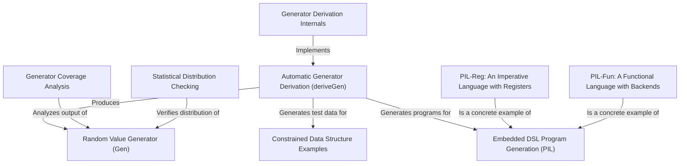

# Tutorial: DepTyCheck

DepTyCheck is a library for the Idris programming language that supercharges *property-based testing*. Its main purpose is to tackle the challenge of testing software that uses complex, rule-filled data structures, known as **dependently-typed data**. The library's core feature, `deriveGen`, acts like a smart assistant that **automatically writes test data generators** for these intricate types just by analyzing their definitions. This saves developers from the difficult and error-prone task of creating valid test cases by hand. To ensure high-quality testing, it also provides tools to analyze *test coverage* and check for biases in the *randomness* of the generated data.

**Source Repository:** [None](None)

## Chapters

1. [Random Value Generator (Gen)
](01_random_value_generator__gen__.md)
2. [Automatic Generator Derivation (deriveGen)
](02_automatic_generator_derivation__derivegen__.md)
3. [Constrained Data Structure Examples
](03_constrained_data_structure_examples_.md)
4. [Generator Coverage Analysis
](04_generator_coverage_analysis_.md)
5. [Statistical Distribution Checking
](05_statistical_distribution_checking_.md)
6. [Embedded DSL Program Generation (PIL)
](06_embedded_dsl_program_generation__pil__.md)
7. [PIL-Reg: An Imperative Language with Registers
](07_pil_reg__an_imperative_language_with_registers_.md)
8. [PIL-Fun: A Functional Language with Backends
](08_pil_fun__a_functional_language_with_backends_.md)
9. [Generator Derivation Internals
](09_generator_derivation_internals_.md)

---

Generated by [AI Codebase Knowledge Builder](https://github.com/The-Pocket/Tutorial-Codebase-Knowledge)