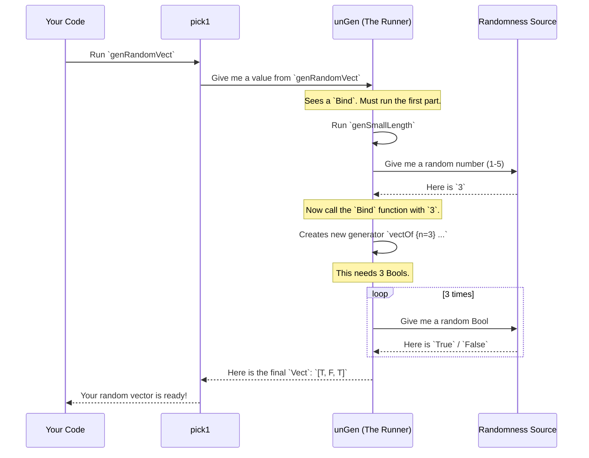

# Chapter 1: `Gen` Monad for Property-Based Testing

Welcome to `DepTyCheck`! You're about to learn how to automatically test your programs in powerful new ways. The first step in this journey is learning how to generate random test data. That's where the `Gen` monad comes in.

## What's the Big Idea?

Imagine you've written a function, say, one that processes a user profile. How do you test it? You could write a few test cases by hand: one for a typical user, one for a user with an empty name, one for an age of 0, etc.

This is fine, but it's easy to miss edge cases. What if your function crashes for a user with a very long name, or a negative age? Property-based testing helps us find these sneaky bugs by running our tests on *hundreds* of randomly generated inputs.

But to do that, we first need a way to create those random inputs. This is the problem `Gen` solves.

Think of `Gen a` as a **recipe for creating a random value of type `a`**.
- A `Gen Int` is a recipe for making a random integer.
- A `Gen String` is a recipe for making a random string.
- A `Gen UserProfile` is a recipe for making a whole random user profile.

Just like in a kitchen, we can start with simple recipes and combine them to create much more complex and delicious dishes!

## Your First Generators: The Basic Ingredients

Let's start with the simplest recipes. To follow along, you can imagine an Idris REPL where you can try these things out.

### `pure`: The Simplest Recipe
The simplest recipe is one that always produces the exact same thing. In `DepTyCheck`, this is `pure`.

```idris
import Test.DepTyCheck.Gen

-- A generator that *always* produces the number 42.
genTheAnswer : Gen1 Int
genTheAnswer = pure 42
```
This is useful when part of your data structure is fixed.

### `choose`: Picking a Random Value in a Range
A more interesting recipe is generating a number within a specific range. For this, we use `choose`.

```idris
-- A generator for a random age between 18 and 99.
genAdultAge : Gen1 Int
genAdultAge = choose (18, 99)
```
Every time you use this "recipe," you get a different random integer between 18 and 99.

### `elements`: Choosing from a List
What if you want to choose from a few specific options? `elements` lets you do just that.

```idris
-- A generator that picks one of three roles.
genRole : Gen1 String
genRole = elements ["Admin", "User", "Guest"]
```
This will randomly (and uniformly) pick one of the strings from the list.

> **Note:** You might see `Gen1` and `Gen0`. For now, just think of `Gen1` as a generator that is guaranteed to produce a value. `Gen0` might be "empty" and fail to produce one. We'll mostly use `Gen1` for now.

## Combining Recipes: Building Complex Data

Now for the fun part! Let's say we have a simple `User` record and we want to generate random users.

```idris
record User where
  constructor MkUser
  name : String
  age  : Int
```

We know how to make a generator for a `String` (let's just use `elements` for simplicity) and an `Int` (`choose`). How do we combine them to create a `Gen1 User`?

We can "apply" one generator to another, building up our `User` piece by piece.

```idris
genUser : Gen1 User
genUser = MkUser <$> elements ["Alice", "Bob"] <*> choose (18, 65)
```
Let's break this down:
1. `MkUser <$> ...`: This says "I'm going to build a `User`. Let's start with the `MkUser` constructor."
2. `... elements ["Alice", "Bob"] ...`: The first ingredient needed for `MkUser` is a `name`. We provide a `Gen1 String` recipe for it.
3. `... <*> choose (18, 65)`: The second ingredient is an `age`. We provide a `Gen1 Int` recipe for that.

We've just combined simple recipes (`elements` and `choose`) into a more complex one (`genUser`)! This is the "Applicative" nature of `Gen`.

## Dependent Generation: The Magic of Monads

Here's where `Gen` gets really powerful. What if the recipe for one part of your data **depends on a value created earlier**?

Let's imagine you want to generate a vector of a random length. First, you need to generate a random length `n`, and *then* you need to generate a vector that has exactly `n` elements.

You can't do this with the `<*>` syntax from before. You need to chain the steps. This is the "Monad" part of `Gen`.

We'll use the `>>=` (pronounced "bind") operator. It works like this:
`generatorA >>= (\valueA => generatorB_that_uses_valueA)`

Let's see it in action. We'll generate a `Nat` between 1 and 5, and then create a `Vect` of that length containing random `Bool`s.

```idris
import Data.Vect

-- A generator for a Nat between 1 and 5.
genSmallLength : Gen1 Nat
genSmallLength = cast <$> choose (1, 5)

-- A generator for a Vect of random Bools, where the length is also random.
genRandomVect : Gen1 (Vect n Bool)
genRandomVect =
  genSmallLength >>= \n => vectOf {n=n} (elements [True, False])
```
Step-by-step, here's what happens when this "recipe" is used:
1. `genSmallLength` is run first. It produces a random number, let's say `3`.
2. This number `3` is given to the function after `>>=`. So, `n` becomes `3`.
3. The function returns a *new* generator: `vectOf {n=3} (elements [True, False])`.
4. This new generator is then run. It creates a `Vect` of length 3 by running the `elements [True, False]` generator three times, producing something like `[True, True, False]`.

This ability to chain generation steps is the key to generating valid dependently-typed data, which is central to `DepTyCheck`.

## How Do I Get a Value? Running the Generator

We have all these fantastic recipes, but how do we actually "cook" them to get a result? You need a function to run the generator. The simplest one is `pick1`.

```idris
-- Let's take our user generator from before
genUser : Gen1 User
genUser = MkUser <$> elements ["Alice", "Bob"] <*> choose (18, 65)

-- Run it once to get a random user!
-- This needs to be inside an IO function to get a random seed.
main : IO ()
main = do
  user <- pick1 genUser
  printLn user
```

What would this print? It could be `MkUser "Alice" 34`, or `MkUser "Bob" 21`, or any other valid combination. Each time you run it, you'll likely get a different result.

## A Peek Under the Hood

You don't need to know the internals to use `Gen`, but a quick look can make things clearer. The `Gen` type is defined (in a simplified way) like this in `src/Test/DepTyCheck/Gen.idr`:

```idris
data Gen : Emptiness -> Type -> Type where
  Pure  : a -> Gen em a
  Raw   : RawGen a -> Gen em a
  Bind  : RawGen c -> (c -> Gen biem a) -> Gen em a
  OneOf : GenAlternatives True alem a -> Gen em a
  Empty : Gen MaybeEmpty a
  -- ... and a few others
```
- `Pure x`: Our simple recipe that just holds a value `x`.
- `Raw`: This is the primitive that actually interacts with the random number source. `choose` is built using this.
- `OneOf`: This represents a choice between several other generators. `elements` is built using this.
- `Bind`: This is the structure that holds our monadic "chaining" from the `Vect` example. It stores the first generator and the function that creates the second one.

When you call `pick1 genRandomVect`, here's a visual of what happens:



This step-by-step process of resolving one generator at a time, potentially using the result to create the *next* generator, is what makes the system so flexible and powerful.

## Conclusion

You've just learned the most fundamental concept in `DepTyCheck`!

- A `Gen a` is a **recipe** for creating random values of type `a`.
- You can create simple generators with `pure`, `choose`, and `elements`.
- You can combine generators using `<$>` and `<*>` to build complex, independent data.
- You can chain generators using `>>=` to create data where one part **depends** on another.
- You run a generator with `pick1` to get a single random instance.

Manually writing these recipes for every single data type can get repetitive, especially for large record types. Wouldn't it be great if the compiler could write them for you? It can!

In the next chapter, we'll explore just that. Get ready to supercharge your testing workflow with [`deriveGen`: Automatic Generator Derivation](02__derivegen___automatic_generator_derivation_.md).

---

Generated by [AI Codebase Knowledge Builder](https://github.com/The-Pocket/Tutorial-Codebase-Knowledge)