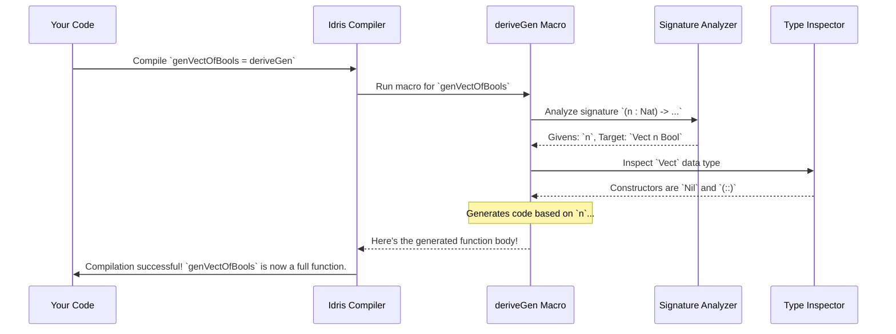

# Chapter 2: `deriveGen`: Automatic Generator Derivation

In the [previous chapter](01__gen__monad_for_property_based_testing_.md), you learned how to become a "recipe writer," carefully crafting generators by hand using the powerful `Gen` monad. This is a fantastic skill, but what if you have a dozen complex data types? Writing generators for all of them would be tedious and error-prone.

What if you could just show the compiler the blueprint for your data, and it could automatically figure out how to build it?

Welcome to `deriveGen`, the flagship feature of `DepTyCheck`. It's a "smart factory" for your data types that does all the hard work for you.

## The Problem: Manual Labor

Let's look at the `User` record from Chapter 1 again.

```idris
record User where
  constructor MkUser
  name : String
  age  : Int
```

We manually wrote a generator for it like this:

```idris
import Test.DepTyCheck.Gen

genUserManual : Gen1 User
genUserManual = MkUser <$> elements ["Alice", "Bob"] <*> choose (18, 65)
```

This isn't too bad for a simple record. But imagine a `BlogPost` with an author, content, tags, comments, timestamps, and validation status. The manual generator would get long and complicated very quickly. This is where we wish for some automation.

## The Solution: `deriveGen`

`deriveGen` is a macro, which is a special piece of code that writes *other code* for you at compile time. It analyzes the type signature you provide and automatically generates the body of your generator function.

Here's how you'd create a `User` generator with `deriveGen`.

First, you need to import the necessary tools and define the function signature:

```idris
import Deriving.DepTyCheck.Gen
import Data.Fuel

-- The signature for our generator
genUser : Fuel -> Gen MaybeEmpty User
```

Let's break down this signature. It's the "order form" you give to the `deriveGen` factory.

*   `Fuel`: This is a new concept! Think of it as a **safety budget**. When generating recursive data (like lists or trees), `deriveGen` needs to know when to stop to avoid getting stuck in an infinite loop. `Fuel` is a simple counter that decreases with each recursive step. It must almost always be the first argument.
*   `Gen MaybeEmpty User`: This is the result. It's a generator that *might* fail to produce a `User` (for example, if it runs out of `Fuel`). This is a common pattern for automatically derived generators.

Now, for the implementation, you just write `deriveGen`:

```idris
genUser = deriveGen
```

That's it! It's like magic. When the compiler sees `deriveGen`, it looks at the signature `Fuel -> Gen MaybeEmpty User`, inspects the `User` record, and writes the following code (or something very similar) behind the scenes:

```idris
-- This is what `deriveGen` writes for you!
genUser : Fuel -> Gen MaybeEmpty User
genUser fuel =
  MkUser <$> elements ["some", "default", "names"]
         <*> choose (0, 100)
```
*(Note: The exact default generators for `String` and `Int` might vary, but the principle is the same.)*

You write one line, and `deriveGen` writes the entire generator body. This saves you time and prevents silly mistakes.

## Guiding the Factory: Dependent Generation

The real power of `deriveGen` shines when dealing with dependent types. Imagine we have a `Vect` (a list with its length encoded in its type) and we want to generate a `Vect` of a *specific length* `n`, where `n` is given as an input.

The signature is key. It tells `deriveGen` what's a "given" input and what needs to be "generated".

*   **Givens:** Arguments that come *before* the `Fuel` argument.
*   **Generatables:** The type parameters described *inside* the `Gen` type at the end.

Let's write a generator for `Vect n Bool`. The length `n` will be a "given".

```idris
import Data.Vect

genVectOfBools : (n : Nat) -> Fuel -> Gen MaybeEmpty (Vect n Bool)
genVectOfBools = deriveGen
```

Look at the signature:
1.  `(n : Nat)`: This is a **given**. We are telling `deriveGen`: "You will be handed an `n`. Don't generate it."
2.  `Fuel`: Our safety budget.
3.  `Gen MaybeEmpty (Vect n Bool)`: This is the **target**. "Your job is to build a `Vect` of length `n` containing `Bool`s."

When you use this generator, you must provide the length:

```idris
-- Get a random vector of 5 Bools
fiveBools <- pick1 (genVectOfBools 5 defaultFuel)
-- Might produce: Just [True, False, False, True, True]

-- Get a random vector of 2 Bools
twoBools <- pick1 (genVectOfBools 2 defaultFuel)
-- Might produce: Just [False, True]
```
> `defaultFuel` is a handy value you can use when you're not worried about deep recursion.

This is something that would have been more complex to write by hand using the `>>=` operator, but with `deriveGen`, it becomes declarative. You just *describe what you want* in the type signature.

## Under the Hood: A Look Inside the Factory

How can `deriveGen` be so smart? It's a multi-step process that happens during compilation.

#### Step 1: Analyze the Order Form (The Type Signature)

When the Idris compiler sees `myGen = deriveGen`, the `deriveGen` macro is activated. The first thing it does is inspect the type signature of `myGen`.

```idris
-- Let's use this signature as an example
genVectOfBools : (n : Nat) -> Fuel -> Gen MaybeEmpty (Vect n Bool)
```

The macro's internal "Signature Analyzer" (`checkTypeIsGen` in `src/Deriving/DepTyCheck/Gen.idr`) breaks this down:
*   **Givens:** `n : Nat`
*   **Budget:** `Fuel`
*   **Target:** `Vect n Bool`

#### Step 2: Inspect the Blueprint (The Data Type)

Next, it looks up the definition of the target type, `Vect`.

```idris
data Vect : Nat -> Type -> Type where
  Nil  : Vect 0 a
  (::) : a -> Vect k a -> Vect (S k) a
```

The macro's "Type Inspector" analyzes each constructor (`Nil` and `(::)`).

#### Step 3: Create the Assembly Plan (Generate the Code)

Now, the "Code Generator" (`canonicBody` in `src/Deriving/DepTyCheck/Gen/ForOneType/Impl.idr`) builds the generator logic. It essentially writes a big `case` statement on the input `n`.

*   **If `n` is 0:** The only matching constructor for `Vect 0 a` is `Nil`. The plan is simple: `pure Nil`.
*   **If `n` is greater than 0 (`S k`):** The only matching constructor is `(::)`. To build this, it needs two things:
    1.  An `a` (which is `Bool` in our case). The plan: "Find a generator for `Bool` (e.g., `elements [True, False]`) and run it."
    2.  A `Vect k a`. The plan: "This looks familiar! I need to generate a vector, but this time of length `k`. I'll make a recursive call to myself: `genVectOfBools k`."

It combines these steps into a `Gen` expression and replaces `deriveGen` with the final code.

Here is a simplified diagram of the process:



The actual implementation is, of course, far more complex and lives across several files (`Gen.idr`, `ForAllNeededTypes/Impl.idr`, `ForOneType/Impl.idr`), but this captures the core idea. The `deriveGen` function itself is just an entry point that kicks off this whole reflective process.

```idris
-- From: src/Deriving/DepTyCheck/Gen.idr

export %macro
deriveGen : DeriveBodyForType => Elab a
deriveGen = do
  Just signature <- goal
     | Nothing => fail "..."
  tt <- deriveGenExpr signature
  check tt
```
This snippet shows how the macro gets the `signature` from the compiler's `goal` and passes it to `deriveGenExpr`, which orchestrates the analysis and code generation we just described.

## Conclusion

You've now seen the incredible power of `deriveGen`. It's the ultimate tool for reducing boilerplate and making property-based testing effortless, especially for the complex, constrained data types that are common in dependently-typed programming.

You've learned:
- `deriveGen` is a macro that automatically writes generator functions for you.
- The **type signature** of your function is the "order form" that tells `deriveGen` what to do.
- Arguments before `Fuel` are **givens** (inputs you provide).
- The type inside `Gen` is the **target** to be generated.
- `Fuel` is a safety mechanism to prevent infinite recursion.

Now that we understand the `what` and `how` of `deriveGen`, let's put it to the test. In the next chapter, we will tackle a classic dependently-typed challenge: generating a list that is guaranteed to be sorted.

Next up: [Example: `SortedList`](03_example___sortedlist__.md).

---

Generated by [AI Codebase Knowledge Builder](https://github.com/The-Pocket/Tutorial-Codebase-Knowledge)