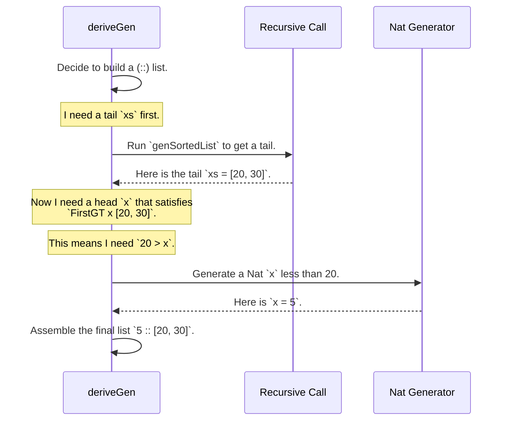

# Chapter 3: Example: `SortedList`

In the [previous chapter](02__derivegen___automatic_generator_derivation_.md), you saw how `deriveGen` can act like a "smart factory," automatically creating generators for your data types. We used simple examples like `User` records and `Vect`s.

Now, let's put `deriveGen` to a real test. We're going to tackle a classic problem in dependently-typed programming: creating a list of numbers that is **provably sorted**. This means the type system itself will prevent us from ever creating a jumbled-up list!

## The Goal: A Self-Sorting List

Imagine you're writing a program that displays a leaderboard. It's crucial that the scores are always shown in descending (or ascending) order. If you use a regular `List Nat`, you have to be careful. A bug somewhere else in your code could accidentally add a new score to the wrong place, breaking the order.

What if the data type for the list *refused* to be created unless it was sorted? That's what a `SortedList` does. Think of it as a line of people organized by height, where the rules of physics (or in our case, the type system) prevent a shorter person from cutting in front of a taller one.

Let's see how we can define such a list in Idris.

## Encoding "Sorted" in the Type System

How do you tell the compiler what "sorted" means? There are a few ways to do it. We'll look at the most direct one first, which you can find in the `sorted-list-tl-pred` example directory.

This implementation defines two things: the `SortedList` itself, and a "permit" type called `FirstGT` that controls how we can add elements.

First, the list itself looks a lot like a normal list:

```idris
-- From: examples/sorted-list-tl-pred/src/Data/List/Sorted.idr

data SortedList : Type where
  Nil  : SortedList
  (::) : (x : Nat) -> (xs : SortedList) -> FirstGT x xs => SortedList
```

Let's break this down:
*   `Nil : SortedList`: An empty list is a `SortedList`. Easy enough.
*   `(::) : ...`: This is the interesting part. To create a new list by adding a number `x` to the front of an existing `SortedList` `xs`, you need one more thing: a "permit" of type `FirstGT x xs`.

So, what is this `FirstGT` permit? It's a type that proves the first element of the existing list `xs` is **G**reater **T**han our new element `x`.

```idris
-- From: examples/sorted-list-tl-pred/src/Data/List/Sorted.idr

data FirstGT : Nat -> SortedList -> Type where
  E  : FirstGT n []
  NE : x `GT` n -> FirstGT n $ (x::xs)
```
This defines the two situations where you can get a `FirstGT n xs` permit:
*   `E`: If the existing list `xs` is empty (`[]`), you can *always* get a permit. It doesn't matter what `n` is. This rule allows us to add the very first element to an empty list. (The "E" stands for "Empty").
*   `NE`: If the existing list `xs` is not empty (`x::xs`), you can get a permit only if you can provide a proof that the head of that list, `x`, is greater than the new number `n` you're trying to add (`x `GT` n`). (The "NE" stands for "Not Empty").

Let's try to build one by hand to see how it works:
*   `Nil` is a valid `SortedList`. Let's call it `l0`.
*   Can we make `10 :: l0`? We need a permit `FirstGT 10 l0`. Since `l0` is `Nil`, we can use the `E` rule. Yes! So, `[10]` is a valid `SortedList`. Let's call it `l1`.
*   Can we make `5 :: l1`? We need a permit `FirstGT 5 l1`. Here, `l1` is `10 :: []`. We use the `NE` rule. This requires a proof that `10 > 5`. Idris knows this is true! So, `[5, 10]` is a valid `SortedList`. Let's call it `l2`.
*   Can we make `8 :: l2`? We need `FirstGT 8 l2`. The `NE` rule requires a proof of `5 > 8`. This is false! The compiler cannot find this proof and will give you an error.

The type system has successfully prevented us from creating an unsorted list `[8, 5, 10]`!

## Generating a `SortedList` with `deriveGen`

Writing valid `SortedList`s by hand is tricky. You have to keep track of the proofs yourself. This is a perfect job for `DepTyCheck`!

How do we write a generator? The same way we did in the last chapter. We just state what we want.

```idris
-- From: examples/sorted-list-tl-pred/src/Data/List/Sorted/Gen.idr

import public Data.List.Sorted
import Deriving.DepTyCheck.Gen

export
genSortedList : Fuel -> Gen MaybeEmpty SortedList
genSortedList = deriveGen
```

That's it. Just one line. You provide the "order form" (the type signature) and `deriveGen` builds the factory. When you run this generator, it will only ever produce valid, provably sorted lists of random numbers.

```idris
-- In a main function...
maybeList <- pick1 (genSortedList defaultFuel)
-- maybeList could be: Just [], Just [42], or Just [10, 25, 103]
-- It will *never* be: Just [10, 5] or Just [100, 20, 300]
```

## How Does `deriveGen` Solve This Puzzle?

This seems like magic. How does `deriveGen` know how to satisfy the `FirstGT` constraint? It can't just generate a random head `x` and a random tail `xs` independently, because the constraint might fail.

`deriveGen` is smart enough to figure out the dependencies. It works backward from the constraints.

Here’s a step-by-step of what the `deriveGen` machinery does when it tries to build a `SortedList`:

1.  **Choose a Constructor**: It randomly decides whether to build a `Nil` or a `(::)` list (usually based on the remaining `Fuel`). If it picks `Nil`, it's done: `pure Nil`.
2.  **Analyze `(::)`**: If it picks `(::)`, it sees it has a three-part "To-Do List":
    *   A head element `x : Nat`.
    *   A tail element `xs : SortedList`.
    *   A proof/permit `FirstGT x xs`.
3.  **Detect Dependency**: `deriveGen` sees that the permit `FirstGT x xs` depends on *both* `x` and `xs`. It realizes it can't just generate them randomly. The secret is to generate things in an order that makes the constraints easier to solve. It correctly decides to **generate the tail `xs` first**.
4.  **Recursive Generation**: It makes a recursive call to `genSortedList` to get a tail. Let’s say this call returns `xs = [20, 30]`.
5.  **Solve the Constraint**: Now its "To-Do" is simpler. It needs to generate an `x : Nat` and a proof for `FirstGT x [20, 30]`. It looks at the `FirstGT` definition and sees the `NE` rule is the only one that applies. This rule requires a proof of `20 > x`.
6.  **Constrained Generation**: Aha! The constraint `20 > x` tells `deriveGen` exactly how to generate `x`. It can't just pick any `Nat`. It must pick a `Nat` that is strictly less than 20. It's as if the type system gave it a perfect `choose (0, 19)`.
7.  **Final Assembly**: It runs this new, constrained generator to get a value for `x`, let's say `5`. Now it has everything it needs:
    *   `x = 5`
    *   `xs = [20, 30]`
    *   A way to build the proof `FirstGT 5 [20, 30]` (because `20 > 5` is true).
    It assembles these into the final result: `5 :: [20, 30]`.

This process of generating the recursive part first, then using the constraints to inform how the other parts are generated, is the key to `deriveGen`'s power.



## Alternative Encodings

The `FirstGT` type is just one way to encode the "sorted" property. The `DepTyCheck` examples include others to show how flexible `deriveGen` is. For instance, the `sorted-list-so-full` example defines the constraint using a `Bool`-returning function.

```idris
-- From: examples/sorted-list-so-full/src/Data/List/Sorted.idr

canPrepend : Nat -> SortedList -> Bool
canPrepend _ []      = True
canPrepend n (x::xs) = n < x

data SortedList : Type where
  Nil  : SortedList
  (::) : (x : Nat) -> (xs : SortedList) -> So (canPrepend x xs) => SortedList
```
Here, instead of a custom `FirstGT` type, we have a function `canPrepend` that returns `True` or `False`. The `So (canPrepend x xs)` constraint is a way of demanding a proof that `canPrepend x xs` evaluates to `True`.

Even though the "shape" of the constraint is different, the logic is identical. `deriveGen` is smart enough to look at the `canPrepend` function, see the `n < x` condition, and come to the same conclusion: generate the tail `xs` first, then generate a head `x` that is smaller than the head of `xs`.

## Conclusion

In this chapter, you've taken a major step into the world of property-based testing for dependent types.

*   You learned how a `SortedList` can use the type system to guarantee that its elements are always in order.
*   You saw how `deriveGen` can automatically create generators for such a complex, constrained type with a single line of code.
*   You peeked under the hood to see the clever strategy `deriveGen` uses: working backward from constraints to figure out the correct order and range for generating random data.

The `SortedList` ensures that each element is greater than the one before it. What if we want to ensure another property, like that every element in a list is unique? `DepTyCheck` can handle that too.

In the next chapter, we'll explore exactly that with [Example: `UniqList` and `UniqVect`](04_example___uniqlist__and__uniqvect__.md).

---

Generated by [AI Codebase Knowledge Builder](https://github.com/The-Pocket/Tutorial-Codebase-Knowledge)