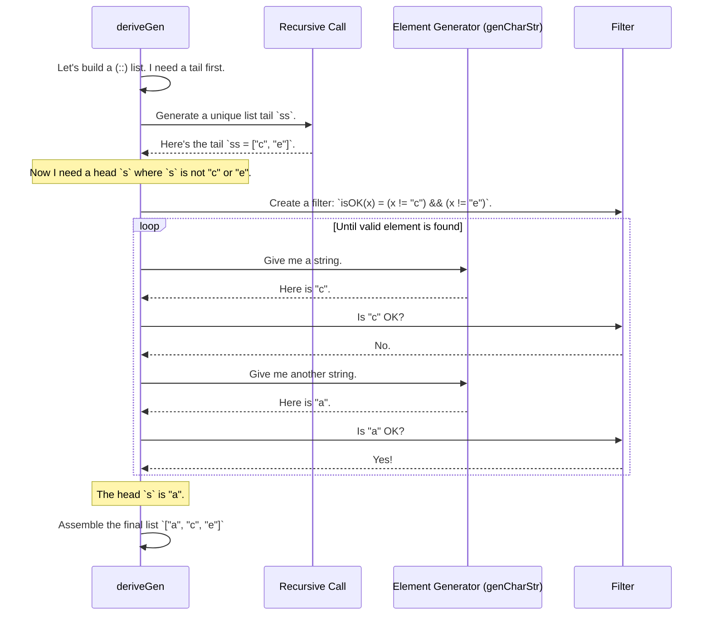

# Chapter 4: Example: `UniqList` and `UniqVect`

In the [previous chapter](03_example___sortedlist__.md), we saw how `DepTyCheck` can automatically generate lists that are guaranteed to be sorted. This was an example of enforcing a property about the *relationship* between adjacent elements.

Now, let's tackle a different kind of constraint: one that applies to the entire collection. We're going to build lists where every single element is provably unique. Think of a lottery ticket: the rules forbid any number from appearing more than once. We want to teach our type system that same rule.

## The Goal: A List Without Duplicates

Imagine you're managing a list of user IDs for a new service. It would be a disaster if two users were assigned the same ID! If you use a regular `List String`, you have to constantly check for duplicates every time you add a new user.

What if your data type for the list simply *refused* to be created if it contained any duplicates? This is exactly what `UniqList` (a list of unique elements) will do. The type system itself will be our guard against duplicates.

## Encoding "Uniqueness" in the Type System

How can we explain "uniqueness" to the Idris compiler? We do it by creating a special "permit" type, just like we did for `SortedList`. We'll call this permit `NotIn`.

First, let's define the `UniqStrList` itself. It looks a lot like a normal list, but with an extra condition.

```idris
-- From: examples/uniq-list/src/Data/List/Uniq.idr

data UniqStrList : Type where
  Nil  : UniqStrList
  (::) : (s : String) -> (ss : UniqStrList) -> s `NotIn` ss => UniqStrList
```
*   `Nil`: An empty list is, by definition, a list of unique elements.
*   `(::)`: To add a new string `s` to an existing `UniqStrList` `ss`, you must provide a permit of type `s `NotIn` ss`. This permit is a proof that `s` is not already in `ss`.

So, what does this `NotIn` permit look like? It's defined recursively.

```idris
-- Also from: examples/uniq-list/src/Data/List/Uniq.idr

data NotIn : String -> UniqStrList -> Type where
  N : NotIn x []
  S : So (x /= s) => x `NotIn` ss -> x `NotIn` (s::ss)
```
Let's break down the rules for getting a `NotIn` permit:
*   `N`: You can *always* get a permit to add an element `x` to an empty list (`[]`). This lets us start building our list.
*   `S`: To get a permit to add `x` to a non-empty list `s::ss`, you need two things:
    1.  A proof that `x` is not equal to the head of the list (`So (x /= s)`).
    2.  A recursive permit that `x` is also not in the rest of the list (`x `NotIn` ss`).

If you try to build a list with duplicates, the compiler will stop you because you won't be able to provide the required permit.

```idris
-- Let's try to build ["b", "a", "b"]
l0 : UniqStrList
l0 = [] -- OK

l1 : UniqStrList
l1 = "a" :: l0 -- OK, using the `N` rule for `NotIn`

l2 : UniqStrList
l2 = "b" :: l1 -- OK, `b /= a` and `b` is not in `[]`

-- Now for the error!
l3 : UniqStrList
l3 = "b" :: l2 -- ERROR!
```
To build `l3`, we'd need a permit ` "b" `NotIn` ["b", "a"] `. The `S` rule requires a proof that `"b" /= "b"`. This is false, so the compiler will fail to find a proof. We are protected from creating a list with duplicates!

## Generating a `UniqList` with `deriveGen`

Building these lists by hand is tedious. Let's ask `deriveGen` to do the heavy lifting.

The signature for this generator is a little different from what we've seen before. Besides `Fuel`, we also need to tell it *how* to generate the individual strings.

```idris
-- From: examples/uniq-list/src/Data/List/Uniq/Gen.idr

import Deriving.DepTyCheck.Gen
import Data.List.Uniq

genUniqStrList : Fuel -> (Fuel -> Gen MaybeEmpty String) => Gen MaybeEmpty UniqStrList
genUniqStrList = deriveGen
```

Look closely at the signature:
- `Fuel`: Our usual budget for recursion.
- `(Fuel -> Gen MaybeEmpty String)`: This is new! It's a "generator for the elements". We are telling `deriveGen`: "To build the `UniqStrList`, you'll need to generate some strings. Here is the recipe you should use to get those strings." This is given as an implicit argument (using `=>`).
- `genUniqStrList = deriveGen`: And as before, the implementation is just one magic line.

To use this generator, we need to provide a string generator. Let's make one that picks from a small set of characters.

```idris
import Data.Fuel

-- A generator for single-character strings
genCharStr : Gen MaybeEmpty String
genCharStr = elements ["a", "b", "c", "d", "e"]

-- Now, let's use it to generate a unique list
main : IO ()
main = do
  -- The `genCharStr` is automatically passed to `genUniqStrList`
  maybeList <- pick1 (genUniqStrList {sub=const genCharStr} (limit 5))
  printLn maybeList
```
The output could be `Just ["c", "a", "e"]` or `Just ["b", "d"]`. It will never be `Just ["a", "c", "a"]`. Notice how we pass our element generator `genCharStr` to `genUniqStrList` using `{sub=...}`.

## How `deriveGen` Solves the Uniqueness Puzzle

This is where `DepTyCheck` gets really clever. How does it avoid duplicates? It can't just run `genCharStr` over and over, because it might randomly pick "a" twice.

`deriveGen` figures out that it needs to "remember" which elements it has already used. It effectively wraps our `genCharStr` in a filter that changes as the list is built.

Here's the step-by-step process, which is similar to a lottery draw:

1.  **Start Building:** `deriveGen` decides to build a cons `(::)` cell for the list.
2.  **Generate the Tail:** It makes a recursive call to generate the tail `ss` first. Let's imagine this call returns `ss = ["c", "e"]`.
3.  **Analyze the Constraint:** Now it needs to generate a head `s` that satisfies the permit `s `NotIn` ["c", "e"]`. This constraint means `s` must not be "c" and `s` must not be "e".
4.  **Create a Stateful Generator:** `deriveGen` takes the `genCharStr` we provided and wraps it in a special "re-try" logic. The logic is:
    *   Run `genCharStr`.
    *   If the result is "c" or "e", throw it away and try again.
    *   If the result is anything else, keep it.
5.  **Generate the Head:** It runs this new, temporary generator.
    *   Attempt 1: `genCharStr` returns "c". The filter rejects it. Try again.
    *   Attempt 2: `genCharStr` returns "a". The filter accepts it! The head `s` is "a".
6.  **Final Assembly:** It now has all the parts: a valid head `s = "a"`, the tail `ss = ["c", "e"]` and the proof that "a" is not in the tail. It assembles them into the final list `["a", "c", "e"]`.

The set of "forbidden" elements is part of the state that `deriveGen` automatically manages for you.



### What about `UniqVect`?

The same logic applies to `UniqVect`, which is a vector (a list with a length encoded in its type) of unique elements.

```idris
-- From: examples/uniq-list/src/Data/Vect/Uniq.idr

data UniqStrVect : Nat -> Type where
  Nil  : UniqStrVect Z
  (::) : (s : String) -> (ss : UniqStrVect n) -> NotIn s n ss => UniqStrVect $ S n
```
The definition is nearly identical, but it also tracks the length `n` at the type level. The `NotIn` constraint works in exactly the same way. When you use [`deriveGen`](02__derivegen___automatic_generator_derivation_.md), it will apply the same stateful "re-try" logic to generate unique elements until the vector is full.

## Conclusion

In this chapter, you've seen one of the most powerful features of `DepTyCheck`: its ability to handle **stateful constraints**.

*   You learned how to define a data type like `UniqList` that enforces global properties like uniqueness using a recursive `NotIn` permit.
*   You saw how `deriveGen` can automatically derive a generator that "remembers" which elements it has already used, effectively filtering a basic element generator to avoid duplicates.
*   This demonstrates that `deriveGen` is not just "gluing" generators together; it's actively analyzing constraints to build sophisticated, state-aware generation logic.

We've now seen how to enforce constraints on ordering (`SortedList`) and uniqueness (`UniqList`). What if we combine these ideas and apply them to a more complex data structure, like a tree?

In the next chapter, we'll do just that as we explore the [Example: `SortedBinTree`](05_example___sortedbintree__.md).

---

Generated by [AI Codebase Knowledge Builder](https://github.com/The-Pocket/Tutorial-Codebase-Knowledge)