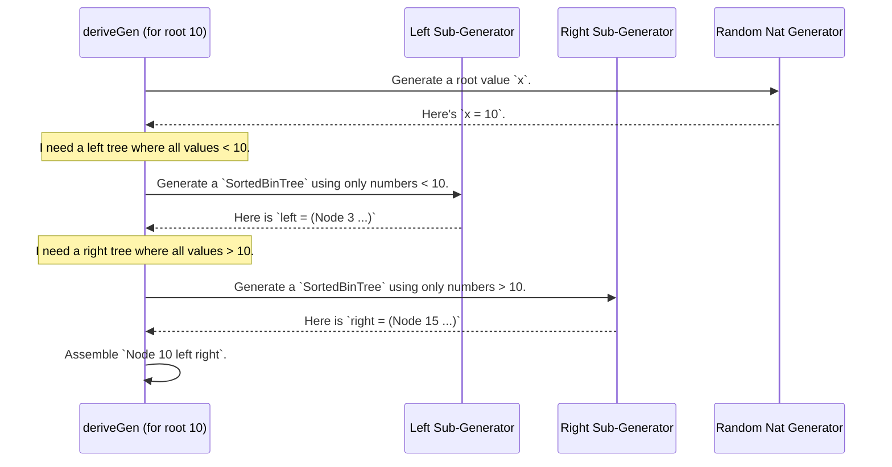

# Chapter 5: Example: `SortedBinTree`

In the [previous chapter](04_example___uniqlist__and__uniqvect__.md), we explored how `DepTyCheck` can generate lists where every element is guaranteed to be unique. This showed us how `deriveGen` can handle "global" properties that apply to the whole collection.

Now, let's take our skills to the next level by combining the ideas of ordering and recursion into a more complex, branching data structure: a binary search tree. We'll build a `SortedBinTree`, where the type system itself acts as a librarian, ensuring every value is always in its correct, sorted place.

## The Goal: A Self-Organizing Tree

Imagine you are building a dictionary or a phone book application. You have millions of entries, and you need to find a specific one very quickly. A simple list is too slow; you'd have to check every entry one by one.

This is a perfect use case for a **Binary Search Tree (BST)**. In a BST, every "node" (or entry) has a value. Everything in its left branch is smaller, and everything in its right branch is larger. To find an entry, you just ask "is my target smaller or larger?" and follow the correct branch, dramatically cutting down the search space at each step.

The problem? A bug in your code that adds a new entry to the wrong place can break this sorting property, making your fast search algorithm give wrong answers or fail entirely.

Our solution is to create a `SortedBinTree` where the compiler *proves* that the sorting property holds. It's like an organization chart where the type system enforces that anyone to the left of a manager joined the company before them, and anyone to the right joined after.

## Encoding the Sorting Property

How do we explain the "left is smaller, right is larger" rule to the Idris compiler? Let's look at one elegant way, found in the `sorted-tree-naive` example directory.

First, we define the tree structure itself:

```idris
-- From: examples/sorted-tree-naive/src/Data/SortedBinTree.idr

data SortedBinTree : Type where
  Empty : SortedBinTree
  Node  : (x : Nat) -> (left, right : SortedBinTree) ->
          AllLT x left => AllGT x right => SortedBinTree
```

*   `Empty`: An empty tree is a valid `SortedBinTree`.
*   `Node`: This is the core of our definition. To create a `Node` with a value `x`, a left subtree, and a right subtree, you must provide two "permits":
    1.  `AllLT x left`: A proof that **ALL** values in the `left` subtree are **L**ess **T**han `x`.
    2.  `AllGT x right`: A proof that **ALL** values in the `right` subtree are **G**reater **T**han `x`.

These `AllLT` and `AllGT` permits are types that recursively check the entire subtree to make sure the property holds.

```idris
-- Simplified definition of AllLT
data AllLT : Nat -> SortedBinTree -> Type where
  EmptyLT : AllLT ref Empty
  NodeLT  : x `LT` ref -> AllLT ref l -> AllLT ref r ->
            AllLT ref (Node x l r)
```

This says: "How do I get a proof that `AllLT ref someTree`?
*   If `someTree` is `Empty`, you're good.
*   If `someTree` is a `Node x l r`, you need three things: the node's value `x` must be less than `ref`, and you recursively need proofs for the left (`l`) and right (`r`) subtrees.

If you try to build a tree like `Node 10 (Node 15 Empty Empty) Empty`, the compiler will complain because it can't find a proof for `AllLT 10 (Node 15 ...)`. Specifically, it would get stuck trying to prove `15 < 10`, which is impossible!

## Generating a `SortedBinTree` with `deriveGen`

As you can imagine, building a valid `SortedBinTree` by hand is a serious puzzle. You have to thread all the `AllLT` and `AllGT` proofs correctly. This is a perfect job for our automated factory, `deriveGen`.

```idris
-- From: examples/sorted-tree-naive/src/Data/SortedBinTree/Gen.idr

import Deriving.DepTyCheck.Gen

export
genSortedBinTree : Fuel -> Gen MaybeEmpty SortedBinTree
genSortedBinTree = deriveGen
```

Once again, the implementation is a single, magical line. You write the "order form" (the type signature `Fuel -> Gen MaybeEmpty SortedBinTree`) and `deriveGen` does the rest. It will automatically figure out how to generate random numbers and place them into the tree structure while satisfying all the constraints.

Running this generator would produce perfectly formed binary search trees:
```idris
-- In an IO block...
maybeTree <- pick1 (genSortedBinTree defaultFuel)

-- A possible result:
-- Just (Node 5 (Node 2 Empty Empty) (Node 8 Empty Empty))
--
--        5
--       / \
--      2   8
--
-- This will NEVER be produced:
-- Just (Node 5 (Node 9 Empty Empty) (Node 8 Empty Empty))
```

## How Does `deriveGen` Build the Tree?

This seems like `deriveGen`'s most impressive trick yet. How does it know how to partition the number space to satisfy the `AllLT` and `AllGT` constraints? It doesn't just generate numbers randomly; it generates them within specific, calculated bounds.

Here is a step-by-step look at `deriveGen`'s thought process when building a `Node`:

1.  **Choose a Root Value:** It starts by generating a random `Nat` to be the root of the current subtree. Let's say it picks `x = 10`.
2.  **Generate the Left Subtree:** Now it needs to create the `left` subtree. It knows it needs a permit `AllLT 10 left`. `deriveGen` analyzes this and understands it means that *every value* inside the `left` tree must be less than 10.
3.  **Constrained Recursive Call (Left):** It makes a recursive call to `genSortedBinTree`. But this time, it's a special call with an *invisible upper bound*. It tells the sub-generator, "Feel free to build a tree, but you are only allowed to use numbers from `0` to `9`."
4.  **Generate the Right Subtree:** Next, it needs to create the `right` subtree, which requires the permit `AllGT 10 right`. This means every value in `right` must be greater than 10.
5.  **Constrained Recursive Call (Right):** It makes another recursive call to `genSortedBinTree`, telling this sub-generator, "Your turn! You can build a tree using any numbers from `11` upwards."
6.  **Assemble the Node:** Once the sub-generators return a valid left tree (e.g., `Node 3 ...`) and a valid right tree (e.g., `Node 15 ...`), `deriveGen` assembles them into the final `Node 10 left right`.

This process of dynamically creating sub-generators with constrained ranges is what allows `deriveGen` to solve these complex, branching puzzles.



## An Alternative Encoding: Indexed Trees

The previous method worked by using permit types (`AllLT`, `AllGT`). Another clever way to define a `SortedBinTree` is to embed the minimum and maximum bounds of the tree directly into its type. This is what the `sorted-tree-indexed` example does.

```idris
-- From: examples/sorted-tree-indexed/src/Data/SortedBinTree.idr

data SortedBinTree1 : (mi, ma : Nat) -> Type where
  Leaf : (x : Nat) -> SortedBinTree1 x x
  Node : (left : SortedBinTree1 lmi lma) ->
         (right : SortedBinTree1 rmi rma) ->
         lma `LT` rmi => SortedBinTree1 lmi rma
```

This definition is dense but powerful:
*   `SortedBinTree1 mi ma`: This type represents a tree where every single value is guaranteed to be between `mi` and `ma`, inclusive.
*   `Leaf x`: A tree with only one element `x` has a min and max of `x`.
*   `Node left right`: To combine two subtrees, the type system demands a proof that the **max** value of the left tree (`lma`) is **L**ess **T**han the **min** value of the right tree (`rmi`). This *is* the binary search tree property, encoded directly! The new, combined tree has bounds from the min of the left subtree (`lmi`) to the max of the right subtree (`rma`).

Generating this version with `deriveGen` is just as easy, though the signature looks a little different.

```idris
-- From: examples/sorted-tree-indexed/src/Data/SortedBinTree/Gen.idr

genSortedBinTree1 : Fuel -> Gen MaybeEmpty (mi ** ma ** SortedBinTree1 mi ma)
genSortedBinTree1 = deriveGen
```

Because `mi` and `ma` are not given as inputs, `deriveGen` will generate them for us. The generator returns a dependent pair `(mi ** ma ** SortedBinTree1 mi ma)`, which bundles up the generated tree along with its now-proven minimum and maximum bounds.

`deriveGen` handles this version by recursively generating subtrees, getting their bounds back, and then re-trying if the `lma < rmi` constraint isn't met.

## Conclusion

You've now successfully tackled a genuinely complex, dependently-typed data structure! This chapter has demonstrated `DepTyCheck`'s remarkable ability to reason about recursive definitions with branching constraints.

You have learned:
*   How to encode the binary search tree property into a type using either explicit proof-like permits (`AllLT`) or by indexing the type with bounds (`mi`, `ma`).
*   That `deriveGen` is powerful enough to understand these constraints and automatically build valid, complex structures.
*   The core strategy `deriveGen` uses: passing down constrained value ranges to recursive calls to "partition" the problem space.

So far, we have focused on constraints related to the *values* within a data structure (sorted, unique, etc.). But what about constraints on the *shape* or *structure* of the data itself?

In the next chapter, we'll investigate this by looking at an example that generates sequences with a special structural property. Get ready for the [Example: `CoveringSequence`](06_example___coveringsequence__.md).

---

Generated by [AI Codebase Knowledge Builder](https://github.com/The-Pocket/Tutorial-Codebase-Knowledge)