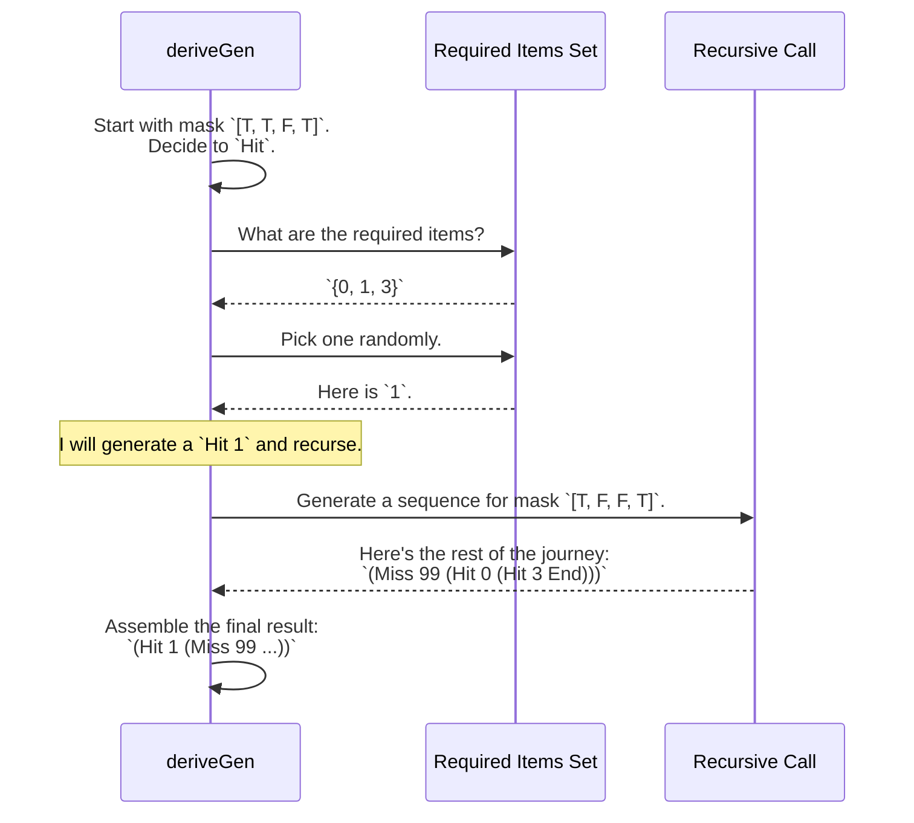

# Chapter 6: Example: `CoveringSequence`

In the [previous chapter](05_example___sortedbintree__.md), we saw how `DepTyCheck` could generate complex, branching data structures like sorted binary trees by cleverly partitioning the space of possible values. The constraints we've seen so far (`SortedList`, `UniqList`, `SortedBinTree`) have been mostly about the *order* or *uniqueness* of values.

Now, let's explore a different kind of problem: what if we need to ensure a collection contains a specific set of values, but we don't care about the order they appear in, and we don't mind other "junk" values being mixed in?

## The Goal: A Scavenger Hunt Checklist

Imagine you're organizing a video game scavenger hunt. Players are given a checklist of achievements they must unlock. Let's say the list is:
*   Find the Golden Key (Achievement #0)
*   Defeat the Dragon (Achievement #1)
*   Solve the Sphinx's Riddle (Achievement #3)

A player's journey is a sequence of events. They might find the key, then do some side quests (which aren't on the checklist), then solve the riddle, and finally defeat the dragon. Their journey is a success only if they have eventually ticked off every required item. The order doesn't matter, and the side quests are irrelevant to their success.

How can we model this in the type system? We want a `CoveringSequence` type that is only valid if it "covers" all the required items from a checklist.

## Encoding the Scavenger Hunt Rules

To build this, we need two components: the "checklist" and the "journey" itself.

### 1. The Checklist: `BitMask`

We can represent our scavenger hunt checklist as a list of `Bool`s. `True` means "you must find this item," and `False` means "you don't need to find this item." We call this a `BitMask`.

```idris
-- From: examples/covering-seq/src/Data/List/Covering.idr

-- A BitMask is just a list of Bools with its length in the type
data BitMask : (bits : Nat) -> Type where
  Nil  : BitMask 0
  (::) : Bool -> BitMask n -> BitMask (S n)
```

For our scavenger hunt example, if we have 4 possible achievements in the game, the checklist `[True, True, False, True]` means we need to find items 0, 1, and 3. Item 2 is optional.

### 2. The Journey: `CoveringSequence`

Now for the `CoveringSequence`, which records the player's journey. It's defined recursively, representing one step at a time.

```idris
-- From: examples/covering-seq/src/Data/List/Covering.idr

data CoveringSequence : (n : Nat) -> BitMask n -> Type where
  End  : AllBitsAre n False bs => CoveringSequence n bs
  Miss : Nat -> CoveringSequence n bs -> CoveringSequence n bs
  Hit  : (i : Fin n) -> AtIndex n i bs True =>
         CoveringSequence n (update i False bs) -> CoveringSequence n bs
```

This looks complicated, so let's break it down using our analogy. A journey can be one of three things:

*   `Hit i`: "You found a required item!" This is the most important step. When you record a `Hit` for item `i`:
    1.  You must provide a permit (`AtIndex n i bs True`) proving that item `i` was actually on your checklist (`True` in the `BitMask`).
    2.  The rest of your journey, `CoveringSequence n (update i False bs)`, now has an **updated checklist**. The `update` function "ticks off" item `i` by changing its entry in the `BitMask` to `False`.

*   `Miss k`: "You saw something else." You recorded an event `k` that wasn't on the checklist. This is fine. The rest of your journey continues with the *exact same* checklist.

*   `End`: "The journey is over." You can only end the journey if you can provide a permit (`AllBitsAre n False bs`) that proves your checklist is now empty (all `False`s). This guarantees you've found everything you were supposed to.

Let's look at a valid journey for the checklist `[True, True, False, True]`:

```idris
-- Hit item 1, then Miss item 20, then Hit item 0, then Hit item 3.
myJourney : CoveringSequence 4 [True, True, False, True]
myJourney = Hit 1 (Miss 20 (Hit 0 (Hit 3 End)))
```
This is valid because we hit all the required items (0, 1, and 3), and when we get to `End`, the checklist has been updated to `[False, False, False, False]`. An invalid journey like `Hit 2 ...` would be a compile-time error because `Hit 2` requires the bit at index 2 to be `True`, but it's `False`.

## Generating a `CoveringSequence` with `deriveGen`

Building these sequences by hand is a pain. You have to track how the `BitMask` changes with every `Hit`. This is a perfect problem for `DepTyCheck`.

We just need to write the function signature and let [`deriveGen`](02__derivegen___automatic_generator_derivation_.md) do its thing. The signature says: "Given a `BitMask`, please generate a valid journey that covers it."

```idris
-- From: examples/covering-seq/src/Data/List/Covering/Gen.idr

import Deriving.DepTyCheck.Gen

export
genCoveringSequence : Fuel -> {n : Nat} -> (bs : BitMask n) ->
                      Gen MaybeEmpty (CoveringSequence n bs)
genCoveringSequence = deriveGen
```

That's it! To use it, we provide a starting `BitMask` and some `Fuel`.

```idris
-- In our main IO function...
let myChecklist = [True, True, False, True]
maybeJourney <- pick1 (genCoveringSequence defaultFuel myChecklist)
```

A possible output could be `Just (Hit 3 (Miss 42 (Hit 0 (Hit 1 End))))`. Note that the order is random, and random `Miss` values are sprinkled in. But no matter what, the generated sequence will *always* contain a `Hit` for items 0, 1, and 3, and for no others.

## How `deriveGen` Completes the Scavenger Hunt

This is a fascinating puzzle. How does `deriveGen` know which `Hit`s it still needs to generate? It has to look at the `BitMask` at each step.

Here's a step-by-step of `deriveGen`'s logic:

1.  **Analyze the Checklist:** `deriveGen` receives the current `BitMask`, for example, `[True, True, False, True]`. This is its current state of the scavenger hunt.
2.  **Choose a Path:** It randomly decides what to do next: `Hit`, `Miss`, or `End`.
    *   It can only choose `End` if the `BitMask` is all `False`.
    *   It can always choose `Miss`.
    *   It can only choose `Hit` if there's at least one `True` in the `BitMask`.
3.  **If it chooses `Hit`:**
    *   **Find a Target:** It scans the `BitMask` for all indices that are `True`. In our example, that's `{0, 1, 3}`.
    *   **Pick a Target:** It randomly picks one of these required items. Let's say it picks `1`.
    *   **Make a Recursive Call:** It then makes a recursive call to `genCoveringSequence`, but with the **updated** checklist: `[True, False, False, True]`. The `Hit 1` is prepended to the result of this recursive call.
4.  **If it chooses `Miss`:**
    *   **Generate Junk:** It generates a random number for the miss, say `99`.
    *   **Make a Recursive Call:** It recursively calls `genCoveringSequence` with the **same** checklist: `[True, True, False, True]`. The `Miss 99` is prepended to the result.

This process continues until the checklist is all `False`s, at which point `End` is generated, and the full sequence is returned.



`deriveGen` is smart enough to see that the `Hit` constructor has a dependency: `AtIndex n i bs True`. It satisfies this by first generating `i` from the set of valid indices and only then making the recursive call. This ensures that only valid `Hit`s are ever created.

## Conclusion

This chapter demonstrated how `DepTyCheck` handles a very different kind of constraint: **set coverage** or a "bag of values" property.

You have learned:
*   How to encode a "checklist" requirement using a `BitMask` and a recursive `CoveringSequence` type.
*   That the type system can track state across a sequence, like "ticking off" items from a list as they are found.
*   How `deriveGen` handles this by analyzing the `BitMask` at each step to decide which moves are valid, and updating the state for its recursive calls.

We've now seen `DepTyCheck` handle constraints on sorting, uniqueness, bounds, and set coverage. These are powerful building blocks. In the next chapters, we will apply these skills to a much larger and more practical example: generating valid programs for a toy programming language, complete with registers, functions, and dynamic memory.

Get ready to test a compiler! Next up: [Example: PIL (Primitive Imperative Language) with Registers](07_example__pil__primitive_imperative_language__with_registers_.md).

---

Generated by [AI Codebase Knowledge Builder](https://github.com/The-Pocket/Tutorial-Codebase-Knowledge)