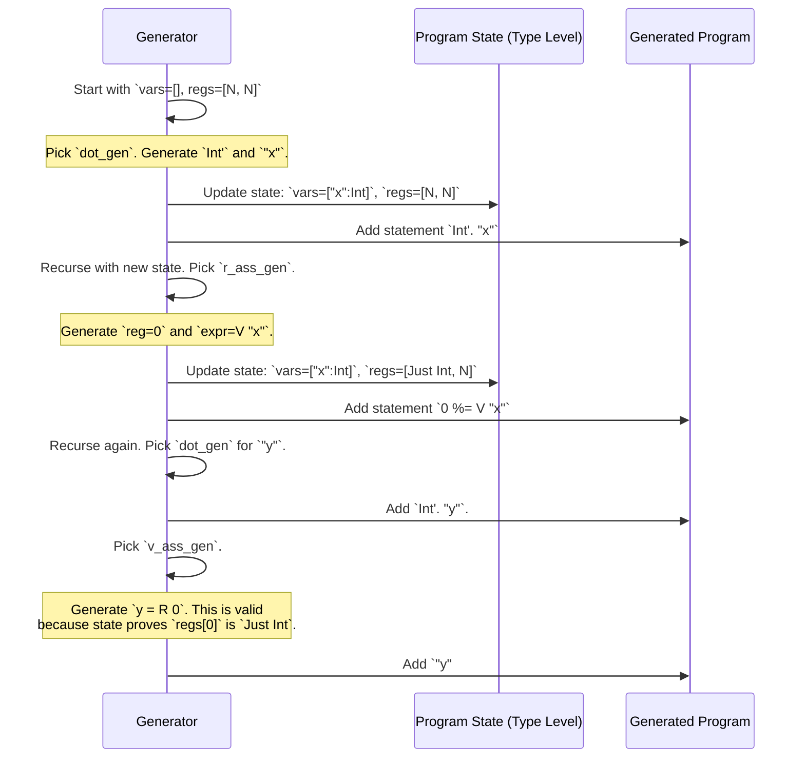

# Chapter 7: Example: PIL (Primitive Imperative Language) with Registers

In the [previous chapter](06_example___coveringsequence__.md), we created a generator for sequences that had to contain a specific set of items, showing how `DepTyCheck` can handle "set coverage" properties. We've mastered generating data with constraints on its values and structure. Now, let's take a giant leap forward and apply these ideas to generate not just data, but entire computer programs.

## The Goal: A Tiny, Type-Safe CPU

Imagine you're designing a new programming language or a static analyzer that checks for bugs. How do you test it? You need a huge number of example programs—some simple, some complex, some that use edge cases—to make sure your tool works correctly. Writing all these test programs by hand is incredibly time-consuming and you're bound to miss things.

This chapter introduces **PIL (Primitive Imperative Language)**, a small, C-like language embedded directly inside Idris. PIL is special because the Idris type checker acts as its compiler. It won't just check for syntax errors; it will prove that your PIL program is type-safe *before it even runs*.

For example, the type system will track:
*   Which variables are currently declared and what their types are (`Int`, `String`, etc.).
*   The state of a fixed number of CPU "registers" and whether they hold a value.

This makes it impossible to write a PIL program that reads from an uninitialized variable or uses a register for the wrong type. Our goal is to use `DepTyCheck` to automatically generate an endless supply of complex, but provably correct, PIL programs.

## The Big Idea: Tracking State in the Type

The core magic of PIL is its `Statement` type. A PIL program is a sequence of `Statement`s. A `Statement` represents a single action, like declaring a variable or assigning a value. Its type definition cleverly encodes the "state of the world" *before* and *after* the statement runs.

```idris
-- From: examples/pil-reg/src/Example/Pil/Lang/Statement.idr
data Statement : (preV  : Variables) -> (preR  : Registers rc) ->
                 (postV : Variables) -> (postR : Registers rc) ->
                 Type
```

This looks scary, but it's just a formal way of saying: "A `Statement` is a transformation from a 'before' state to an 'after' state."

*   `preV`: The list of variables available **before** the statement.
*   `preR`: The types of values in our CPU registers **before** the statement.
*   `postV`: The list of variables available **after** the statement.
*   `postR`: The types of values in our registers **after** the statement.

Let's look at a few statements to see how they change the state.

### Declaring a Variable

In a language like C, you might write `int x;`. In PIL, this is `Int'. "x"`.

```idris
-- C-like: int x;
-- PIL:    Int'. "x"

-- Its type in the Statement GADT:
(.) : (ty : Type') -> (n : Name) -> Statement vars regs ((n, ty)::vars) regs
```
This says: Declaring a variable `n` of type `ty` takes a state `(vars, regs)` and produces a new state where the list of variables `vars` now has `(n, ty)` at the front. The registers are unchanged.

### Assigning to a Register

Imagine we have a CPU with 4 registers. Let's assign the number 42 to register #3.

```idris
-- PIL: 3 %= C 42
-- (`C 42` is a constant integer expression)

-- Its type:
(%=) : (reg : Fin rc) -> Expression vars preR ty ->
      Statement vars preR vars (preR `With` (reg, Just ty))
```
This is the coolest part! This statement takes a "before" register state `preR` and produces an "after" state `preR `With` (reg, Just ty)`. The `With` is a type-level instruction that tells the compiler, "The state of the registers is the same as before, *except* we now know that register `reg` definitely contains a value of type `ty`."

### Reading From a Register

What happens when we want to use the value in a register?

```idris
-- PIL: Int'. "y" !#= R 2
-- (Declare a new int 'y' and assign it the value from register #2)

-- The type of the `R` (Register) expression:
R : (r : Fin rc) -> (0 _ : IsJust $ index r regs) => Expression ...
```
To read from a register `r`, you must provide a "permit" of type `IsJust (index r regs)`. This permit is a proof that the register `r` is actually initialized (`Just SomeType`) and not empty (`Nothing`). If you try to write `R 2` when the type of `regs` shows register 2 is empty, the Idris compiler will give you a type error! It has prevented a classic runtime bug at compile time.

## Generating PIL Programs

Manually writing these state-transforming programs is tricky. It's a perfect job for automation. However, the logic is too complex for a simple [`deriveGen`](02__derivegen___automatic_generator_derivation_.md) call. Instead, the `pil-reg` example uses a custom, hand-written generator that follows the same principles.

Let's look at its signature. We want to generate a program starting from a blank slate: no variables and no initialized registers.

```idris
-- From: examples/pil-reg/tests/gens/demo001/DemoGen.idr
someStatementGen : {rc : Nat} -> Gen0 (postV ** postR ** Statement [] (AllUndefined {rc}) postV postR)
```
Let's break this down:
- `{rc : Nat}`: We can pick how many registers our toy CPU has.
- `Statement [] (AllUndefined {rc}) ...`: The program starts with zero variables (`[]`) and a register state where every register is `Nothing` (`AllUndefined`).
- `Gen0 (postV ** postR ** ...)`: The generator doesn't just return a `Statement`. It returns a dependent pair (`**`) containing the a`f`ter-state (`postV`, `postR`) *and* the program that achieves it.

The generator works by randomly picking which kind of statement to generate next, and then recursively calling itself with the *new* state.

```idris
-- From: examples/pil-reg/src/Example/Pil/Gens.idr
statement_gen (More f) preV preR = frequency
  [ (1,   nop_gen   f preV preR) -- do nothing
  , (5,   dot_gen   f preV preR) -- declare a variable
  , (50,  v_ass_gen f preV preR) -- assign to variable
  , (50,  r_ass_gen f preV preR) -- assign to register
  , (200, seq_gen   f preV preR) -- chain two statements
  , ...
  ]
```
The `frequency` function lets us give weights to different choices, so we can guide the generator to produce more interesting programs (e.g., more assignments than `nop`s).

### How a Program is Built, Step-by-Step

Let's trace how the generator might build a simple program.

1.  **Initial State:** `vars = []`, `regs = [Nothing, Nothing]`
2.  The generator randomly picks `dot_gen` (declare variable). It generates a `String`. `x` and a `Type`. `Int'`.
    *   **Statement:** `Int'. "x"`
    *   **New State:** `vars = [("x", Int')]`, `regs = [Nothing, Nothing]`
3.  It recursively calls itself with this new state. It picks `v_ass_gen` (assign to variable). It sees `"x"` is available and generates `C 10`.
    *   **Statement:** `"x" #= C 10`
    *   **New State:** (Types are unchanged) `vars = [("x", Int')]`, `regs = [Nothing, Nothing]`
4.  It calls itself again. This time it picks `r_ass_gen` (assign to register). It generates a register index `0` and an expression `V "x"`.
    *   **Statement:** `0 %= V "x"`
    *   **New State:** `vars = [("x", Int')]`, `regs = [Just Int', Nothing]`
5.  Finally, it chains these all together using the `>>` operator.

The generator has successfully built a program and, more importantly, it has tracked the type-level state at every step to ensure the program is valid.



### Chaining Statements Together

The most important part of the manual generator is the one that chains statements together, `seq_gen`. This is what builds up longer programs.

```idris
-- Simplified from: examples/pil-reg/src/Example/Pil/Gens.idr
seq_gen : ... -> Gen0 (postV ** postR ** Statement preV preR postV postR)
seq_gen f preV preR = do
  -- Generate the first part of the program
  (midV ** midR ** left) <- statement_gen f preV preR

  -- Generate the second part, starting from where the first part left off
  (postV ** postR ** right) <- statement_gen f midV midR

  -- Combine them and return the final state and combined program
  pure (postV ** postR ** left >> right)
```
This elegant `do` block perfectly captures the logic:
1.  Generate a `left` statement that transforms our starting state `(preV, preR)` into an intermediate state `(midV, midR)`.
2.  Generate a `right` statement that starts from that intermediate state `(midV, midR)` and ends in our final state `(postV, postR)`.
3.  Combine them with `>>` to form a single, larger program.

## Conclusion

This chapter was a deep dive into one of `DepTyCheck`'s most powerful applications: generating entire, valid programs for a domain-specific language.

*   You learned how a type system can be used to model the state of an imperative program, tracking variables and registers to prevent bugs at compile time.
*   You saw that while [`deriveGen`](02__derivegen___automatic_generator_derivation_.md) is amazing, some complex, stateful problems require carefully hand-written generators.
*   You understood the core recursive strategy: generate one small piece, update the state, and then recurse with the new state to generate the next piece.

This `pil-reg` example is like a tiny, type-safe CPU simulator. But real programming languages have more than just variables and registers; they have functions! How could we possibly model function calls, separate scopes, and return values in the type system?

That's exactly what we'll explore in the next chapter, as we upgrade our language. Get ready for [Example: PIL with Functions](08_example__pil_with_functions_.md).

---

Generated by [AI Codebase Knowledge Builder](https://github.com/The-Pocket/Tutorial-Codebase-Knowledge)