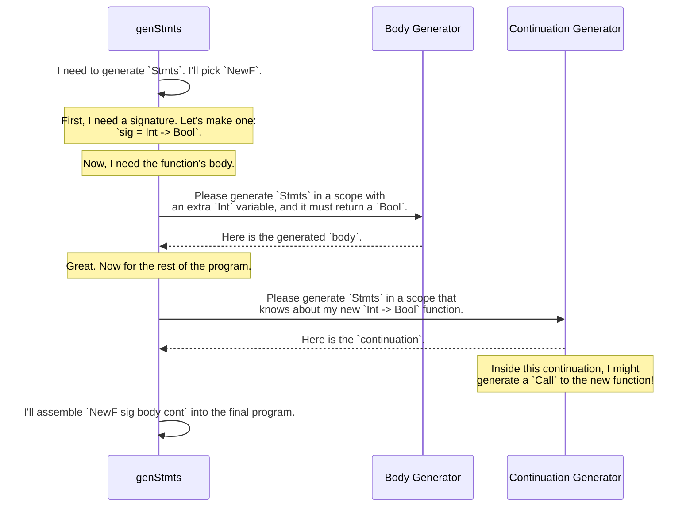

# Chapter 8: Example: PIL with Functions

In the [previous chapter](07_example__pil__primitive_imperative_language__with_registers_.md), we built a tiny, type-safe programming language called PIL. We successfully generated programs that were proven correct by the Idris type system, which acted as our own personal compiler, preventing bugs like reading from uninitialized registers.

Our language was powerful, but it was missing a crucial feature found in almost every real-world language: **functions**. This chapter will show you how `DepTyCheck` can handle the mind-bending complexity of generating programs with function definitions, argument passing, separate variable scopes, and return values.

## The Goal: A Language We Can Actually Use

Imagine trying to write a large program without functions. You'd be copying and pasting the same chunks of code over and over again. It would be a nightmare to read and maintain. Functions allow us to package up logic, give it a name, and reuse it.

We want to upgrade our PIL to support functions. For example, we want to be able to write something conceptually like this:

```
// Define a function "add" that takes two integers and returns an integer
function add(x: Int, y: Int) -> Int {
  return x + y;
}

// Now use it in our main program
let z = add(5, 10);
print(z); // Should print 15
```

The challenge is to model all of this—function signatures, local variables (`x`, `y`), and return values—at the type level, so that `DepTyCheck` can generate valid, complex programs automatically.

## The Big Idea: Tracking Functions and Scopes in Types

Just like in the last chapter, the secret is to embed the program's state into its type. We already tracked variables and registers. Now we need to add two more things:

1.  A list of all functions that have been defined so far.
2.  The scope of variables, distinguishing between global variables and the local arguments inside a function.

Let's see how the `pil-fun` example achieves this.

### Step 1: The Function's Blueprint (`FunSig`)

First, we need a way to describe what a function looks like. This is its "signature". We create a simple `FunSig` record for this.

```idris
-- From: examples/pil-fun/src/Language/PilFun.idr

-- A list of types for the arguments
data SnocListTy : Type where
  Lin  : SnocListTy       -- An empty list of arguments
  (:<) : SnocListTy -> Ty -> SnocListTy -- Add an argument type

-- The function signature itself
record FunSig where
  constructor (==>)
  From : SnocListTy  -- The types of the arguments it takes
  To   : MaybeTy     -- The type it returns (or Nothing for void)
```

A signature like `[< Int', Int'] ==> Just Int'` represents a function that takes two `Int`s and returns an `Int`. A signature like `[< Int'] ==> Nothing` represents a function that takes one `Int` and returns nothing (like a `print` function).

### Step 2: Adding Functions to Our Language (`Stmts`)

Now we upgrade our `Stmts` type. It now needs to track the list of available functions (`Funs`) and variables (`Vars`).

```idris
-- From: examples/pil-fun/src/Language/PilFun.idr

data Stmts : (funs : Funs) -> (vars : Vars) -> (retTy : MaybeTy) -> Type
```
This says: "A program (`Stmts`) is defined in a context with a list of known `funs` and `vars`, and it's expected to eventually return a value of type `retTy`."

Let's look at the key new constructors for `Stmts`.

#### Defining a New Function: `NewF`

This is the most important constructor. It lets us define a new function and add it to our list of known functions for the rest of the program (`cont`).

```idris
-- A simplified view of NewF
NewF : (sig : FunSig) ->                             -- The signature of our new function
       (body : Stmts funs (vars ++ sig.From) sig.To) -> -- The function's body
       (cont : Stmts (funs :< sig) vars retTy) ->     -- The rest of the program
       Stmts funs vars retTy
```

Let's break down this beautiful piece of type-level engineering:
1.  `sig`: The signature, like `[< Int'] ==> Just Bool'`.
2.  `body`: This is the code *inside* our new function. Look at its type! It operates in a new scope: `vars ++ sig.From`. This is type-level magic for "take the current variables `vars` and add the function's arguments `sig.From` to the scope". It also knows that it must return a value matching the signature's return type, `sig.To`.
3.  `cont`: This is the code that runs *after* the function has been defined. Its list of available functions has been updated to include our new one: `funs :< sig`.

#### Calling a Function: `F` (in an `Expr`) and `Call` (as a `Stmt`)

To call a function, we use the `F` constructor inside an `Expr` (if it returns a value) or the `Call` constructor as a `Stmt` (if it returns nothing).

```idris
-- Simplified view of the function call expression
F : (n : IndexIn funs) ->             -- The function to call
    AtIndex n (from ==> Just to) =>  -- A permit: it must return a value
    ExprsSnocList funs vars from ->   -- The arguments we pass
    Expr funs vars to                -- The result is an expression of the return type
```

The permit `AtIndex n (from ==> Just to)` is the type system acting as our compiler. It forces you to prove that the function you're calling actually returns a value. It also checks that the `ExprsSnocList` (the arguments you provide) have types that match the function's `from` signature.

## Generating Function-Filled Programs with `deriveGen`

Manually building these programs would be incredibly complex. You'd have to track all the scopes and types yourself. But for `DepTyCheck`, this is just another day at the office. We simply ask [`deriveGen`](02__derivegen___automatic_generator_derivation_.md) to do the work.

```idris
-- From: examples/pil-fun/src/Language/PilFun/Derived.idr

genStmts : Fuel -> (funs : Funs) -> (vars : Vars) -> (retTy : MaybeTy) ->
           Gen MaybeEmpty (Stmts funs vars retTy)
genStmts = deriveGen
```

This one-line definition creates a generator that can build arbitrarily complex and deeply nested programs with functions, loops (`If`), and variables, all while guaranteeing that every generated program is 100% type-safe.

### How Does `deriveGen` Write a Program?

This seems impossible. How does `deriveGen` handle the mutual recursion of defining a function (`NewF`) which itself contains a program (`body`)? It follows the types, breaking the problem down into smaller and smaller pieces.

Let's see how it might generate `NewF`:

1.  **Goal:** Generate a `Stmts`. It randomly chooses the `NewF` constructor.
2.  **To-Do List for `NewF`:**
    *   A signature `sig`.
    *   A function body `body`.
    *   A continuation `cont`.
3.  **Generate Signature:** It generates a random `FunSig`, say `[< Int'] ==> Just Bool'`.
4.  **Generate Body:** Now for the hard part. It needs to generate the `body`. It sees from the type that this requires a recursive call to `genStmts`. But crucially, it's a call with a **new context**:
    *   `genStmts fuel (funs) (vars ++ [< Int']) (Just Bool')`
    This call will generate a program snippet that assumes an extra `Int` variable is in scope (the argument) and that it *must* return a `Bool`.
5.  **Generate Continuation:** After generating the body, it needs to generate the rest of the program, `cont`. Again, it makes a recursive call to `genStmts`, but with a different new context:
    *   `genStmts fuel (funs :< sig) (vars) (retTy)`
    This call generates a program that knows about the newly defined function (`funs :< sig`) and can now `Call` it.

`deriveGen` has flawlessly navigated the complex dependencies, generating each part of the program in the correct context.



## The Grand Finale: Transpiling to Other Languages

The most exciting part of the `pil-fun` example is what it does with these generated programs. It includes "pretty-printers" that can translate the `Stmts` data structure into actual, runnable code in other languages!

After using `genStmts` to create a random, valid program, we can pass it to `printScala3` or `printLua5_4` to get a real program.

For example, `DepTyCheck` might generate a `Stmts` value representing this logic:
*   Define a function `f0` that takes one `Int` argument `v0` and returns `v0 > 10`.
*   Declare a variable `v1`.
*   Call `f0` with the argument `20`.
*   Assign the result (`True`) to `v1`.

When passed to the Scala pretty-printer, this `Stmts` value would be turned into the following string of code:

```scala
def f0(v0 : Int): Boolean =
  v0 > 10

val v1 : Boolean =
  f0(20)
```

This is the ultimate test. We are not just generating abstract data; we are automatically writing correct, complex programs in mainstream languages.

## Conclusion

This chapter demonstrated one of the most advanced capabilities of `DepTyCheck`: modeling and generating programs for a language with functions and lexical scope.

*   You learned how function signatures, scopes, and return types can be encoded in a dependently-typed data structure (`Stmts`).
*   You saw that `deriveGen` can automatically handle the mind-boggling recursion needed to generate function bodies in their correct, local scope.
*   You discovered the practical power of this approach: we can now automatically generate an infinite number of type-safe test programs and even transpile them to other languages.

Our PIL is becoming quite sophisticated. But it still has a limitation from the `pil-reg` example: a fixed number of registers. What if we wanted a language that could allocate memory or registers dynamically? That sounds even more complicated, but `DepTyCheck` is up to the challenge.

In the next chapter, we'll explore just that: [Example: PIL with Dynamic Registers](09_example__pil_with_dynamic_registers_.md).

---

Generated by [AI Codebase Knowledge Builder](https://github.com/The-Pocket/Tutorial-Codebase-Knowledge)