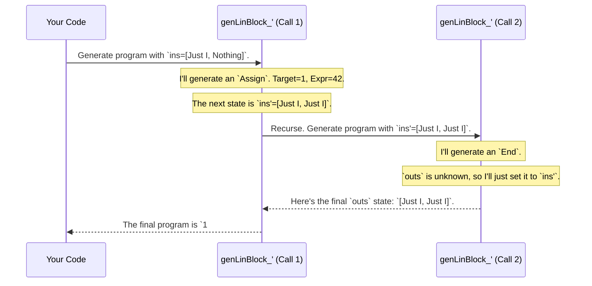

# Chapter 9: Example: PIL with Dynamic Registers

In the [previous chapter](08_example__pil_with_functions_.md), we built an impressive version of our toy language, PIL, complete with functions and lexical scopes. It was a powerful demonstration of how `DepTyCheck` can generate complex, structured programs. However, that language, and the register-based one before it, had a fixed number of registers determined at the start.

What if we want to be more flexible? What if we want to generate programs without even knowing what the initial state of the registers should be? This chapter introduces `pil-dyn`, a streamlined version of PIL designed to explore this very idea. We'll see how `DepTyCheck` can work with different levels of "known" information. It's like giving a GPS a specific destination versus just telling it to "drive somewhere interesting and report back."

## The Goal: A Typed Assembly Language

Imagine you're writing a low-level compiler that translates a high-level language into machine code. A core part of this is managing the CPU registers. You need to know that if you put an integer into register `R1`, you don't accidentally try to use it later as if it were a memory address.

The `pil-dyn` example models this exact scenario. It's a tiny, typed assembly language where a program is just a linear sequence of instructions. The type system's job is to act like a static analyzer, precisely tracking what type of value is in each register at every single step of the program.

Our goal is to use `DepTyCheck` to automatically generate valid assembly programs. More importantly, we'll see how we can ask `DepTyCheck` different kinds of questions:
*   "Generate *any* valid program."
*   "Generate a program that *ends* with an integer in Register 0."
*   "Generate a program that *starts* with empty registers and ends with them full."

## The `LinBlock` Type: A Contract for Your Code

The heart of `pil-dyn` is the `LinBlock` type. It represents a "linear block" of instructions and acts as a contract that describes what the program does to the registers.

```idris
-- From: examples/pil-dyn/src/Language/PilDyn.idr

data LinBlock : (ins, outs : Regs r) -> Type
```
This signature says: "`LinBlock` is a program that transforms a register state `ins` into a register state `outs`."

*   `Regs r`: This type represents the state of `r` registers. It's essentially a list of types. For example, `[Just I, Nothing, Just B]` means:
    *   Register 0 holds an Integer (`I`).
    *   Register 1 is empty (`Nothing`).
    *   Register 2 holds a Boolean (`B`).
*   `ins`: The "in-signature." The types the registers must hold **before** the block runs.
*   `outs`: The "out-signature." The types the registers are guaranteed to hold **after** the block runs.

A `LinBlock` is built from two main pieces:

#### `Assign`: The Workhorse Instruction
This instruction assigns a value to a register.

```idris
-- Assigns a value to a register, then continues with the rest of the block (`cont`)
Assign : (target : Fin r) ->
         (expr : Expr ins t) ->
         (cont : LinBlock (update target (Just t) ins) outs) ->
         LinBlock ins outs
```
This is the magic! When you `Assign` to a `target` register, the rest of the program (`cont`) operates in a new world. Its "in-signature" is `update target (Just t) ins`, which reflects that the `target` register now provably holds a value of type `t`. The type system tracks the state change for you!

#### `End`: The End of the Line
This instruction marks the end of a block.

```idris
End : ReducesTo ins outs => LinBlock ins outs
```
To end a block, you must provide a permit `ReducesTo ins outs`. This is a proof that the final state of your registers (`ins` at this point) is compatible with the "out-signature" `outs` that your block promised to deliver. You can't use `End` if your program doesn't fulfill its contract.

## `deriveGen`: The Adaptable Program Factory

This is where `pil-dyn` truly shines. It demonstrates how incredibly adaptable [ `deriveGen`: Automatic Generator Derivation ](02__derivegen___automatic_generator_derivation_.md) is. By simply changing the type signature of our generator, we can ask it to solve four different kinds of problems.

Let's imagine we have 2 registers. The state could be something like `[Just I, Nothing]`.

### Scenario 1: Total Mystery (`genLinBlock''`)
First, let's tell `deriveGen` it has total freedom.

```idris
-- From: examples/pil-dyn/src/Language/PilDyn/Derived/NoGiven.idr

genLinBlock'' : Fuel -> ... => Gen MaybeEmpty (ins ** outs ** LinBlock ins outs)
genLinBlock'' = deriveGen
```

**What we're asking:** "I don't know the starting state `ins` or the ending state `outs`. Just create a random, valid program and then *tell me* what its `ins` and `outs` turned out to be."

**The result:** `deriveGen` might return a pair like `([Nothing,Nothing] ** [Just I,Just B] ** myProgram)`. This tells us it created a program `myProgram` that starts with empty registers and ends with an `Int` in register 0 and a `Bool` in register 1.

### Scenario 2: Known Destination (`genLinBlock'_`)
Now, let's give it a specific goal.

```idris
-- From: examples/pil-dyn/src/Language/PilDyn/Derived/OutsGiven.idr

genLinBlock'_ : Fuel -> ... => (outs : Regs r) -> Gen MaybeEmpty (ins ** LinBlock ins outs)
genLinBlock'_ = deriveGen
```

**What we're asking:** "I want a program that *ends* with the registers in state `outs` (e.g., `[Just I, Nothing]`). Please figure out a valid starting state `ins`, and the program that transforms `ins` to `outs`."

**The result:** We would call it like `genLinBlock'_ fuel [Just I, Nothing]`. `deriveGen` might work backward and figure out that it can start with `[Just I, Just B]` and generate a program that uses register 1 and then clears it.

### Scenario 3: Known Starting Point (`genLinBlock_'`)
This is the most common kind of test: we know our initial state and want to see what happens.

```idris
-- From: examples/pil-dyn/src/Language/PilDyn/Derived/InsGiven.idr

genLinBlock_' : Fuel -> ... => (ins : Regs r) -> Gen MaybeEmpty (outs ** LinBlock ins outs)
genLinBlock_' = deriveGen
```

**What we're asking:** "My registers *start* in state `ins` (e.g., `[Just I, Nothing]`). Generate a random program that runs from this state, and tell me what the final state `outs` is."

**The result:** `deriveGen` would generate a program that might, for example, read from register 0 and assign a new value to register 1, returning a final state `[Just I, Just B]`.

### Scenario 4: The Full Contract (`genLinBlock__`)
Finally, we can be extremely specific, giving `deriveGen` a puzzle to solve.

```idris
-- From: examples/pil-dyn/src/Language/PilDyn/Derived/AllGiven.idr

genLinBlock__ : Fuel -> ... => (ins, outs : Regs r) -> Gen MaybeEmpty (LinBlock ins outs)
genLinBlock__ = deriveGen
```

**What we're asking:** "Find me a program that starts *exactly* at state `ins` and ends *exactly* at state `outs`."

**The result:** This is the most constrained. If we ask for a program that transforms `[Nothing, Nothing]` to `[Just I, Just B]`, `deriveGen` will happily create one. But if we ask for a transformation from `[Just I]` to `[Just B]`, it might fail because there's no way to turn an `Int` into a `Bool`, so it can't find a program.

## How `deriveGen` Adapts Under the Hood

How can one `deriveGen` call be so versatile? The key is that it analyzes the "givens" (inputs to the function) versus the "generatables" (types inside the `Gen`) in the signature. Its strategy is always to do the least amount of work necessary.

Let's trace Scenario 3: we provide `ins`, and it must generate `outs` and the `LinBlock`.

1.  **Start:** `genLinBlock_'` is called with a known `ins = [Just I, Nothing]`. `outs` is unknown.
2.  **Choice:** `deriveGen` randomly decides whether to generate an `End` or an `Assign`. Let's say it picks `Assign`.
3.  **Generate `Assign`:**
    *   It picks a random `target` register, say `1`.
    *   It generates a valid `Expr` that can run with `ins = [Just I, Nothing]`. For example, `42`, which has type `I`.
    *   Now it has the first line: `1 #= 42`.
4.  **Recurse:** The "rest of the program" (`cont`) needs to be a `LinBlock` for an updated `ins`. The new `ins` is `update 1 (Just I) [Just I, Nothing]`, which calculates to `[Just I, Just I]`.
5.  **Recursive Call:** It calls itself: `genLinBlock_' fuel [Just I, Just I]`. This new call now knows its starting state precisely.
6.  **The End Case:** Let's say this recursive call decides to `End`. Since `outs` is still an unknown "generatable", it takes the easiest path: it just decides `outs` should be the same as the current `ins`. So, for this sub-problem, `outs = [Just I, Just I]`.
7.  **Return:** The recursive call returns the final `outs` state `[Just I, Just I]` and an `End` block. The outer call assembles the full program: `1 #= 42 >> End`. The final `outs` for the whole program is `[Just I, Just I]`.



By passing known information down through recursive calls, and letting the generator "fill in the blanks" for the unknowns, `deriveGen` can solve all four scenarios with the same underlying logic.

## Conclusion

This chapter demonstrated the incredible flexibility of `DepTyCheck`. The `pil-dyn` example showed that `deriveGen` isn't just a simple code-gluer; it's a sophisticated reasoning engine.

*   You learned that a `LınBlock` is a typed assembly program where the type system tracks the state of registers.
*   You saw how changing the generator's type signature allows you to ask different questions—from open-ended generation to highly specific goal-seeking.
*   You understood that `deriveGen` works by propagating "known" information through its recursive calls and filling in the "unknowns" as needed.

We have now seen `DepTyCheck` tackle sorting, uniqueness, trees, functions, and dynamic state-tracking. We've seen *what* it can do. But *how* does it do it? What are the fundamental algorithms and data structures inside the `deriveGen` macro itself?

In the final chapter, we'll pull back the curtain and take a look. Get ready for [Generator Derivation Internals](10_generator_derivation_internals_.md).

---

Generated by [AI Codebase Knowledge Builder](https://github.com/The-Pocket/Tutorial-Codebase-Knowledge)