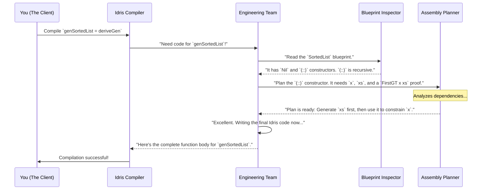

# Chapter 10: Generator Derivation Internals

Throughout this tutorial, you've seen the incredible power of [`deriveGen`: Automatic Generator Derivation](02__derivegen___automatic_generator_derivation_.md). From [Example: `SortedList`](03_example___sortedlist__.md) to [Example: PIL with Dynamic Registers](09_example__pil_with_dynamic_registers_.md), we've been treating it like a magic wand—wave it over a type signature, and a perfectly crafted generator appears.

But `DepTyCheck` isn't magic; it's a masterpiece of engineering. In this final chapter, we're going to pull back the curtain and take a peek inside the `deriveGen` factory. You'll learn the fundamental concepts that power this automation, giving you a deeper appreciation for what's happening when you compile your code.

## The Smart Factory Analogy

The best way to understand `deriveGen` is to think of it as a fully automated, state-of-the-art factory. Your job is to be the client who places an order.

*   **Your "Order Form"**: Your function signature, e.g., `genSortedList : Fuel -> Gen MaybeEmpty SortedList`. This tells the factory exactly what you want.
*   **The "Engineering Team"**: The `deriveGen` macro itself. This is a team of brilliant, hyper-fast engineers who work *at compile time*.
*   **The "Blueprints"**: The Idris definitions of your data types (like `SortedList`, `FirstGT`, etc.).
*   **The "Assembly Line"**: The final `Gen` code that the engineers design and build.

When you write `genSortedList = deriveGen`, you're submitting your order form. The `deriveGen` engineering team immediately gets to work. Their job is to read your order, study the necessary blueprints, design a flawless assembly line, and replace your one-line `deriveGen` with the complete, finished code.

Let's follow the engineering team as they process an order for a `SortedList`.

## Step 1: Read the Order Form (`GenSignature`)

The first thing the engineering team does is analyze your `genSortedList` signature. This process is handled by logic in `src/Deriving/DepTyCheck/Gen/Signature.idr`. The team fills out an internal "job ticket" with all the key details. In `DepTyCheck`, this ticket is a data structure called `GenSignature`.

A simplified version of this internal ticket looks like this:

```idris
-- From: src/Deriving/DepTyCheck/Gen/Signature.idr

record GenSignature where
  constructor MkGenSignature
  targetType : TypeInfo  -- The blueprint for the final product (e.g., `SortedList`)
  givenParams : SortedSet (Fin targetType.args.length) -- Which parts are "given" (none in this case)
```

For our `genSortedList : Fuel -> Gen MaybeEmpty SortedList` order, the `GenSignature` ticket would contain:
*   `targetType`: Information about `SortedList`.
*   `givenParams`: An empty set, because besides `Fuel`, we didn't provide any other inputs.

If we had an order like `genVectOfBools : (n : Nat) -> ...`, the `givenParams` would contain the index for `n`, telling the team that `n` is a pre-supplied part, not something they need to build.

## Step 2: Analyze the Blueprints (`ConsRecs`)

Next, the team gathers all the blueprints for the `targetType`. For `SortedList`, this means looking at its definition:

```idris
data SortedList : Type where
  Nil  : SortedList
  (::) : (x : Nat) -> (xs : SortedList) -> FirstGT x xs => SortedList
```

The engineers identify the two possible ways to build it: the `Nil` constructor and the `(::)` constructor. They pay special attention to recursion. They can see that the `(::)` constructor's second argument, `xs`, is another `SortedList`. This is a recursive call!

This information is stored in another internal data structure called `ConsRecs` (Constructor Recursiveness), defined in `src/Deriving/DepTyCheck/Gen/ConsRecs.idr`.

```idris
-- From: src/Deriving/DepTyCheck/Gen/ConsRecs.idr
-- (Heavily simplified for clarity)

record ConWeightInfo where
  constructor MkConWeightInfo
  weight : Either Nat1 RecWeightInfo -- Either a fixed number (non-recursive) or recursion details

data RecWeightInfo : Type where
  SpendingFuel : ... -- This constructor needs to use Fuel to terminate
  StructurallyDecreasing : ... -- This constructor is recursive on a smaller part
```

For `SortedList`, the team's notes would look like this:
*   **`Nil` constructor**: Not recursive. Assign it a simple weight (`Left 1`).
*   **`(::)` constructor**: Is recursive! It calls itself. Note this as `SpendingFuel`, a reminder that the generated code must use the `Fuel` parameter to ensure termination.

## Step 3: Design the Assembly Plan (Dependency Analysis)

This is the most brilliant part of the whole process. The team looks at the `(::)` constructor and its "To-Do List":
1.  Get a head element `x : Nat`.
2.  Get a tail element `xs : SortedList`.
3.  Get a permit `FirstGT x xs`.

A naive team might try to build these in order. But the `deriveGen` engineers are smarter. They see that the permit `FirstGT x xs` creates a **dependency**: the choice of `x` depends on `xs`. They realize they can't just pick a random `x` and a random `xs` and hope for the best.

To figure this out, they use a special scanner called `analyseDeepConsApp` (from `src/Deriving/DepTyCheck/Util/DeepConsApp.idr`). This function inspects the types of GADT indices (like `FirstGT x xs`) and figures out which constructor arguments they depend on.

Once all dependencies are known, a powerful algorithm called `searchOrder` (in `src/Deriving/DepTyCheck/Gen/ForOneTypeConRhs/Impl.idr`) solves the puzzle. It creates a "dependency graph" and finds the optimal order to generate the arguments.

For `(::)`, the `searchOrder` algorithm concludes:
1.  The permit `FirstGT x xs` depends on `xs`.
2.  Therefore, **generate `xs` first!**
3.  Once `xs` is known (e.g., `[20, 30]`), the permit becomes `FirstGT x [20, 30]`, which simplifies to a constraint `20 > x`.
4.  **Now, generate `x`** using this new, powerful constraint (e.g., `choose (0, 19)`).

This strategy of working backward from constraints is the secret sauce that makes `deriveGen` so powerful.

## Step 4: Write the Assembly Instructions (Code Generation)

With a solid plan in hand, the team is ready to write the final code. This happens in functions like `canonicConsBody` and `consGenExpr`. They write a function body that looks something like this (in concept):

```idris
-- This is a simplified "mental model" of the code `deriveGen` writes for you.

genSortedList_internal fuel =
  case fuel of
    Dry =>
      -- Ran out of fuel, only safe option is the non-recursive one.
      pure Nil
    More newFuel =>
      -- With fuel, we can choose between Nil and (::).
      frequency
        [ (1, pure Nil) -- Small chance to stop early.
        , (4, buildCons newFuel) -- Higher chance to continue.
        ]

-- Helper function for the (::) case.
buildCons fuel = do
  -- Step 1: Generate the tail `xs` first (as planned!).
  xs <- genSortedList_internal fuel

  -- Step 2: Use `xs` to constrain the generation of `x`.
  x <- case xs of
         Nil => choose (0, 100) -- No constraint, pick any Nat.
         (h :: t) => choose (0, h - 1) -- **The magic!** Constrained by `h`.

  -- Step 3: We now have a valid `x` and `xs`, so the proof is trivial.
  -- The framework finds the `FirstGT` proof automatically.
  pure (x :: xs)
```

This generated code, the final "assembly line," is then seamlessly inserted into your program, replacing the `deriveGen` placeholder. Your program compiles, and you never even see the brilliant work the engineering team did for you.

Here is a diagram summarizing the entire process:



## Conclusion: You've Mastered `DepTyCheck`!

Congratulations! You've made it through the entire `DepTyCheck` tutorial. You started with the basic [`Gen` Monad for Property-Based Testing](01__gen__monad_for_property_based_testing_.md) and have now uncovered the deepest secrets of `deriveGen`'s internal machinery.

You've learned that `deriveGen` is not magic, but a sophisticated application of **reflection**—the ability of a program to inspect and manipulate its own code at compile time. It's a powerful system that:
1.  **Analyzes** type signatures to understand your goal.
2.  **Inspects** data type definitions to learn the rules.
3.  **Solves** complex dependency puzzles to find a valid generation order.
4.  **Generates** efficient, correct, and often surprisingly clever code on your behalf.

You have seen it conquer sorting, uniqueness, binary trees, set coverage, and even the generation of entire, type-safe programming languages.

The journey doesn't end here. The real adventure begins when you apply `DepTyCheck` to your own projects. Go forth and generate data, find bugs, and build more robust, reliable, and correct software with the power of dependent types and automated testing at your fingertips. Happy testing

---

Generated by [AI Codebase Knowledge Builder](https://github.com/The-Pocket/Tutorial-Codebase-Knowledge)