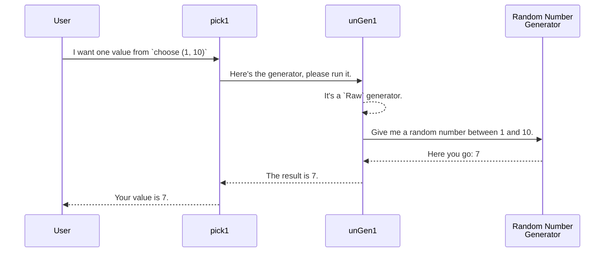

# Chapter 1: Generator Monad (`Gen`)

Welcome to `DepTyCheck`! This library is all about generating random, well-typed data, which is a cornerstone of modern property-based testing. In this first chapter, we'll dive into the heart of the library: the `Gen` type.

## What's a Generator For?

Imagine you've written a function, say, one that sorts a list of numbers. How do you test it? You could write a few examples by hand: `[3, 1, 2]`, `[]`, `[5, 5, 1]`. But what if you miss an edge case?

A better approach is to automatically generate hundreds or thousands of random lists and check if your sorting function works for all of them. This is what property-based testing is all about, and to do it, we need a way to create random data. That's precisely the problem `Gen` solves.

Let's set a simple goal for this chapter: **we want to generate a random number between 1 and 10.**

## `Gen`: A Recipe for Randomness

Think of a `Gen a` as a **recipe** for creating a random value of type `a`. It's not the value itself, but the instructions for how to make it. `DepTyCheck` gives you a rich cookbook of functions to create and combine these recipes.

### Basic Ingredients: Simple Generators

Let's start with the simplest recipes.

1.  **A Fixed Value with `pure`**

   Sometimes you don't want a random value, but a fixed one. The `pure` function creates a recipe that always produces the same result.

   ```idris
   -- A recipe that always results in the number 5.
   alwaysFive : Gen NonEmpty Int
   alwaysFive = pure 5
   ```

   This is like a recipe that just says, "serve the number 5." It's simple, but it's a fundamental building block.

2.  **A Random Value with `choose`**

   Now for कुछ more interesting. To solve our goal of generating a number between 1 and 10, we can use `choose`.

   ```idris
   -- A recipe for a random integer between 1 and 10 (inclusive).
   aNumberBetween1And10 : Gen NonEmpty Int
   aNumberBetween1And10 = choose (1, 10)
   ```

   This recipe tells the system: "Pick a random whole number from 1 to 10."

3.  **Picking from a List with `elements`**

   What if you want to choose from a specific set of options? `elements` takes a list and creates a generator that randomly picks one of its items.

   ```idris
   -- A recipe for a random primary color.
   aPrimaryColor : Gen NonEmpty String
   aPrimaryColor = elements ["Red", "Green", "Blue"]
   ```

### Running the Generator: Let's Bake!

So far, we've only created recipes (`Gen a`). We don't have any actual values yet. To get a value, we need to "run" the generator. The `pick1` function does exactly this. It takes a generator and produces a single random value.

```idris
-- Let's run our generator from before.
-- This will print a random number between 1 and 10.
testRun : IO ()
testRun = do
  pickedNumber <- pick1 aNumberBetween1And10
  print pickedNumber
```
**Example Output (could be different each time):**
```
7
```
`pick1` handles the details of using a random number-generating seed to follow the recipe and produce a result.

### Combining Recipes with `>>=` (bind)

The real power of `Gen` comes from combining simple recipes to create complex ones. The main tool for this is the "bind" function, written as `>>=`.

Let's say we want to create a more complex recipe:
1.  First, generate a random number `n` between 1 and 3.
2.  *Then*, generate a list containing `n` random booleans (`True` or `False`).

The `>>=` operator lets us chain these steps. The result of the first recipe is "fed" into the second to create the final recipe.

```idris
-- A generator for a list of 1, 2, or 3 random booleans.
randomBoolList : Gen NonEmpty (List Bool)
randomBoolList =
  choose (1, 3) >>= \n =>
    listOf n (elements [True, False])
```
Let's break this down:
- `choose (1, 3)` is our first recipe, which produces a number `n`.
- `>>=` takes that `n`...
- `\n => ...` and uses it in a new function that creates the *next* recipe.
- `listOf n (elements [True, False])` is that next recipe. It says "create a list of length `n` by running the recipe `elements [True, False]` `n` times."

If we run `pick1 randomBoolList`, we might get `[True]`, `[False, False]`, or `[True, False, True]`, among other possibilities.

## A Guarantee: Is the Recipe Book Empty?

You may have noticed the `NonEmpty` in `Gen NonEmpty Int`. This is the `Emptiness` parameter, and it's a powerful safety feature. Think of it as a guarantee on your recipe book.

*   `Gen NonEmpty a`: This recipe is **guaranteed** to produce a value. `pure 5` and `choose (1, 10)` are non-empty. You can confidently use `pick1` with them.

*   `Gen MaybeEmpty a`: This recipe **might fail**. It might not be possible to produce a value.

When would a recipe fail? A common way is by filtering. Let's try to generate an integer greater than 10, but only by picking from the range 1-10. This is impossible!

```idris
-- A recipe that tries to find a number > 10 in a range where none exist.
impossibleGen : Gen MaybeEmpty Int
impossibleGen = choose (1, 10) `suchThat` (\x => x > 10)
```
The `suchThat` function filters a generator. If the condition isn't met, it fails. Because failure is possible, the result type is `Gen MaybeEmpty Int`, not `Gen NonEmpty Int`.

If we try to run a `MaybeEmpty` generator, `pick1` won't work because it expects a guaranteed result. Instead, we use `pick`, which returns a `Maybe a`.

```idris
-- This will always print "Nothing" because the generator can't produce a value.
testEmptyRun : IO ()
testEmptyRun = do
  result <- pick impossibleGen
  print result
```
**Example Output:**
```
Nothing
```
This `Emptiness` tracking prevents runtime errors by forcing you to handle the case where a generator might not produce a value.

## Under the Hood

How does `Gen` actually work? It's surprisingly simple. A `Gen` is just a data structure that describes the steps to take.

```idris
data Gen : Emptiness -> Type -> Type where
  -- A recipe that might be empty.
  Empty : Gen MaybeEmpty a

  -- A recipe for a fixed value.
  Pure  : a -> Gen em a

  -- A recipe for a raw random action.
  Raw   : RawGen a -> Gen em a

  -- A recipe that depends on a previous one.
  Bind  : RawGen c -> (c -> Gen biem a) -> Gen em a
  -- ... and a few others for combining and labeling.
```
- `pure 5` becomes `Pure 5`.
- `choose (1, 10)` becomes `Raw (some_random_action)`.
- `g1 >>= g2` becomes a `Bind` that links the two.

When you call `pick1 myGenerator`, a runner function called `unGen1` walks through this data structure.

Here's a simplified diagram of what happens when you call `pick1 (choose (1, 10))`:



The `unGen1` function is just a big pattern match that knows what to do for each kind of recipe:
- If it sees `Pure x`, it just returns `x`.
- If it sees `Raw action`, it executes the random `action` and returns the result.
- If it sees `Bind first_action create_next_gen`, it runs `first_action`, gets a value, and then recursively calls itself on the generator created by `create_next_gen`.

This simple, descriptive structure is what makes `Gen` so flexible and powerful.

## Conclusion

In this chapter, we learned about the most fundamental concept in `DepTyCheck`: the `Gen` monad.

- **`Gen a`** is a recipe for creating random values of type `a`.
- We can create simple recipes with **`pure`**, **`choose`**, and **`elements`**.
- We can run recipes to get values using **`pick1`** (for guaranteed success) and **`pick`** (for possible failure).
- We can build complex, sequential recipes by chaining them together with **`>>=`** (bind).
- The **`Emptiness`** parameter (`NonEmpty` vs. `MaybeEmpty`) provides a compile-time safety guarantee about whether a generator can fail.

You now have the basic tools to generate simple random data. But `DepTyCheck` is designed for much more complex, *dependently-typed* data.

In the next chapter, we'll see how these simple building blocks can be used to generate values for more interesting and powerful data types.

Next: [Chapter 2: Dependently-Typed Data Structures (Examples)](02_dependently_typed_data_structures__examples__.md)

---

Generated by [AI Codebase Knowledge Builder](https://github.com/The-Pocket/Tutorial-Codebase-Knowledge)