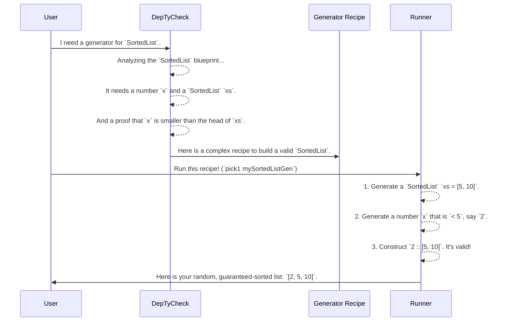

# Chapter 2: Dependently-Typed Data Structures (Examples)

In [Chapter 1: Generator Monad (`Gen`)](01_generator_monad___gen___.md), we learned how to create "recipes" for generating random data like numbers and simple lists. This is great for standard property-based testing. But what if your data has to follow complex rules?

What if you need a list that is **always sorted**? Or a list that **never contains duplicates**? With normal data types, you'd have to generate a random list and then check if it's sorted, throwing it away if it's not. That's inefficient and clumsy.

This chapter introduces a better way: **dependently-typed data structures**. This is a powerful concept where the rules of a data structure are part of its very type. It's like having a blueprint for a machine that includes physical laws preventing it from being assembled incorrectly.

## A List That Guarantees It's Sorted

Let's start with a simple `List Nat`. You can easily create a list that isn't sorted:

```idris
-- A normal, unsorted list. This is perfectly valid.
myUnsortedList : List Nat
myUnsortedList = [3, 1, 4]
```

Now, let's look at `DepTyCheck`'s example `SortedList`. Its definition ensures that an unsorted list is **impossible to create**.

Here is a simplified view of its definition:

```idris
-- Definition of a sorted list of natural numbers.
data SortedList : Type where
  Nil  : SortedList
  (::) : (x : Nat) -> (xs : SortedList) -> (So (canPrepend x xs)) => SortedList
```

This looks a bit like a regular list definition, but with a critical extra piece: `(So (canPrepend x xs))`. Let's break it down:

*   `Nil : SortedList`: An empty list is, by definition, sorted. Simple enough.
*   `(::) : ...`: This says we can create a new `SortedList` by prepending a number `x` to an existing `SortedList` `xs`, but *only if* we can provide a proof: `So (canPrepend x xs)`.

`So` is a way of saying "I have proof that this boolean expression is `True`". The function `canPrepend` checks if our rule holds:

```idris
-- Can we prepend `n` to a list and keep it sorted?
canPrepend : Nat -> SortedList -> Bool
canPrepend _ []      = True  -- Yes, you can prepend anything to an empty list.
canPrepend n (x::xs) = n < x -- Yes, if `n` is less than the list's first element.
```

So, to build the list `1 :: 3 :: Nil`, you need to provide proofs:
1.  Proof that `canPrepend 3 Nil` is `True`. (It is).
2.  Proof that `canPrepend 1 (3 :: Nil)` is `True`. (It is, because `1 < 3`).

But what if you try to build `3 :: 1 :: Nil`? You would need a proof that `canPrepend 3 (1 :: Nil)` is `True`. This requires `3 < 1`, which is `False`. Since you can't find a proof for a false statement, the compiler will give you an error. You simply **cannot construct an invalid `SortedList`**.

## More Examples: Embedding Rules in Types

This pattern of baking rules into types is incredibly powerful. Here are a couple of other examples from the `DepTyCheck` project.

### `UniqList`: A List with No Duplicates

A `UniqList` guarantees that every element in it is unique.

```idris
-- A list of unique strings.
data UniqStrList : Type where
  Nil  : UniqStrList
  (::) : (s : String) -> (ss : UniqStrList) -> (s `NotIn` ss) => UniqStrList
```

The magic here is the `s `NotIn` ss` requirement. This is a **proof** that the string `s` you're trying to add is not already present in the rest of the list `ss`. If you try to add a duplicate, you won't be able to provide the proof, and your code won't compile.

### `SortedBinTree`: A Self-Validating Binary Search Tree

A Binary Search Tree (BST) is a data structure where for any given node, all values in its left subtree are smaller, and all values in its right subtree are larger.

```idris
-- A Binary Search Tree that is always sorted.
data SortedBinTree : Type where
  Empty : SortedBinTree
  Node  : (x : Nat) -> (left, right : SortedBinTree) ->
          (AllLT x left) => (AllGT x right) => SortedBinTree
```

The `Node` constructor is the key. To create a node with value `x`, you must provide two proofs:
1.  `AllLT x left`: A proof that **All** values in the `left` subtree are **Less Than** `x`.
2.  `AllGT x right`: A proof that **All** values in the `right` subtree are **Greater Than** `x`.

Just like with `SortedList`, these proofs aren't optional comments; they're mandatory arguments enforced by the type system. You physically cannot construct a `SortedBinTree` that violates the binary search tree property.

## From Blueprint to Product: Generating Correct Data

Think of these dependent types as incredibly strict blueprints.

*   **The Blueprint:** The `SortedList` type definition.
*   **The Rules:** The `canPrepend` check.
*   **A Valid Product:** A value like `1 :: 3 :: 7 :: Nil`. It follows all the rules.
*   **An Impossible Product:** Trying to construct `[1, 5, 2]` as a `SortedList` is like trying to build a car where the wheels are bigger than the chassis—the blueprint itself forbids it.

This is where `DepTyCheck`'s main feature comes in. It acts as an automated factory that can read these complex blueprints and **generate valid, random products for testing**.

You don't need to write a complicated generator that tries and fails to build a `SortedList`. Instead, you will ask `DepTyCheck` to derive a generator for you.



Using a generator that `DepTyCheck` creates, every call to `pick1 mySortedListGen` will produce a different, but always perfectly sorted, list.

## Conclusion

In this chapter, we moved from simple data to "smart" data.

-   **Dependently-Typed Data Structures** embed correctness rules directly into their types.
-   This makes it **impossible** to create invalid data, like an unsorted `SortedList` or a `UniqList` with duplicates.
-   Examples like `SortedList`, `UniqList`, and `SortedBinTree` show how properties like order, uniqueness, and search-tree structure can be guaranteed at compile time.
-   `DepTyCheck` is designed to understand these blueprints and **automatically create generators** for them, giving you an endless supply of complex, guaranteed-correct test data.

We've seen *what* these amazing data structures look like and why they are useful. But how does `DepTyCheck` work its magic to create generators for them automatically? That's the subject of our next chapter.

Next: [Chapter 3: Automatic Generator Derivation (`deriveGen`)](03_automatic_generator_derivation___derivegen___.md)

---

Generated by [AI Codebase Knowledge Builder](https://github.com/The-Pocket/Tutorial-Codebase-Knowledge)