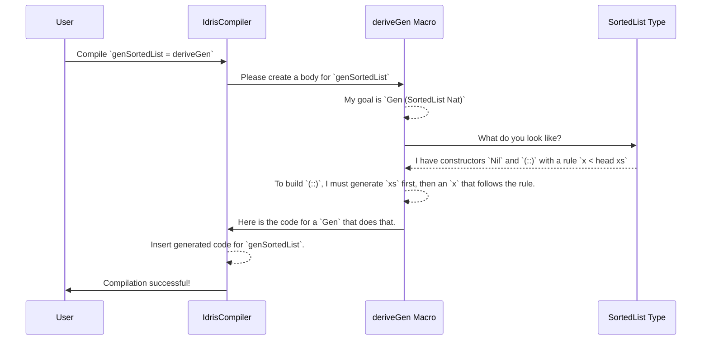

# Chapter 3: Automatic Generator Derivation (`deriveGen`)

In [Chapter 2: Dependently-Typed Data Structures (Examples)](02_dependently_typed_data_structures__examples__.md), we saw how types like `SortedList` can bake correctness rules right into their definitions, making it impossible to create an invalid instance. This is amazing for writing correct software, but it poses a new challenge: how do we generate random, *valid* instances of these types for testing?

Writing a generator for `SortedList` by hand would be tricky. We'd have to carefully generate a list, then generate a new element that is smaller than the current head, handle the empty list case, and so on. It's tedious and easy to get wrong.

What if we had a magic tool that could look at the blueprint for `SortedList` and automatically write a perfect generator for us? That magic tool is `deriveGen`.

## The AI Chef: `deriveGen` at a Glance

Think of `deriveGen` as an incredibly smart AI chef.
-   **You provide:** A picture and a brief description of a complex dish (your dependently-typed data structure, like `SortedList`).
-   **The AI Chef does:** It analyzes the dish's components and constraints (the constructors and their proof requirements).
-   **The AI Chef produces:** A complete, step-by-step recipe (`Gen`) to create delicious, valid instances of that dish from scratch, every single time.

This saves you, the developer, from the grueling task of figuring out the recipe yourself.

## Your First Derived Generator

Let's get straight to it. Our goal is to create a generator for `SortedList Nat`.

Here's how you do it with `deriveGen`.

1.  **Define the generator's type signature.** You tell `DepTyCheck` what you want. In this case, a generator for `SortedList Nat`. We also need a `Fuel` argument, which is a simple mechanism to ensure recursive generators don't run forever.

    ```idris
    -- A recipe for a random, sorted list of natural numbers.
    genSortedList : Fuel -> Gen (MaybeEmpty (SortedList Nat))
    ```

2.  **Use `deriveGen` as the implementation.**

    ```idris
    genSortedList : Fuel -> Gen (MaybeEmpty (SortedList Nat))
    genSortedList = deriveGen
    ```

That’s it. You're done.

`deriveGen` is a special piece of code called a **macro**. When you compile your program, `deriveGen` runs, inspects the required type (`Gen (MaybeEmpty (SortedList Nat))`), analyzes the `SortedList` data type, and writes the entire function body for `genSortedList` for you.

We can now use this generator just like any other `Gen` from [Chapter 1: Generator Monad (`Gen`)](01_generator_monad___gen___.md).

```idris
testSortedList : IO ()
testSortedList = do
  -- `pick` returns a Maybe because the Gen is MaybeEmpty
  maybeList <- pick (genSortedList भरपूर) -- `भरपूर` is a value for plentiful fuel
  print maybeList
```

**Example Output (could be different each time):**

```
Just [2, 5, 9, 17]
```

No matter how many times you run it, every list you get will be perfectly sorted, guaranteed. `deriveGen` figured out the complex logic for you.

## Given vs. Generated Parameters

`deriveGen` is even smarter than that. It can tell the difference between inputs you want to provide and values it needs to generate.

Let's imagine a `Vect n String`—a list that has a statically known length `n`. We want to write a generator where we *give* it the length `n`, and it *generates* a `Vect` of that length.

The signature tells the story:
-   Arguments *before* the `Gen` type are **inputs** (given parameters).
-   Arguments described *inside* the `DPair` within the `Gen` type are **outputs** (generated parameters).

```idris
import Data.Vect

-- A generator where we provide `n`, and it generates `v`
genVect : (n : Nat) -> Fuel -> Gen (MaybeEmpty (v : Vect n String ** Vect n String))
genVect = deriveGen
```

Let's break down that confusing type: `Gen (MaybeEmpty (v : Vect n String ** Vect n String))`.

*   `Gen (MaybeEmpty ...)`: It's a generator that might fail.
*   `(v : Vect n String ** Vect n String)`: This is `DPair` syntax. It means "We are generating a `v` of type `Vect n String`, and the final resulting type is also `Vect n String`". For simple types, it looks a bit redundant, but this syntax is powerful for more complex dependent types. The key is that `v` is being generated.

`deriveGen` understands this distinction perfectly:
-   It sees `(n : Nat)` is an input.
-   It sees `(v : Vect n String)` needs to be generated.
-   It automatically creates a generator that takes `n` and produces a `Vect` of that length.

## How the Chef Thinks: Under the Hood

`deriveGen` feels like magic, but it's just very clever code analysis. When the Idris compiler sees `myGen = deriveGen`, it triggers a process.

Let’s trace how `deriveGen` would create our `genSortedList`.

1.  **Analyze the Goal:** The macro sees that it needs to produce a term of type `Fuel -> Gen (MaybeEmpty (SortedList Nat))`. The target data type is `SortedList Nat`.

2.  **Inspect the Data Type:** `deriveGen` looks up the definition of `SortedList`.
    ```idris
    data SortedList : Type where
      Nil  : SortedList
      (::) : (x : Nat) -> (xs : SortedList) -> (So (canPrepend x xs)) => SortedList
    ```
    It finds two constructors: `Nil` and `(::)`. These are the only two ways to build a `SortedList`.

3.  **Formulate a Plan:** It decides to build a generator that can choose between these two construction methods.

    *   **For the `Nil` constructor:** This is easy. It takes no arguments. The plan is `pure Nil`.
    *   **For the `(::)` constructor:** This is the tricky part. It has three arguments: `x`, `xs`, and a proof. `deriveGen` analyzes their dependencies:
        *   To create the proof `So (canPrepend x xs)`, it needs both `x` and `xs`.
        *   The `canPrepend` function is `canPrepend n (x::xs) = n < x`.
        *   This means to generate `x`, it must be smaller than the head of `xs`.
        *   **Conclusion:** It *must* generate `xs` first!

4.  **Write the Recipe (`Gen`)**: Based on this plan, it writes the actual Idris code, which looks something like this (in a simplified form):

    ```idris
    -- This is a simplified representation of what deriveGen writes.
    genSortedList_impl fuel =
      frequency "SortedList"
        [ -- Option 1: The `Nil` case (higher chance for smaller lists)
          (10, pure Nil),

          -- Option 2: The `(::)` case
          (5, genSortedList_impl (decr fuel) >>= \xs =>
                let upperBound = case xs of
                                  [] => 100 -- Pick any number if the list is empty
                                  (h::_) => h
                in
                choose (0, upperBound) >>= \x =>
                  -- The proof is found automatically by the compiler
                  pure (x :: xs))
        ]
    ```

This generated code is then inserted as the body of your `genSortedList` function and compiled as if you had written it by hand.

The following diagram illustrates this process.



### A Peek at the Source

The core logic for `deriveGen` lives in `src/Deriving/DepTyCheck/Gen.idr`. The entry point is a macro:

```idris
-- from: src/Deriving/DepTyCheck/Gen.idr

export %macro
deriveGen : DeriveBodyForType => Elab a
deriveGen = do
  Just signature <- goal
     | Nothing => fail "..."
  tt <- deriveGenExpr signature
  check tt
```
-   `%macro`: This tells Idris this is a macro.
-   `Elab a`: This means the function runs during the "Elaboration" phase of compilation and produces a piece of code.
-   `goal`: This function magically grabs the type signature of the function we are trying to define (e.g., `Fuel -> Gen (SortedList Nat)`).

The real thinking happens inside `deriveGenExpr`, which eventually calls down to the [Least-Effort Derivation Tactic](05_least_effort_derivation_tactic_.md) in `src/Deriving/DepTyCheck/Gen/ForOneTypeConRhs/Impl.idr`. This tactic is responsible for figuring out the dependency order of constructor arguments. It uses a record like this to model the dependencies:

```idris
-- from: src/Deriving/DepTyCheck/Gen/ForOneTypeConRhs/Impl.idr
-- (simplified for clarity)

record Determination (con : Con) where
  constructor MkDetermination
  -- Arguments that this argument depends on
  argsDependsOn : SortedSet (Fin con.args.length)
```

By analyzing which arguments `dependOn` others, it can `searchOrder` to find a valid sequence for generation, just like we reasoned through `xs` needing to come before `x`.

## Conclusion

In this chapter, we introduced the star feature of `DepTyCheck`: the `deriveGen` macro.

-   **`deriveGen`** is an automatic "recipe writer" that creates complex `Gen`s for you.
-   You simply provide a **type signature** for the generator you want and set its body to `deriveGen`.
-   It understands the difference between **given parameters** (inputs to your generator) and **generated parameters** (values it needs to create).
-   It works by **analyzing the data type's constructors and rules** at compile time to build a step-by-step generation plan.

`deriveGen` turns the difficult task of testing dependently-typed programs into a much simpler one. But how does it represent its internal generation plan? Before `deriveGen` writes the final `Gen` code, it first translates its plan into an intermediate language tailored for this task.

In the next chapter, we'll explore this internal language.

Next: [Chapter 4: Primitive Imperative Language (PIL)](04_primitive_imperative_language__pil__.md)

---

Generated by [AI Codebase Knowledge Builder](https://github.com/The-Pocket/Tutorial-Codebase-Knowledge)