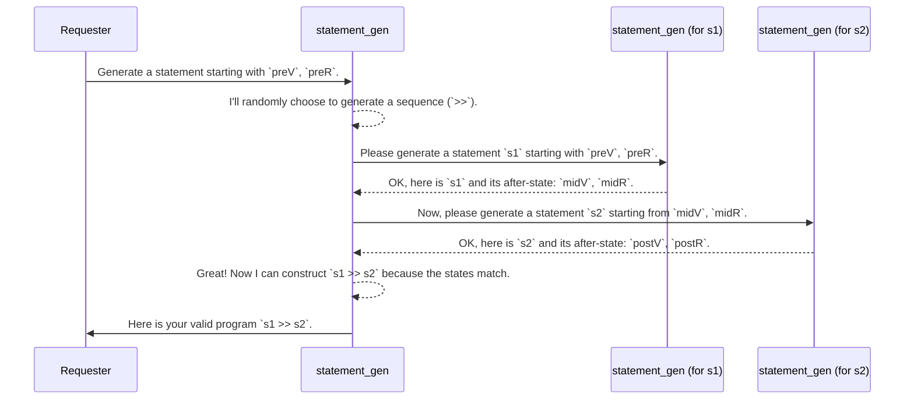

# Chapter 4: Primitive Imperative Language (PIL)

In [Chapter 3: Automatic Generator Derivation (`deriveGen`)](03_automatic_generator_derivation___derivegen___.md), we discovered the magic of `deriveGen`, a tool that can automatically write generator "recipes" for complex, dependently-typed data structures. It frees us from the tedious work of figuring out how to construct valid data.

Now, we're going to look at the perfect "final exam" for `deriveGen`: a sophisticated example called the **Primitive Imperative Language (PIL)**. PIL is a small programming language built entirely inside Idris, and its rules are so strict that it's impossible to write an incorrect program. Our goal in this chapter is to understand what PIL is and why it's such a great way to showcase the power of `DepTyCheck`.

## The Magnetized Train Set

Imagine you're building a model train set, but this one is special. The tracks and train cars are magnetized. A "turn left" piece of track can only connect to a "straight" piece, and a passenger car can only connect to an engine, never to another passenger car directly. It's physically impossible to build a track that derails or a train that's put together incorrectly.

This is exactly what PIL is. It's a "toy" programming language where the components (`Statement`, `Expression`) are like those magnetized train parts. They are defined using Idris's dependent types, which enforce the rules of the language at compile time.

You simply **cannot construct a PIL program with errors** like:
*   Using a variable that hasn't been declared.
*   Assigning a `String` value to an `Int` variable.
*   Forgetting the state of a "register" (a special kind of global variable).

Because building valid PIL programs by hand is tricky (like carefully assembling the magnetized train), it's the perfect candidate for `DepTyCheck` to generate for us automatically.

## The Building Blocks of PIL

PIL is an "embedded" language, meaning it's not a separate file you compile. It's just a collection of Idris data types. Let's look at its main components.

### 1. Types (`Type'`)

First, our language needs to know about basic types like integers and booleans. PIL defines a simple `Type'` data type for this.

```idris
-- from: examples/pil-reg/src/Example/Pil/Lang/Aspects/Types.idr

public export
data Type' = Int' | Bool' | String'
```
This is straightforward: a value in our language can be an `Int'`, a `Bool'`, or a `String'`.

### 2. Expressions (`Expression`)

Expressions are the parts of a program that produce a value, like `x + 5` or `true`. The `Expression` type in PIL is cleverly defined to be aware of its context.

```idris
-- from: examples/pil-reg/src/Example/Pil/Lang/Expression.idr (simplified)

data Expression : (vars : Variables) -> (regs : Registers rc) -> (res : Type') -> Type
```
Let's break down this signature:
*   `vars : Variables`: This is a type-level list of the variables (and their types) that are available to be used in this expression.
*   `regs : Registers rc`: This tracks the state of special global "registers".
*   `res : Type'`: This is the type of the value that the expression will produce (e.g., `Int'`).

Here are two of its constructors:
```idris
-- from: examples/pil-reg/src/Example/Pil/Lang/Expression.idr (simplified)

data Expression : (vars : Variables) -> ... -> Type where
  -- A constant value, like `5` or `"hello"`
  C' : (x : idrTypeOf ty) -> Expression vars regs ty

  -- Using a variable `n`.
  -- The `{0 lk : Lookup n vars}` proof ensures `n` is in `vars`!
  V : (n : Name) -> {0 lk : Lookup n vars} => Expression vars regs lk.reveal
```
*   `C'` creates a constant expression. `C' 5` is an `Expression` of type `Int'`.
*   `V "x"` creates an expression that reads the value of variable `"x"`. The `{0 lk : ...}` part is a **compile-time proof** that a variable named `"x"` actually exists in the `vars` list. If you try to use a variable that doesn't exist, your program won't compile!

### 3. Statements (`Statement`)

Statements are the actions of your program, like declaring a variable or assigning a value. This is where the magic of state tracking happens.

```idris
-- from: examples/pil-reg/src/Example/Pil/Lang/Statement.idr (simplified)

data Statement : (preV : Variables) -> (preR : Registers rc) ->
                 (postV : Variables) -> (postR : Registers rc) ->
                 Type
```

This is the most important definition in PIL. A `Statement` is a transformation from a "before" state to an "after" state.

*   `preV`, `preR`: The state of variables and registers **before** the statement runs.
*   `postV`, `postR`: The state of variables and registers **after** the statement runs.

Let's see some constructors to make this concrete:

```idris
-- from: examples/pil-reg/src/Example/Pil/Lang/Statement.idr (simplified)

-- Nop: Does nothing. The state before and after is the same.
Nop : Statement vars regs vars regs

-- `ty. n`: Declares a new variable `n` of type `ty`.
-- The "after" variable list is the "before" list with `(n, ty)` added.
(.) : (ty : Type') -> (n : Name) -> Statement vars regs ((n, ty)::vars) regs

-- `n #= v`: Assigns an expression `v` to an existing variable `n`.
-- The variable list doesn't change, as `n` must already exist.
(#=) : (n : Name) -> {0 lk : Lookup n vars} => (v : Expression vars regs ty) ->
       Statement vars regs vars regs

-- `s1 >> s2`: Sequences two statements.
-- The "after" state of `s1` MUST match the "before" state of `s2`.
(>>) : Statement preV preR midV midR ->
       Statement midV midR postV postR ->
       Statement preV preR postV postR
```

The `(>>)` constructor is the glue. It's the magnet that ensures two track pieces can only connect if they line up perfectly. You can only sequence `statement1` and `statement2` if the state left by `statement1` is exactly the state expected by `statement2`.

## Building a Program: The Hard Way

Let's try to write a tiny program: `var x : Int; x = 10;`. In PIL, this would be:

```idris
-- 1. Declare an Int variable named "x".
-- Type: Statement [] regs [("x", Int')] regs
declare_x : Statement [] regs [("x", Int')] regs
declare_x = Int'. "x"

-- 2. Assign 10 to "x". Requires "x" to exist.
-- Type: Statement [("x", Int')] regs [("x", Int')] regs
assign_x : Statement [("x", Int')] regs [("x", Int')] regs
assign_x = "x" #= C' 10

-- 3. Sequence them. This only works because the types line up!
program : Statement [] regs [("x", Int')] regs
program = declare_x >> assign_x
```
Notice how `declare_x`'s "after" state (`[("x", Int')]`) perfectly matches `assign_x`'s "before" state. If it didn't, the `(>>)` constructor would give a type error. Manually tracking these states is difficult and error-prone.

## Generating PIL Programs with DepTyCheck

This is where `DepTyCheck` shines. Instead of building programs by hand, we can ask it to generate random, valid programs for us. The project includes handwritten generators for PIL statements in `examples/pil-reg/src/Example/Pil/Gens.idr`.

```idris
-- from: examples/pil-reg/src/Example/Pil/Gens.idr (conceptual)

-- A generator that produces a valid statement and its "after" state.
statement_gen : (fuel : Fuel) ->
                (preV : Variables) -> (preR : Registers rc) ->
                Gen (postV ** postR ** Statement preV preR postV postR)
```
This `statement_gen` is a complex function that knows how to randomly (but correctly!) pick constructors and call other generators to build a valid `Statement`. Running `pick1 (statement_gen ...)` would give us a completely random, but guaranteed-to-be-correct, little program.

### Under the Hood of a Generator

How would a generator for PIL know what to do? Let's trace the logic for generating a sequence `s1 >> s2`.


This recursive process, where the output of one generator becomes the input constraint for the next, is fundamental to generating dependently-typed data.

### A Look at an Actual Generator

The handwritten code for this is quite involved, which reinforces why we want `DepTyCheck` to automate it. Here is a simplified version of the generator for the sequence `(>>)` constructor.

```idris
-- from: examples/pil-reg/src/Example/Pil/Gens.idr (simplified)

namespace Statements_given_preV_preR
  seq_gen : Statement_postV_postR_Gen
  seq_gen f preV preR = do
    -- 1. Generate the first statement and get its output state (midV, midR)
    (midV ** midR ** l) <- statement_gen f preV preR

    -- 2. Generate the second statement using the output state of the first
    (_ ** _ ** r) <- statement_gen f midV midR

    -- 3. Combine them into a valid sequence
    pure (_ ** _ ** l >> r)
```

This code follows the logic from our diagram:
1. It calls `statement_gen` to get the left part `l` and its resulting state `midV` and `midR`.
2. It then calls `statement_gen` *again*, but this time it passes in `midV` and `midR` as the starting state to generate the right part `r`.
3. Finally, it combines them with `l >> r`.

Writing this logic for every single constructor in PIL is a lot of work!

## Conclusion

In this chapter, we've taken a tour of the Primitive Imperative Language (PIL), a powerful example of a dependently-typed embedded DSL.

- **PIL** is a language defined in Idris where correctness rules (like variable scoping and type checking) are enforced by the type system.
- It uses type-level state tracking (`preV`, `postV`) to model how a statement changes the program's context.
- Building PIL programs by hand is possible but requires careful management of these dependent types.
- PIL is an ideal showcase for `DepTyCheck`, which can automatically generate random, syntactically-correct, and type-safe programs.

We saw that even a hand-written generator for PIL is complex. The `deriveGen` macro from the previous chapter promises to do this automatically. But how does it figure out the correct order to generate things, like generating the first statement in a sequence *before* the second? It uses a clever planning algorithm.

In the next chapter, we will pull back the curtain on `deriveGen`'s brain and explore this powerful internal strategy.

Next: [Chapter 5: Least-Effort Derivation Tactic](05_least_effort_derivation_tactic_.md)

---

Generated by [AI Codebase Knowledge Builder](https://github.com/The-Pocket/Tutorial-Codebase-Knowledge)