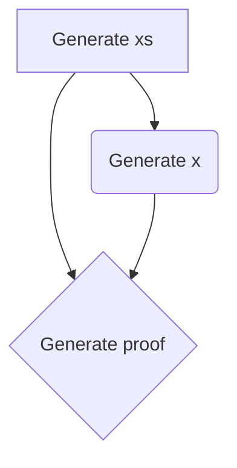
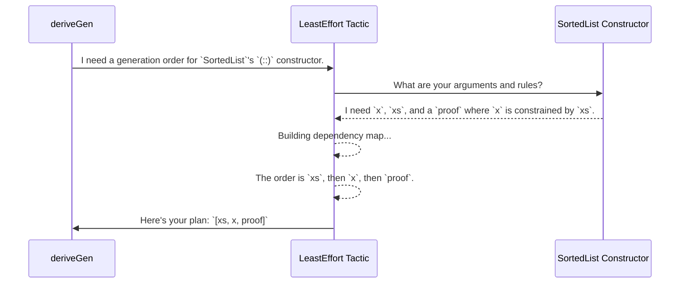

# Chapter 5: Least-Effort Derivation Tactic

In [Chapter 3: Automatic Generator Derivation (`deriveGen`)](03_automatic_generator_derivation___derivegen___.md), we met the magical `deriveGen`, which automatically writes generator "recipes" for us. Then, in [Chapter 4: Primitive Imperative Language (PIL)](04_primitive_imperative_language__pil__.md), we saw just how complicated a data structure can be, making automatic generation an essential tool.

But how does `deriveGen` actually work its magic? When faced with a complex constructor with many arguments and rules, how does it decide what to generate first? This chapter pulls back the curtain on `deriveGen`'s default strategy: the **Least-Effort Derivation Tactic**.

## Assembling Furniture, One Step at a Time

Imagine you're assembling a new bookshelf. The instruction manual lays out a clear sequence:
1.  Attach the side panels to the base.
2.  Insert the back panel.
3.  Slide in the shelves.
4.  Attach the top.

You wouldn't try to put the shelves in before the side panels are up, right? That would be impossible. You follow the dependencies: the shelves *depend* on the side panels being in place.

The "Least-Effort" tactic is `deriveGen`'s instruction manual. It looks at all the arguments a data constructor needs and figures out the simplest, most direct order to generate them, just like following assembly steps one by one. It does the easiest thing first.

## The Problem: In What Order Should We Generate?

Let's revisit `SortedList` from [Chapter 2: Dependently-Typed Data Structures (Examples)](02_dependently_typed_data_structures__examples__.md). The `(::)` constructor has a very specific "blueprint":

```idris
(::) : (x : Nat) -> (xs : SortedList) -> (So (canPrepend x xs)) => SortedList
```

To build a new `SortedList`, we need to provide three things:
1.  A number `x`.
2.  An existing `SortedList` `xs`.
3.  A **proof** that adding `x` to `xs` is valid (i.e., `x` is smaller than the first element of `xs`).

If we generate `x` first—say, the number `50`—we might have a hard time generating a sorted list `xs` where every element is greater than 50. It's possible, but it complicates things.

What's the easiest, "least-effort" way? The tactic sees this puzzle and thinks:
*   The **proof** (`So (canPrepend x xs)`) depends on *both* `x` and `xs`. We can't create it until we have them.
*   The choice of `x` is constrained by `xs`. To pick a valid `x`, it helps to already know what `xs` is.
*   The `xs` argument (a `SortedList`) can be generated independently.

The conclusion is obvious: the path of least resistance is to **generate `xs` first**, then **generate a valid `x`**, and finally, let the compiler synthesize the **proof**.

## How the Tactic Thinks: A Dependency Map

The Least-Effort tactic formalizes this reasoning by building a simple dependency graph. It asks, "Who needs whom?"

For our `SortedList` constructor, the map looks like this:



*   **Generate `xs`:** Has no incoming arrows. It depends on nothing. It's a starting point!
*   **Generate `x`:** Has one incoming arrow from `xs`. It depends on `xs`.
*   **Generate proof:** Has two incoming arrows. It depends on both `x` and `xs`.

The tactic follows a simple algorithm:
1.  Find all arguments that have **zero** dependencies. Here, it's just `xs`. Add `xs` to the generation plan.
2.  Pretend `xs` is done. Now, `x`'s dependency is satisfied. The proof's is not. The next item with no *unmet* dependencies is `x`. Add `x` to the plan.
3.  Pretend `x` and `xs` are done. The only thing left is the proof, and both of its dependencies are now satisfied. Add the proof to the plan.

The final plan is: **`xs` -> `x` -> `proof`**. This is the "least-effort" order.

## Under the Hood: From Plan to Code

`deriveGen` uses this ordered plan to write the final `Gen` recipe code you would have written by hand.

#### 1. The Planning Phase

The following diagram shows the interaction between `deriveGen` and the Least-Effort tactic.



#### 2. The Code-Writing Phase

Once `deriveGen` has this plan, it translates it into chained generator calls using the `>>=` operator we learned about in [Chapter 1: Generator Monad (`Gen`)](01_generator_monad___gen___.md). The generated code looks conceptually like this:

```idris
-- A simplified version of what `deriveGen` writes for the `(::)` case.

-- 1. Generate `xs` first.
genExistingList >>= \xs =>
  -- 2. Then, using `xs`, generate a valid `x`.
  genValidX xs >>= \x =>
    -- 3. With `x` and `xs`, `pure` can construct the final value.
    --    The compiler finds the proof automatically.
    pure (x :: xs)
```
This is exactly the logic we would have come up with ourselves, but the tactic discovered it automatically by analyzing the dependencies.

### A Glimpse at the Real Code

The logic for this tactic lives in `src/Deriving/DepTyCheck/Gen/ForOneTypeConRhs/Impl.idr`. The core idea is captured by two key pieces.

First, a `Determination` record models the dependencies for each argument. It's like one node in our dependency graph.

```idris
-- Simplified from: src/Deriving/DepTyCheck/Gen/ForOneTypeConRhs/Impl.idr

record Determination (con : Con) where
  constructor MkDetermination
  -- Which other arguments does this one depend on?
  argsDependsOn : SortedSet (Fin con.args.length)
```

Second, the `searchOrder` function implements the core algorithm: find an argument with no remaining dependencies, add it to the plan, and repeat until all arguments are planned.

```idris
-- Simplified from: src/Deriving/DepTyCheck/Gen/ForOneTypeConRhs/Impl.idr

searchOrder : (argumentsLeft : FinMap _ (Determination con)) -> List (Fin _)
searchOrder argumentsLeft =
  -- 1. Find an argument that doesn't depend on anything *left* to generate.
  let Just (nextArg, _) = findFirstMax (findUndetermined argumentsLeft)
    | Nothing => [] -- All done!

  -- 2. Remove the chosen argument from the "left" set.
  let remainingArgs = removeDeeply [nextArg] argumentsLeft

  -- 3. Add it to our plan and recurse.
  nextArg :: searchOrder remainingArgs
```
This simple, greedy, non-backtracking strategy is the "Least-Effort" tactic in a nutshell. It prioritizes a straightforward assembly without trying to solve complex puzzles involving external generators, making it a reliable and predictable default.

## Conclusion

In this chapter, we learned about the default brain behind `deriveGen`: the **Least-Effort Derivation Tactic**.

-   It acts like a set of assembly instructions, figuring out the simplest order to generate a constructor's arguments.
-   It works by building a **dependency graph** to see which arguments must be generated before others.
-   It follows a simple, "greedy" algorithm: find an argument that has all its dependencies met, generate it, and repeat.
-   This tactic allows `deriveGen` to automatically produce logical and efficient generator code for even complex, dependently-typed data.

You now understand how `DepTyCheck` can generate random, valid data. But how can we be sure that the *distribution* of that random data is good? Are we generating too many empty lists? Are our random numbers clustered in one small range?

In the next chapter, we will look at the tools `DepTyCheck` provides to help you answer these questions and inspect the quality of your generators.

Next: [Chapter 6: Distribution Checking Utilities](06_distribution_checking_utilities_.md)

---

Generated by [AI Codebase Knowledge Builder](https://github.com/The-Pocket/Tutorial-Codebase-Knowledge)