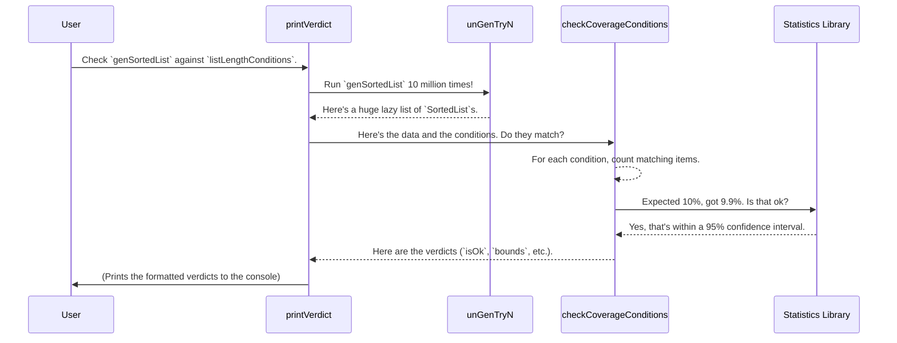

# Chapter 6: Distribution Checking Utilities

In the last chapter, [Chapter 5: Least-Effort Derivation Tactic](05_least_effort_derivation_tactic_.md), we saw how `deriveGen` can cleverly figure out how to build complex, valid data. We now have a powerful, automated factory for producing test data.

But just because a factory is producing items that pass the "correctness" check, does that mean it's doing a good job? What if our candy factory, which is supposed to make red, green, and blue candies, ends up making 99% red candies and only a handful of the others? The candy is still valid, but the variety is terrible! This is the problem that distribution checking solves.

## The Quality Control Inspector

A generator that always produces an empty `SortedList` is technically correct, but it's not very useful for testing. We want our generators to produce a wide *variety* of data to catch as many edge cases as possible. We need a quality control inspector.

This is where `DepTyCheck`'s **Distribution Checking Utilities** come in. These are not part of the core library you'd use every day, but are special testing tools used within the `DepTyCheck` project itself to ensure that the generators it derives are of high quality. They check if the generated values have a good statistical distribution.

Our goal for this chapter: **Check if our `genSortedList` generator produces lists of different lengths in roughly equal measure.**

## Setting Expectations with `CoverageTest`

Before the inspector can check the candy production line, they need a spec sheet. What is the *expected* distribution? For our list generator, we want to specify that we expect to see lists of certain lengths.

This is done with a data type called `CoverageTest`. Think of a `CoverageTest` as a single line on the inspector's clipboard:

*   **What to look for:** A specific property (e.g., "the list has a length of 3").
*   **How often to see it:** The expected probability (e.g., "about 10% of the time").

Let's say we want to check that our generator produces `SortedList`s of lengths 0, 1, and 2. We can define a `CoverageTest` for each length.

```idris
-- This is a simplified definition for demonstration.
record CoverageTest a where
  constructor MkCoverage
  predicate : a -> Bool
  expected : Double -- A probability, e.g., 0.1 for 10%
```

Here’s how we'd create a "spec sheet" to check for lists of length 0 up to 4, each with an expected probability.

```idris
import Data.Vect

-- Spec sheet: a list of tests to run on our generated SortedLists.
listLengthConditions : Vect 5 (CoverageTest (SortedList Nat))
listLengthConditions =
  [ MkCoverage (\lst => length lst == 0) 0.1 -- Expect 10% of lists to be empty
  , MkCoverage (\lst => length lst == 1) 0.1 -- Expect 10% to have length 1
  , MkCoverage (\lst => length lst == 2) 0.1 -- And so on...
  , MkCoverage (\lst => length lst == 3) 0.1
  , MkCoverage (\lst => length lst == 4) 0.1
  ]
```
This vector of tests tells our inspector exactly what to check for.

## Running the Inspection with `printVerdict`

Now that we have our generator (`genSortedList`) and nuestro spec sheet (`listLengthConditions`), we can run the inspection. The `printVerdict` function, found in the examples' test suites, does just this.

`printVerdict` will:
1.  Run our generator thousands or millions of times.
2.  Count how many of the generated lists match each predicate in our `listLengthConditions`.
3.  Perform a statistical analysis to see if the actual frequencies match the expected ones.
4.  Print a "verdict".

```idris
-- Assuming `genSortedList` is defined as in previous chapters.
main : IO ()
main = printVerdict genSortedList listLengthConditions
```

After running for a while, it will print a result that looks something like this:

**Example Output:**

```
[ isOk: True, bounds: (low: 0.099, high: 0.101), actual: 0.100
, isOk: True, bounds: (low: 0.099, high: 0.101), actual: 0.099
, isOk: True, bounds: (low: 0.099, high: 0.101), actual: 0.101
, isOk: True, bounds: (low: 0.099, high: 0.101), actual: 0.100
, isOk: True, bounds: (low: 0.099, high: 0.101), actual: 0.101
]
```
This output is a vector of results, one for each `CoverageTest` we provided. Let's look at the first line:
*   `isOk: True`: The test passed!
*   `bounds: (low: 0.099, high: 0.101)`: Our statistical model says that for an expected probability of `0.1`, any actual result between `0.099` and `0.101` is acceptable.
*   `actual: 0.100`: In our massive sample run, empty lists occurred 10.0% of the time.

Since `0.100` is within the `bounds`, `isOk` is `True`. Because all five tests have `isOk: True`, we can be confident that our `genSortedList` generator has good distribution for small list lengths!

## Under the Hood: The Assembly Line of a Verdict

How does `printVerdict` come to its conclusion? It's a pipeline of operations, defined in a helper file like `examples/sorted-list-so-comp/tests/gens/distribution-length/DistrCheckCommon.idr`.



The core of this process happens in a single, dense line of code. Let's look at the `verdict` function that `printVerdict` calls.

```idris
-- from: examples/sorted-list-so-comp/tests/gens/distribution-length/DistrCheckCommon.idr

verdict : (a -> Maybe b) -> Vect n (CoverageTest b) -> Gen em a -> Maybe (Vect n SignificantBounds)
verdict f conds = find . mapMaybe sequence . checkCoverageConditions conds . mapMaybe f . unGenTryN 10000000 someStdGen
```

This looks intimidating! But it's just a functional pipeline. Let's read it from right to left, which is how the data flows:

1.  `unGenTryN 10000000 someStdGen`: This is the engine. It takes a generator and runs it 10 million times, producing a huge (lazy) list of raw values.

2.  `mapMaybe f`: It applies a function `f` to each generated value. This is useful if you want to inspect a part of the value, like getting the `length` of a list. For our simple case, `f` is just the `Just` function, which wraps each value in a `Maybe`.

3.  `checkCoverageConditions conds`: This is the inspector. It takes the stream of generated values and our list of `conds` (`CoverageTest`s). It uses statistical functions to compare the actual counts against the expected probabilities. It returns a list of results (`SignificantBounds`).

4.  `find . mapMaybe sequence`: These are just helper functions to process the results and find a stable verdict once the statistical noise settles down.

The `printVerdict` function is a small wrapper around this `verdict` function that simply formats and prints the final output.

```idris
-- from: examples/sorted-list-so-comp/tests/gens/distribution-length/DistrCheckCommon.idr

export
printVerdict' : HasIO m => (a -> Maybe b) -> Gen em a -> Vect n (CoverageTest b) -> m ()
printVerdict' mapper = putStrLn .: show .: flip (verdict mapper)
```

This shows how you can build powerful analysis tools by combining the basic `Gen` primitives with other libraries (like statistics).

## Conclusion

In this chapter, we played the role of a quality control inspector, making sure our automatically-derived generators are not just correct, but also *good*.

-   **Distribution matters**: A generator that produces a narrow range of data is not effective for property-based testing.
-   The **Distribution Checking Utilities** are tools used within the `DepTyCheck` project to validate the quality of its own derived generators.
-   We use **`CoverageTest`** to define our expectations for how often certain values should appear.
-   The **`printVerdict`** function automates the process of running a generator millions of times, collecting statistics, and reporting whether the actual distribution matches the expected one.
-   This process gives us confidence that `deriveGen` is producing diverse, high-quality, and unbiased test data.

We now have tools to create generators and check their quality. But what happens if `deriveGen` can't figure out how to create a generator on its own? Sometimes it needs a little help.

In the next chapter, we will look at how `DepTyCheck` analyzes a generator's signature to figure out exactly what it needs to do, which is the first step in its derivation process.

Next: [Chapter 7: Generator Signature Analysis](07_generator_signature_analysis_.md)

---

Generated by [AI Codebase Knowledge Builder](https://github.com/The-Pocket/Tutorial-Codebase-Knowledge)