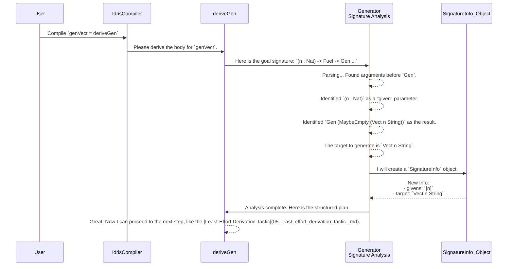

# Chapter 7: Generator Signature Analysis

In our journey so far, especially in [Chapter 3: Automatic Generator Derivation (`deriveGen`)](03_automatic_generator_derivation___derivegen___.md), we've seen the magic of `deriveGen`. It seems to just *know* how to create a generator for almost any type we throw at it. But how does it know what we want? How does it tell the difference between a parameter we provide (like the length of a `Vect`) and a value it needs to create (the `Vect` itself)?

This chapter pulls back the curtain on the very first step of the `deriveGen` process: the **Generator Signature Analysis**. This is the internal mechanism that reads and understands your request.

## The Customs Officer for Types

Imagine you're at a port, managing a logistics operation. You have a truck, and your job is to get a specific package from Point A to Point B. You hand a manifest to the customs officer.

*   **The Manifest:** This is your function's type signature.
*   **Goods Already on the Truck:** These are the inputs you are *providing* to the function.
*   **Goods to be Loaded at the Port:** These are the values you expect the function to *generate* for you.

The **Generator Signature Analysis** is that diligent customs officer. It reads your manifest (the type signature), checks what goods you've already provided (the "given" inputs), and figures out what goods it needs to source and load onto the truck (the "generated" outputs). It makes sure your request is valid and understood before any work begins.

## Defining the "Manifest"

Let's use a concrete example. We want to create a generator that, given a length `n`, produces a `Vect` of that length containing random strings. The "manifest" we write for `deriveGen` looks like this:

```idris
import Data.Vect

-- A recipe where we give `n` and get back a `Vect n String`.
genVect : (n : Nat) -> Fuel -> Gen (MaybeEmpty (Vect n String))
genVect = deriveGen
```

This single line of code contains all the information the "customs officer" needs. Let's break down how it reads this manifest.

### 1. The "Given" Parameters: What's Already on the Truck

The analysis engine scans the signature from left to right. Any argument *before* the `-> Gen ...` part is considered a **given** parameter. These are inputs you, the user, will provide when you call the generator.

```idris
-- This is a "given" parameter. You must provide it.
(n : Nat)
```

In our analogy, you've arrived at the port with a truck that already has the number `n` loaded onto it.

There's also a special "given" parameter that's always required: `Fuel`. This is a simple counter to prevent recursive generators from running forever.

```idris
-- This is a special, required "given".
-> Fuel ->
```

### 2. The "Generated" Target: What to Load at the Port

Next, the analysis finds the `Gen` type constructor. This signals the end of the "givens" and the beginning of the "generateds." Everything *inside* the `Gen (...)` describes the payload to be created.

```idris
-- The engine sees this and knows its job is to produce a recipe.
Gen (MaybeEmpty (...))
```

And what is the payload? In this simple case, it's `Vect n String`.

```idris
-- This is the type of the value to be generated.
Vect n String
```

The analysis engine now has a complete picture:
*   **Given:** A `Nat` named `n`.
*   **To Generate:** A value of type `Vect n String`.

Because `n` is a "given," the engine knows it will be available when it needs to generate the `Vect`. It doesn't need to generate `n` itself; it just uses the one you provided.

## Under the Hood: The Analysis Process

When the Idris compiler encounters `genVect = deriveGen`, it triggers the signature analysis macro. Here’s a step-by-step walkthrough of what happens.



This process turns your human-readable type signature into a structured data object that the rest of the `DepTyCheck` machinery can work with.

### A Peek at the Code

The main entry point for this analysis is the `checkTypeIsGen` function in `src/Deriving/DepTyCheck/Gen.idr`. Don't worry about the details; just see how it reflects our high-level description.

First, the `deriveGen` macro grabs the signature (the "goal") and passes it to the analysis function.

```idris
-- from: src/Deriving/DepTyCheck/Gen.idr

export %macro
deriveGen : DeriveBodyForType => Elab a
deriveGen = do
  Just signature <- goal
     | Nothing => fail "..."

  -- The analysis starts right here!
  checkResult <- checkTypeIsGen DerivationTask signature
  -- ... more steps follow ...
```

Inside `checkTypeIsGen`, it breaks the signature apart into its arguments (`sigArgs`) and its final return type (`sigResult`). This is like separating the manifest's header from its item list.

```idris
-- from: src/Deriving/DepTyCheck/Gen.idr (simplified logic)

checkTypeIsGen : ... -> TTImp -> Elab (CheckResult ...)
checkTypeIsGen ... sig = do

  -- Break signature into (args, result)
  let (sigArgs, sigResult) = unPi sig

  -- Analyze `sigArgs` to find the "given" parameters.
  -- ...

  -- Analyze `sigResult` to find the `Gen` wrapper and "generated" target.
  -- ...
```

After parsing everything, the analysis engine packages its findings into a record. The `ExternalGenSignature` record is a key part of this. It's the final, stamped manifest that the customs officer hands over to the warehouse workers.

```idris
-- from: src/Deriving/DepTyCheck/Gen/Signature.idr (simplified)

record ExternalGenSignature where
  constructor MkExternalGenSignature
  -- What type are we building? (e.g., Vect)
  targetType : TypeInfo

  -- What parameters did the user provide? (e.g., n)
  givenParams : SortedMap (Fin targetType.args.length) (ArgExplicitness, Name)

  -- ... and other details ...
```

This structured `ExternalGenSignature` object is then passed along to the next stage in the derivation pipeline, which decides the *order* in which to generate arguments.

## Conclusion

In this chapter, we've demystified the very first step of `deriveGen`'s magic. The **Generator Signature Analysis** is a crucial interpreter that:

-   Acts like a **customs officer** inspecting a **manifest** (the type signature).
-   Distinguishes between **"given" parameters** (inputs you provide) and the **"generated" target** (the value `deriveGen` must create).
-   Validates your request and translates it into a structured plan for the rest of the machinery.

This analysis provides the clear instructions needed for the next stages to work correctly. It's the foundation upon which the entire automatic derivation process is built. Without it, `deriveGen` would have no idea what you're asking it to do!

Now that we have seen how `DepTyCheck` understands what to generate, what about visualizing the complex data it creates? The next chapter will look at a utility designed to help with just that.

Next: [Chapter 8: PIL-Fun Pretty-Printer](08_pil_fun_pretty_printer_.md)

---

Generated by [AI Codebase Knowledge Builder](https://github.com/The-Pocket/Tutorial-Codebase-Knowledge)