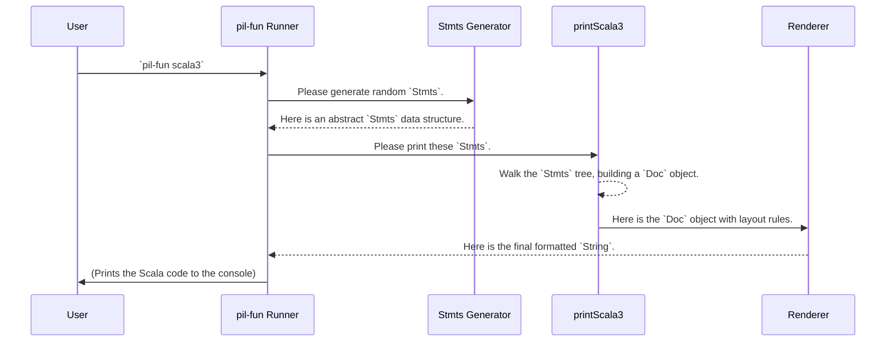

# Chapter 8: PIL-Fun Pretty-Printer

Welcome to the final chapter of our `DepTyCheck` tutorial! In our previous chapter, [Chapter 7: Generator Signature Analysis](07_generator_signature_analysis_.md), we looked at how `DepTyCheck` understands exactly what we want to generate. We've journeyed from creating basic generators with the [Generator Monad (`Gen`)](01_generator_monad___gen___.md) to automatically deriving them for complex types like the [Primitive Imperative Language (PIL)](04_primitive_imperative_language__pil__.md).

But once we've generated a complex, abstract data structure like a PIL program, how do we look at it? It's just a raw data tree in Idris. This chapter introduces a practical and powerful solution: a pretty-printer that can turn our abstract program into beautiful, readable source code for multiple target languages.

## The Universal Translator

Imagine you have a detailed, abstract blueprint for a machine. This blueprint is pure structure, not tied to any specific language. Now, imagine you have a "universal translator" that can take this blueprint and generate building instructions in English, Spanish, or Chinese. It knows the vocabulary, grammar, and idiomatic phrases of each language.

The `pil-fun` pretty-printer is exactly this.
*   **The Blueprint:** A `Stmts` value—the abstract syntax tree of a program generated by `DepTyCheck`.
*   **The Translator:** The pretty-printing system.
*   **The Languages:** Scala 3, Lua 5.4, and Idris 2.

Our goal is to take a randomly generated program and see what it looks like as a human-readable Scala 3 program.

## From Abstract Data to Concrete Code

The `pil-fun` example in the `DepTyCheck` repository is a command-line application that does exactly this. When you run it, it performs two main steps:

1.  **Generate:** It uses a generator (like `genStmts` which is derived automatically) to create a random, valid program as a `Stmts` data structure.
2.  **Pretty-Print:** It passes this abstract `Stmts` value to a language-specific printing function, which converts it into a formatted string.

Let's see what this looks like in practice. If we ask the tool to generate a simple program and print it as Scala, here's what might happen:

**A Randomly Generated `Stmts` Value (conceptual):**

```idris
-- Conceptual representation of the abstract data
NewV Int' Immutable (C (I 10)) (
  NewV Bool' Immutable (C (B True)) (
    Nop -- Does nothing
  )
)
```

**Output after running `pil-fun scala3`:**

```scala
// This is the pretty-printed, human-readable output
val x_1 : Int = 10
val x_2 : Boolean = true
```

The pretty-printer translated the abstract `NewV` (New Variable) constructor into the `val` keyword in Scala, generated unique variable names (`x_1`, `x_2`), and formatted everything correctly.

## The Components of the Translator

This system isn't one giant, monolithic function. It's a collection of modular pieces that work together.

### 1. The Core `PP` (Pretty-Printer) Type

First, we need a common definition for what a pretty-printer *is*. It's a function that takes our abstract `Stmts` data and produces a `Doc`—a special data type from a printing library that knows how to handle layout, indentation, and line breaks.

```idris
-- from: examples/pil-fun/src/Language/PilFun/Pretty.idr

public export
0 PP : SupportedLanguage -> Type
PP language = {funs : _} -> {vars : _} -> {retTy : _} ->
              (names : UniqNames language funs vars) =>
              Fuel -> Stmts funs vars retTy -> Gen0 $ Doc opts
```

This is a generic "interface" for all our pretty-printers. It says: "A `PP` for a given `language` is a function that can take some `Stmts` and turn them into a `Doc`."

### 2. Language-Specific "Dialects"

For each target language, there's a file that implements this `PP` interface. It's the "dialect" module that knows the specific syntax of that language. Let's look at a tiny piece of the Scala 3 implementation.

```idris
-- Simplified from: examples/pil-fun/src/Language/PilFun/Pretty/Scala3.idr

printStmts : Fuel -> Stmts funs vars retTy -> Gen0 $ Doc opts

-- How to print a "New Variable" statement
printStmts fl $ NewV ty mut initial cont = do
  -- ... generate a new unique name, like "x_1"
  let declPref = case mut of
                   Mutable   => "var"
                   Immutable => "val"
  let lhs = declPref <++> line nm <++> "="
  rhs <- printExpr Open initial
  -- Put it all together and then print the rest of the program (`cont`)
  pure $ hangSep' 2 lhs rhs `vappend` !(printStmts fl cont)
```

This function pattern-matches on the `Stmts` data structure. When it sees `NewV`, it knows to emit the text "val" or "var", followed by the variable's name and an equals sign. It recursively calls itself to print the rest of the program.

Each language (Lua, Idris 2) has a similar file that maps the same abstract constructors to its own unique syntax.

### 3. Language Configuration

Different languages have a different feel. For example, `+` is an infix operator in Scala (`a + b`), but it could be a prefix function call in another language (`add(a, b)`). The pretty-printing system is configurable to handle these differences.

The `NamedCtxt` record acts as a "dictionary" for a language's built-in functions.

```idris
-- from: examples/pil-fun/src/Language/PilFun/Pretty/DSL.idr

public export
record NamedCtxt (l : SupportedLanguage) where
  constructor MkNamedCtxt
  functions : Funs
  variables : Vars
  fvNames   : UniqNames l functions variables
```

We can define a context for each language, telling the system about its standard library functions and whether they are infix.

```idris
-- from: examples/pil-fun/src/Runner.idr

scala3StdFuns : NamedCtxt Scala3
scala3StdFuns = do
  -- Defines "Console.println" as a non-infix, non-pure function
  AddFun False False "Console.println" $ [< Int'] ==> Nothing
  -- Defines "+" as an infix, pure function
  AddFun True  True "+"                $ [< Int', Int'] ==> Just Int'
  -- ... more function definitions
  Enough
```

This configuration tells the `printExpr` function how to format function calls correctly for Scala.

## Under the Hood: The Printing Pipeline

Let's trace the journey from a command-line invocation to the final printed code.



The `Runner.idr` file orchestrates this entire process. It contains a map of all supported languages and their corresponding pretty-printers.

```idris
-- from: examples/pil-fun/src/Runner.idr

supportedLanguages : SortedMap String (l ** (NamedCtxt l, PP l))
supportedLanguages = fromList
  [ ("scala3", (Scala3 ** (scala3StdFuns, printScala3)))
  , ("lua5.4", (Lua5_4 ** (lua5_4StdFuns, printLua5_4)))
  , ("idris2", (Idris2 ** (idris2StdFuns, printIdris2)))
  ]
```
When you run `pil-fun scala3`, the runner looks up `"scala3"` in this map, grabs its context (`scala3StdFuns`) and its pretty-printer function (`printScala3`), and wires them into the pipeline shown in the diagram.

The `run` function shows this wiring clearly:
1.  Generate the `Stmts`.
2.  Call the pretty-printer (`pp`) on the result.
3.  Render and print the final document.

```idris
-- Simplified from: examples/pil-fun/src/Runner.idr

run : Config -> NamedCtxt language -> (pp : PP language) -> IO ()
run conf ctxt pp = do
  -- 1. Generate random statements (`Stmts`)
  let vals = unGenTryN conf.testsCnt seed $
               genStmts ... >>=
                 -- 2. Call the pretty-printer on them
                 pp @{ctxt.fvNames} conf.ppFuel
  -- 3. Render and print each one
  Lazy.for_ vals $ \val => do
    putStrLn "-------------------\n"
    putStr $ render conf.layoutOpts val
```

This elegant design separates the "what" (the abstract `Stmts`) from the "how" (the language-specific printing logic), making the system easy to extend with new target languages.

## Conclusion: Tying It All Together

In this chapter, we explored the `pil-fun` pretty-printer, a practical and powerful utility that showcases a real-world use case for `DepTyCheck`.

-   It acts as a **universal translator**, converting abstract `Stmts` data structures into human-readable source code.
-   The system is **modular**, with a generic `PP` interface and specific implementations for each target language (Scala, Lua, Idris 2).
-   It is **configurable**, allowing us to define language-specific features like infix operators.

This brings our tour of `DepTyCheck` to a close. We started with the fundamental building block, the [Generator Monad (`Gen`)](01_generator_monad___gen___.md), and saw how it could be used to create recipes for random data. We explored how it handles complex [Dependently-Typed Data Structures](02_dependently_typed_data_structures__examples__.md) and how the magic of [`deriveGen`](03_automatic_generator_derivation___derivegen___.md) automates the creation of these recipes. Finally, we saw how these generated structures can be used and visualized in a real application.

You now have a solid understanding of the core concepts behind `DepTyCheck` and how it revolutionizes property-based testing for dependently-typed languages. Happy testing

---

Generated by [AI Codebase Knowledge Builder](https://github.com/The-Pocket/Tutorial-Codebase-Knowledge)