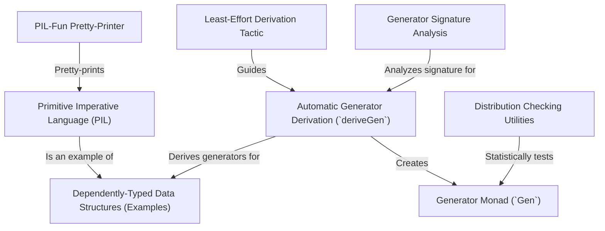

# Tutorial: DepTyCheck

DepTyCheck is a library for the Idris programming language that makes *property-based testing* much easier. Its main feature is a powerful tool, `deriveGen`, that can **automatically create random data generators** for even the most complex, *dependently-typed* data structures. This saves developers from the difficult and error-prone task of writing these generators by hand, allowing them to test their code with a wide variety of valid, randomly-generated inputs.

**Source Repository:** [None](None)

## Chapters

1. [Generator Monad (`Gen`)
](01_generator_monad___gen___.md)
2. [Dependently-Typed Data Structures (Examples)
](02_dependently_typed_data_structures__examples__.md)
3. [Automatic Generator Derivation (`deriveGen`)
](03_automatic_generator_derivation___derivegen___.md)
4. [Primitive Imperative Language (PIL)
](04_primitive_imperative_language__pil__.md)
5. [Least-Effort Derivation Tactic
](05_least_effort_derivation_tactic_.md)
6. [Distribution Checking Utilities
](06_distribution_checking_utilities_.md)
7. [Generator Signature Analysis
](07_generator_signature_analysis_.md)
8. [PIL-Fun Pretty-Printer
](08_pil_fun_pretty_printer_.md)

---

Generated by [AI Codebase Knowledge Builder](https://github.com/The-Pocket/Tutorial-Codebase-Knowledge)