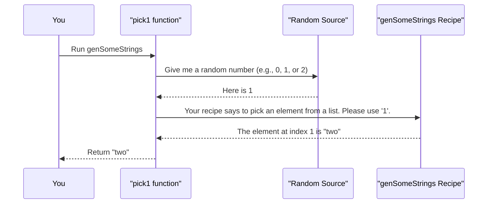

# Chapter 1: Gen: The Data Generator

Welcome to the world of `DepTyCheck`! Before we can test our code, we need a way to generate a wide variety of inputs. How can we be sure our `sort` function works for lists with 0, 1, or 100 elements? Or for lists with duplicate numbers? Generating all this test data by hand is tedious and error-prone. This is where `Gen`, the data generator, comes in.

In this chapter, we'll explore the heart of `DepTyCheck`: the `Gen` type. Think of it as a magical recipe book for creating random data.

## What is a `Gen`?

A `Gen` (short for "Generator") is a **recipe** for creating random values of a specific type. It doesn't hold a value itself; it holds the *instructions* on how to make one.

Imagine a cookie cutter. The cutter isn't a cookie, but it defines the shape. You can use it to make as many star-shaped cookies as you want.


Similarly, a `Gen String` is a "recipe" for making `String`s. When we "run" the generator, it follows the recipe and gives us a random `String` value.

### Your First Generator: `elements`

Let's create our first generator. The simplest way is to provide a list of possible values and have the generator pick one at random. We can do this with the `elements` function.

```idris
import Deriving.DepTyCheck.Gen

-- A generator that randomly picks "one", "two", or "three".
genSomeStrings : Gen NonEmpty String
genSomeStrings = elements ["one", "two", "three"]
```

Let's break this down:
- `genSomeStrings` is the name of our generator.
- Its type is `Gen NonEmpty String`. This tells us two things:
    1.  `Gen ... String`: It's a generator for `String` values.
    2.  `NonEmpty`: This is a guarantee. It promises that this generator will *always* succeed in creating a value. It can never be "empty." We'll see why this is important soon.
- `elements [...]`: This is the function we use to build the generator from a list of choices.

## Combining Generators

Making generators from a fixed list is a good start, but the real power comes from combining them.

### Choosing Between Recipes with `oneOf`

What if we have two different generators and we want to create a new one that randomly picks between them? We can use `oneOf`.

```idris
-- A new generator that picks from a different list of strings.
genOtherStrings : Gen NonEmpty String
genOtherStrings = elements ["alpha", "beta"]

-- A generator that combines the two.
genCombined : Gen NonEmpty String
genCombined = oneOf [genSomeStrings, genOtherStrings]
```

When we run `genCombined`, it first makes a 50/50 choice: should it use the `genSomeStrings` recipe or the `genOtherStrings` recipe? Once it picks a recipe, it follows it to produce a value.

### Building Complex Data

Most of the time, we're not just testing with simple `String`s or `Nat`s. We have our own custom data structures. `Gen` makes it easy to create recipes for these too.

Let's say we have a `User` record:

```idris
data User = MkUser Nat String
```

How do we generate random `User`s? We need a generator for `Nat` and a generator for `String`. We can then combine them using special `[| ... |]` syntax.

```idris
-- A generator for some ages (we'll keep it simple).
genAges : Gen NonEmpty Nat
genAges = elements [18, 25, 42, 67]

-- A generator for some names.
genNames : Gen NonEmpty String
genNames = elements ["Alice", "Bob", "Charlie"]

-- Now, a generator for Users!
genUser : Gen NonEmpty User
genUser = [| MkUser genAges genNames |]
```

This is incredibly powerful! The `[| MkUser genAges genNames |]` line reads like you're building a regular `User`, but you're actually building a *recipe*. When run, this recipe will:
1.  Run the `genAges` generator to get a random age (e.g., `42`).
2.  Run the `genNames` generator to get a random name (e.g., `"Bob"`).
3.  Combine them into a `User`: `MkUser 42 "Bob"`.

## A Special Case: Empty Generators

In regular programming, we usually assume that any type has values. You can always make a `String` or a `Nat`. But in dependently-typed programming, some types might have **no values at all** under certain conditions.

A classic example is `Fin n`, the type of numbers from `0` to `n-1`.
- `Fin 3` has values: `0`, `1`, and `2`.
- `Fin 1` has one value: `0`.
- What about `Fin 0`? There are no numbers "from 0 to -1". This type is **uninhabited**, or **empty**.

If we want to write a function that creates a generator for *any* `Fin n`, we have to handle the `n=0` case. A generator for an empty type must itself be empty—it cannot produce a value.

`DepTyCheck` handles this elegantly. Remember the `NonEmpty` tag from before? The alternative is `MaybeEmpty`.

- `Gen NonEmpty a`: A generator that is **guaranteed** to produce a value of type `a`.
- `Gen MaybeEmpty a`: A generator that **might** produce a value, or it might be empty.

Here’s how we can write a generator for `Fin n`:

```idris
import Data.Fin

-- A function that returns a generator for a given `n`.
genFin : (n : Nat) -> Gen MaybeEmpty (Fin n)
genFin Z     = empty
genFin (S k) = elements' (allFins k) -- `allFins` lists all values of Fin (S k)
```

Look closely:
1.  The return type is `Gen MaybeEmpty (Fin n)`. This warns us that the returned generator isn't guaranteed to produce a value.
2.  If `n` is `Z` (zero), we return `empty`. This is a special generator that produces nothing.
3.  If `n` is `S k` (a successor, so `n > 0`), we know the type is inhabited. We use `elements'` to create a generator that picks from all possible `Fin (S k)` values.

This awareness of "emptiness" is a key feature of `DepTyCheck` that makes it safe and powerful for testing dependent types.

## How Does `Gen` Work Under the Hood?

So far, we've only talked about creating recipes. How do we actually "bake the cookies"? And what does a `Gen` look like on the inside?

### The Big Picture: Running a `Gen`

A `Gen` is just a data structure. It's inert until you pass it to a function like `pick1`, which knows how to interpret the recipe.

Here is a simplified sequence of what happens when you run `pick1 genSomeStrings`:



### The Code: The `Gen` Data Type

If you were to look inside the `DepTyCheck` library (in the file `src/Test/DepTyCheck/Gen.idr`), you would find the definition of `Gen`. It's a bit complex, but here are the key pieces we've seen so far:

```idris
-- From: src/Test/DepTyCheck/Gen.idr

data Gen : Emptiness -> Type -> Type where
  -- A generator that can't produce a value.
  Empty : Gen MaybeEmpty a

  -- A generator that always produces the exact same value.
  Pure  : a -> Gen em a

  -- A generator that chooses from a list of other generators.
  OneOf : GenAlternatives True alem a -> Gen em a

  -- ... other, more advanced constructors
```

- `Empty`: This is the constructor for the `empty` generator we used for `Fin 0`. Notice its type is `Gen MaybeEmpty a`, enforcing that only `MaybeEmpty` generators can be `Empty`.
- `Pure`: The simplest possible recipe: "always return this specific value". The `elements ["hello"]` generator is essentially built on `Pure "hello"`.
- `OneOf`: This is the internal constructor used by functions like `oneOf` and `elements`. It holds a collection of other generators to choose from.

## Getting Values from a Generator

Okay, we have our recipes. How do we get the food? `DepTyCheck` provides simple functions for this.

- `pick1 : Gen NonEmpty a -> IO a`
  Use this for `NonEmpty` generators. It's guaranteed to return a value.

- `pick : Gen MaybeEmpty a -> IO (Maybe a)`
  Use this for `MaybeEmpty` generators. It returns a `Maybe a` to safely handle the case where the generator was empty (returning `Nothing`).


Let's try them with our previous examples.

```idris
-- For a NonEmpty generator:
-- > pick1 genUser
-- Result could be: MkUser 42 "Alice"

-- > pick1 genUser
-- Result could be: MkUser 18 "Charlie"
```

```idris
-- For a MaybeEmpty generator:

-- Let's run our Fin generator for n=2
-- > pick (genFin 2)
-- Result could be: Just 1

-- Now let's run it for n=0
-- > pick (genFin 0)
-- Result is always: Nothing
```

## Conclusion

In this chapter, we've pulled back the curtain on `Gen`, the fundamental building block of `DepTyCheck`. You've learned:

- A `Gen` is a **recipe** for creating random data.
- You can create simple generators with `elements` and combine them with `oneOf` and `[| ... |]`.
- The `Emptiness` type (`NonEmpty` vs. `MaybeEmpty`) is crucial for safely handling dependently-typed code where some types might have no values.
- You can "run" a generator using functions like `pick1` and `pick` to get actual test data.

Creating all these generator recipes by hand is a great way to understand how they work, but it can become repetitive for complex data types. Wouldn't it be great if `DepTyCheck` could just look at your data type and write the generator for you?

In the next chapter, we'll see exactly how to do that.

---

Next up: [deriveGen: The Automatic Generator Factory](02_derivegen__the_automatic_generator_factory_.md)

---

Generated by [AI Codebase Knowledge Builder](https://github.com/The-Pocket/Tutorial-Codebase-Knowledge)