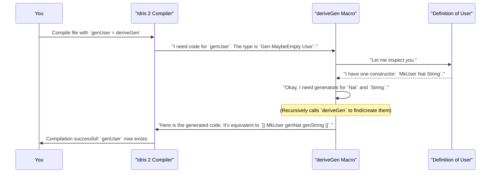

# Chapter 2: deriveGen: The Automatic Generator Factory

In the [previous chapter](01_gen__the_data_generator_.md), we learned how to build our own data generators from scratch. We used functions like `elements` and the special `[| ... |]` syntax to create recipes for simple data types. This is great for understanding how generators work, but what happens when our data types get more complex?

Imagine we have a `BlogPost` record with a title, author, list of tags, and maybe even a list of comments. Writing a generator for this by hand would involve writing generators for comments, combining them into a list generator, and then combining _that_ with generators for strings, tags, and so on. It's a lot of work!

This is where `DepTyCheck`'s superpower comes in. Meet `deriveGen`, the automatic generator factory.

## What is `deriveGen`?

`deriveGen` is a powerful macro that automatically writes generators for you.

Think back to the toy factory analogy. Imagine you've designed a complex blueprint for a new action figure (your Idris data type). Instead of manually designing and building the manufacturing process for every single plastic part (the fields of your data type), you can show your blueprint to a master roboticist.

`deriveGen` is that roboticist. It looks at your blueprint and instantly creates a fully automated factory (a `Gen`) that can produce that action figure in countless variations. It's not magic, but it's close! It uses a feature of Idris 2 called "elaborator reflection" to inspect your types at compile-time and write the generator code on your behalf, right before your program is fully built.

## Your First Derived Generator

Let's revisit the `User` data type from the previous chapter.

```idris
data User = MkUser Nat String
```

Previously, we wrote a generator for it manually. With `deriveGen`, it's much simpler. Here's how you do it:

```idris
%language ElabReflection

import Deriving.DepTyCheck.Gen

data User = MkUser Nat String

-- Define the generator's type signature...
genUser : Fuel -> Gen MaybeEmpty User
-- ...and let deriveGen write the implementation!
genUser = deriveGen
```

Let's break down what's happening here, because some new things have appeared.

1.  `%language ElabReflection`: This is a special command for the Idris compiler. It's like flipping a switch to turn on the "metaprogramming" features that allow `deriveGen` to inspect your code. You'll need this at the top of any file where you use `deriveGen`.

2.  `genUser : Fuel -> Gen MaybeEmpty User`: This is the function's type signature. This looks a bit different from our manual `genUser` in Chapter 1.
    *   `Fuel -> ...`: `deriveGen` automatically adds a `Fuel` argument. We'll explore this in the next section. For now, think of it as a safety budget.
    *   `Gen MaybeEmpty User`: All generators created by `deriveGen` are `MaybeEmpty` by default. This is a safety measure, as `deriveGen` can't always prove that a type has values, especially with complex dependent types. For `User`, it will always succeed, but the type signature is cautious.

3.  `genUser = deriveGen`: This is the incredible part. We don't write a function body. We just tell Idris to use the `deriveGen` macro. The compiler sees this, runs `deriveGen`, which then writes the necessary code and slots it in as the body of our `genUser` function.

Behind the scenes, `deriveGen` has effectively written code similar to this for you:

```idris
-- This is what deriveGen conceptually generates for you:
genUser fuel = [| MkUser (deriveGen {for=Nat} fuel) (deriveGen {for=String} fuel) |]
```

## The `Fuel` Argument: A Safety Budget for Recursion

You might be wondering, "Why the `Fuel` argument?" The answer is **recursion**.

Let's consider a simple recursive data type: a list of numbers.

```idris
data MyList = MyNil | MyCons Nat MyList
```

If we ask `deriveGen` to create a `Gen` for `MyList`, it will see two choices: `MyNil` or `MyCons`. To make a `MyCons`, it needs a `Nat` and... another `MyList`! If it just randomly picked between the two constructors, it could get unlucky and choose `MyCons` over and over again, trying to build an infinitely long list and crashing your program.

`Fuel` prevents this. It's a number that acts as a "recursion budget".

Here's how we'd derive a generator for `MyList`:

```idris
%language ElabReflection
import Deriving.DepTyCheck.Gen

data MyList = MyNil | MyCons Nat MyList

genMyList : Fuel -> Gen MaybeEmpty MyList
genMyList = deriveGen
```

When you run this generator—for example, with `pick (genMyList 5)`—here's what happens:
*   The generator starts with a `fuel` budget of `5`.
*   It might choose `MyCons`. To do this, it needs to generate a `Nat` and another `MyList`.
*   When it recursively calls itself to generate the inner `MyList`, it **spends one unit of fuel**, calling `genMyList 4`.
*   This continues. When the `fuel` reaches `0`, the generated code is forced to pick a non-recursive constructor. In this case, `MyNil`.

This "fuel" mechanism guarantees that the generator will always finish and never get stuck in an infinite loop.

## How Does `deriveGen` Work? A Peek Inside the Factory

We've said that `deriveGen` is a "compile-time macro", but what does that really mean? It means `deriveGen` is a special piece of code that runs *during the compilation of your program*, not when you run the final executable.

Let's follow the journey of `genUser = deriveGen`.



The core of this process happens inside the `Deriving.DepTyCheck.Gen` module. If you were to peek inside the file `src/Deriving/DepTyCheck/Gen.idr`, you'd find the definition of `deriveGen` itself.

```idris
-- From: src/Deriving/DepTyCheck/Gen.idr

export %macro
deriveGen : DeriveBodyForType => Elab a
deriveGen = do
  Just signature <- goal
     | Nothing => fail "The goal signature is not found..."
  tt <- deriveGenExpr signature
  check tt
```

You don't need to understand every detail, but here's the gist:
*   `%macro`: This tag tells Idris that `deriveGen` is a special compile-time macro.
*   `Elab a`: The function operates in the "Elaboration" monad, which is the world of compile-time code inspection and generation.
*   `goal`: This is a special command that asks the compiler, "What function am I trying to write the code for?" It gets back the type signature, like `Fuel -> Gen MaybeEmpty User`.
*   `deriveGenExpr`: This is the real engine room. It takes the signature, does all the type analysis, and builds the abstract syntax tree (`tt`) for the new generator code.
*   `check tt`: This hands the newly created code back to the Idris compiler, which then type-checks it and inserts it as the body of your `genUser` function.

## Deriving Generators for Dependent Types

The real magic of `deriveGen` shines when working with dependent types. Let's try generating a `Vect n a`—a list that is proven at the type level to have exactly `n` elements.

Suppose we want a function that, for any given `n`, generates a `Vect n Nat`. Here is the signature we want:

`(n : Nat) -> Fuel -> Gen MaybeEmpty (Vect n Nat)`

And here's how we implement it:

```idris
%language ElabReflection
import Deriving.DepTyCheck.Gen

-- The signature tells deriveGen exactly what we want.
genVectNat : (n : Nat) -> Fuel -> Gen MaybeEmpty (Vect n Nat)
genVectNat = deriveGen
```

That's it! `deriveGen` is smart enough to use the entire signature to guide its code generation. It sees:
1.  The target type is `Vect n Nat`.
2.  The value `n` is an *input* to the function.

When it analyzes the `Vect` data type, it sees its two constructors have very specific types:
*   `Nil : Vect 0 a`
*   `:: : a -> Vect k a -> Vect (S k) a`

The code `deriveGen` writes will be clever. If you call `genVectNat 0 fuel`, it knows that the only way to produce a `Vect 0 Nat` is to use the `Nil` constructor. If you call `genVectNat 3 fuel`, it knows it *must* use the `::` constructor, which will require it to recursively call itself to build a `Vect 2 Nat`, and so on, until `n` becomes 0. It handles the dependent-type logic for you, automatically.

## Conclusion

In this chapter, you've unlocked one of `DepTyCheck`'s most powerful features. You've learned:

- Manually writing generators for complex types is tedious and error-prone.
- **`deriveGen`** is a compile-time macro that automates this process by inspecting your data types.
- You must enable it with `%language ElabReflection`.
- Derived generators always take a **`Fuel`** argument to safely handle recursive data types and prevent infinite loops.
- `deriveGen` is smart enough to generate code that respects the constraints of dependent types, like `Vect n a`.

`deriveGen` is incredibly convenient, but sometimes we need more control. What if we want to generate a vector of a *random* length, instead of a fixed one? How can we tell `deriveGen` "please generate the `n` for me, too"? To do that, we need a more precise way to describe exactly what we want the generator to produce.

In the next chapter, we will explore the `GenSignature`, a blueprint that gives us fine-grained control over the derivation process.

---

Next up: [GenSignature: The Generator Blueprint](03_gensignature__the_generator_blueprint_.md)

---

Generated by [AI Codebase Knowledge Builder](https://github.com/The-Pocket/Tutorial-Codebase-Knowledge)