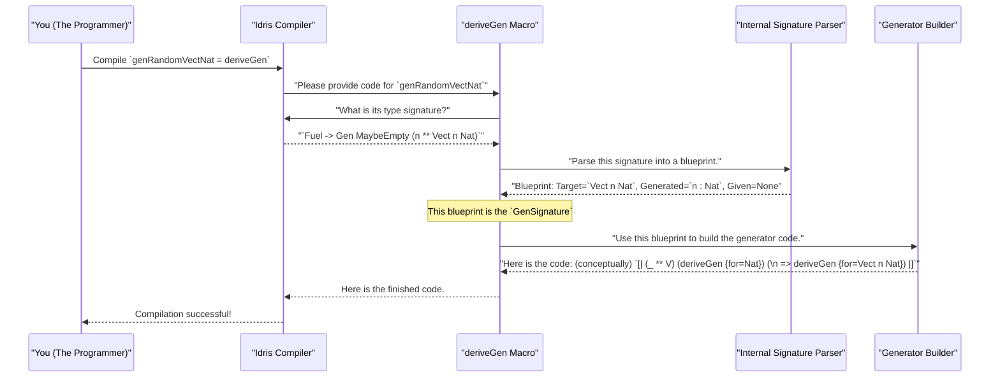

# Chapter 3: GenSignature: The Generator Blueprint

In the [previous chapter](02_derivegen__the_automatic_generator_factory_.md), we discovered the power of `deriveGen`, our automatic generator factory. We saw how it could look at a data type like `User` or `Vect n Nat` and instantly build a generator for it.

But `deriveGen` seems a bit like a mind reader. How does it know exactly what kind of generator we want? For `genVectNat : (n : Nat) -> Fuel -> Gen ...`, it correctly understood that `n` was a fixed input.

But what if we want something different? What if we want `deriveGen` to create a generator that produces vectors of a *random* length? How do we tell the factory, "Don't ask me for the length, just pick one yourself"?

To give these precise instructions, `deriveGen` needs a blueprint. This blueprint is called `GenSignature`.

## The Problem: Asking for a Random Length

Let's think about our `Vect` example. We want a generator that gives us a `Vect` of `Nat`s, but we want the length of the vector to be random, too. We want to get `Vect 0 Nat` sometimes, `Vect 3 Nat` other times, and so on.

In Idris, a value that comes packaged with its own proof or property is often represented by a dependent pair, written as `(x ** P x)`. So, a vector of a random length `n` would have the type `(n : Nat ** Vect n Nat)`.

How would we ask `deriveGen` to build a generator for this? We need a way to write a type signature that tells `deriveGen`:
1.  The final thing I want is a `Vect n Nat`.
2.  But I also want you to *generate* the `n` for me.
3.  I'm not *giving* you `n` as an input.

This is where the structure of your function's type signature becomes the blueprint itself.

## The Type Signature as a Blueprint

`GenSignature` is not a thing you write yourself. It's an internal data structure that `deriveGen` creates by *reading your function's type signature*. The way you write the type tells `deriveGen` exactly what to build.

Think of it like an order form for a custom PC. The form has different sections:
*   **Chassis (Target Type):** The main thing you're building (e.g., `Vect n Nat`).
*   **Pre-installed Parts (Given Parameters):** Components you provide up-front (e.g., you specify "I want an Intel CPU").
*   **Build-to-Order Parts (Generated Parameters):** Components you let the factory choose (e.g., you say "just pick a compatible graphics card for me").

Let's see how this maps to an Idris type signature.

### Blueprint for a Fixed-Length Vector

First, let's look at the `genVectNat` from the previous chapter.

```idris
-- genVectNat : (n : Nat) -> Fuel -> Gen MaybeEmpty (Vect n Nat)
-- genVectNat = deriveGen
```

When `deriveGen` reads this signature, it creates the following blueprint:
*   **Target Type:** `Vect n Nat` (The type inside the `Gen`).
*   **Given Parameters:** `n : Nat` (An input to the function, before the `Fuel` part).
*   **Generated Parameters:** *None*.

This blueprint tells the factory: "The user will give you a number `n`. Your job is to build a `Vect` of that exact length."

### Blueprint for a Random-Length Vector

Now, let's write a signature for our new goal: generating a vector of a random length.

```idris
%language ElabReflection
import Deriving.DepTyCheck.Gen

-- A generator for a Nat and a Vect of that Nat's length
genRandomVectNat : Fuel -> Gen MaybeEmpty (n ** Vect n Nat)
genRandomVectNat = deriveGen
```

When `deriveGen` reads this *new* signature, it creates a completely different blueprint:
*   **Target Type:** `Vect n Nat`.
*   **Given Parameters:** *None* (besides the standard `Fuel`).
*   **Generated Parameters:** `n : Nat` (The `n` is inside the `Gen`'s type, as part of a `(**)` pair).

This blueprint tells the factory: "The user isn't giving you anything. Your job is to first generate a random `Nat` called `n`, and *then* build a `Vect` of that length."

This is the key insight!
*   **Arguments to the function** become **Given Parameters**.
*   **Components of the dependent pair `(**)` inside the `Gen`** become **Generated Parameters**.

By simply changing the type signature, we give `deriveGen` completely different instructions.

## How `deriveGen` Reads the Blueprint

You don't need to know the complex details to use `DepTyCheck`, but it can be helpful to have a mental model of what's happening when you write `... = deriveGen`.

When the Idris compiler sees `deriveGen`, it essentially pauses and lets the `deriveGen` macro take over.



The "Internal Signature Parser" is the part that creates the `GenSignature`. It's a function that splits your type signature into the three key parts we discussed.

### A Look at the `GenSignature` Record

If we were to peek inside the `DepTyCheck` source code, specifically in the file `src/Deriving/DepTyCheck/Gen/Signature.idr`, we'd find the internal data structure. Here is a simplified version of what it looks like:

```idris
-- From: src/Deriving/DepTyCheck/Gen/Signature.idr

-- A simplified view of the blueprint
record GenSignature where
  constructor MkGenSignature

  -- The type we ultimately want to make, like `Vect`.
  targetType  : TypeInfo

  -- The parameters that are GIVEN as function inputs.
  givenParams : List Name

  -- Note: The generated parameters aren't a direct field here,
  -- they are calculated as the `targetType`'s arguments
  -- that are NOT in `givenParams`.
```

When `deriveGen` parses `genRandomVectNat`, it fills this record like so:
*   `targetType`: Information about `Vect`.
*   `givenParams`: `[]` (an empty list).

When it parses `genVectNat` from Chapter 2, it fills it differently:
*   `targetType`: Information about `Vect`.
*   `givenParams`: `["n"]`.

The rest of the derivation process doesn't look at your original type signature anymore. It just looks at this clean, simple `GenSignature` blueprint to know what to do.

## Conclusion

In this chapter, we've demystified how `deriveGen` knows what to do. It's not magic; it's a careful process of reading the blueprint you provide.

You've learned that:
-   A `GenSignature` is an internal blueprint that `deriveGen` uses to build a generator.
-   You create this blueprint **by writing the type signature** for your generator function.
-   Parameters that are **inputs to your function** are treated as **"given"** and must be provided when you call the generator.
-   Parameters that are part of a **dependent pair `(**)` inside the `Gen`** are treated as **"generated"** and will be created randomly.
-   This powerful mechanism gives you precise control over the automatic derivation process.

Now that we understand how the blueprint is created, we can start to look at the assembly line that uses it. How does `deriveGen` actually walk through a data type's constructors and piece together the final generator code?

In the next chapter, we'll explore the main steps of this assembly line.

---

Next up: [Derivation Pipeline Interfaces](04_derivation_pipeline_interfaces_.md)

---

Generated by [AI Codebase Knowledge Builder](https://github.com/The-Pocket/Tutorial-Codebase-Knowledge)