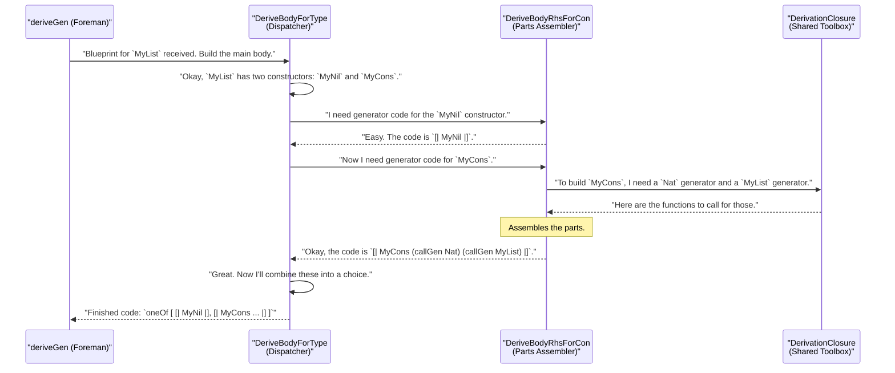

# Chapter 4: Derivation Pipeline Interfaces

In the [previous chapter](03_gensignature__the_generator_blueprint_.md), we learned how `deriveGen` uses a `GenSignature` as a blueprint to understand exactly what kind of generator we want. We saw how changing the type signature—our order form—results in a different blueprint for the generator factory.

But what happens inside the factory once it has the blueprint? Is it one giant, complicated machine that does everything at once? The answer is no, and that's a very good thing! The automatic derivation process is more like a modern assembly line, broken down into specialized workstations. Each workstation has a specific job, and they all work together to build the final generator.

In `DepTyCheck`, these "workstations" are defined by **interfaces**. This chapter will pull back the curtain on this assembly line.

## A Factory, Not a Magic Box

Imagine you need to `deriveGen` for a simple list type:

```idris
data MyList = MyNil | MyCons Nat MyList
```

The blueprint (`GenSignature`) tells the factory it needs to build a generator for `MyList`. A naive factory might be one single, monolithic machine trying to do everything. This would be hard to maintain, debug, and impossible to customize.

`DepTyCheck` takes a smarter approach. It breaks the job down:
1.  **Workstation 1 (The Dispatcher):** Its job is to look at `MyList` and see it has two constructors: `MyNil` and `MyCons`. It decides that the final generator must make a choice between these two. Its job isn't to build the `MyCons` part itself, just to set up the choice.
2.  **Workstation 2 (The Parts Assembler):** When the Dispatcher needs to figure out how to handle `MyCons`, it sends an order to this workstation. This station's job is to build just the *body* of the `MyCons` generator. It sees that `MyCons` needs a `Nat` and another `MyList`, and it figures out how to generate those parts.

This separation of concerns makes the system incredibly modular. Each "workstation" is defined by an **interface**, which is like a standardized job description. If you can do the job described in the interface, you can work at that station.

## The Workstation Job Descriptions: The Interfaces

In Idris, an `interface` is a contract. It defines a set of functions that a type must provide. In `DepTyCheck`, these interfaces define the "jobs" on our assembly line. Let's look at the two most important ones.

### `DeriveBodyForType`: The Dispatcher

This interface describes the main job: creating the overall body of the generator function for a given type. Its primary responsibility is to look at all the constructors of a data type and create the code that chooses between them.

Here is a simplified look at its "job description" from the `DepTyCheck` source code:

```idris
-- From: src/Deriving/DepTyCheck/Gen/ForOneType/Interface.idr

interface DeriveBodyForType where
  -- Takes a blueprint and builds the generator's main body
  canonicBody : GenSignature -> ... -> List Clause
```

*   **What it does:** The key function is `canonicBody`. It takes the [GenSignature](03_gensignature__the_generator_blueprint_.md) blueprint and produces the high-level structure of our generator. For `MyList`, it would generate code that conceptually looks like this: `oneOf [genForMyNil, genForMyCons]`.

### `DeriveBodyRhsForCon`: The Parts Assembler

This interface describes a more specialized job: building the generator for the "right-hand side" (RHS) of a *single* constructor.

Here's its simplified job description:

```idris
-- From: src/Deriving/DepTyCheck/Gen/ForOneTypeConRhs/Interface.idr

interface DeriveBodyRhsForCon where
  -- Takes a blueprint and one constructor, and builds the code for it
  consGenExpr : GenSignature -> Con -> ... -> TTImp
```

*   **What it does:** The `consGenExpr` function gets the blueprint and information about one specific constructor (like `MyCons`). Its job is to create the code that generates all the arguments for *that constructor*. For `MyCons Nat MyList`, it would produce code that is equivalent to `[| MyCons (deriveGen {for=Nat} ...) (deriveGen {for=MyList} ...) |]`. It assembles the parts.

## The Assembly Line in Action

Let's see how these two workstations collaborate to `deriveGen` for `MyList`.



As you can see, it's a beautifully organized process. The foreman (`deriveGen`) delegates to the dispatcher (`DeriveBodyForType`), who in turn delegates the detailed work to the parts assembler (`DeriveBodyRhsForCon`).

### The Shared Toolbox: `DerivationClosure`

You might have noticed the "Shared Toolbox" in the diagram. This corresponds to a third, very important interface called `DerivationClosure`.

```idris
-- From: src/Deriving/DepTyCheck/Gen/ForAllNeededTypes/Interface.idr

interface DerivationClosure m where
  -- A function to recursively get a generator for another type
  callGen : GenSignature -> ... -> m TTImp
  -- ... and other useful tools
```

Think of `DerivationClosure` as the set of power tools available at every workstation. The most important tool is `callGen`. When the `DeriveBodyRhsForCon` station is building the generator for `MyCons`, it needs to get generators for `Nat` and `MyList`. It doesn't build them from scratch; it uses the `callGen` tool, which is a safe way to recursively invoke the `deriveGen` process for another type.

## Why Bother with Interfaces? Pluggable Strategies!

This might seem like a lot of internal machinery. Why go to all this trouble? The answer is the reason `DepTyCheck` is so powerful: **extensibility**.

Because the jobs on the assembly line are defined by interfaces, we can swap out the workers! An implementation of `DeriveBodyForType` and `DeriveBodyRhsForCon` is called a **derivation strategy**.

`DepTyCheck` comes with a default, built-in strategy called `LeastEffort`. It's a team of workers who follow a simple set of rules:
*   `DeriveBodyForType`: "Give every constructor an equal chance."
*   `DeriveBodyRhsForCon`: "For each argument, just call `deriveGen` on it."

But what if you wanted a different strategy? What if you wanted a `Smart` strategy that gives a higher chance of picking the non-recursive `MyNil` constructor to create smaller lists more often?

Because of the interface-based design, you could write your own `Smart` implementations of the interfaces and tell `DepTyCheck` to use them instead. Your `Smart` workers would plug right into the assembly line, no other changes needed!

## Conclusion

In this chapter, we've peeked inside the `deriveGen` factory and discovered its modular, assembly-line design.

You've learned that:
-   `deriveGen` is not a monolithic process but a **pipeline of distinct stages**.
-   Each stage is defined by an `interface` like `DeriveBodyForType` (the dispatcher) and `DeriveBodyRhsForCon` (the parts assembler).
-   Interfaces act as "job descriptions," allowing different implementations to be used for the same job.
-   A set of implementations for these interfaces is called a **derivation strategy**.
-   This modular design makes `DepTyCheck` extensible and allows you to customize the derivation process by providing your own strategies.

We've talked a lot about the job descriptions, but we haven't met the actual workers yet. In the next chapter, we'll get properly introduced to the default and most common team of workers on the assembly line.

---

Next up: [`LeastEffort` Derivation Strategy](05__leasteffort__derivation_strategy_.md)

---

Generated by [AI Codebase Knowledge Builder](https://github.com/The-Pocket/Tutorial-Codebase-Knowledge)