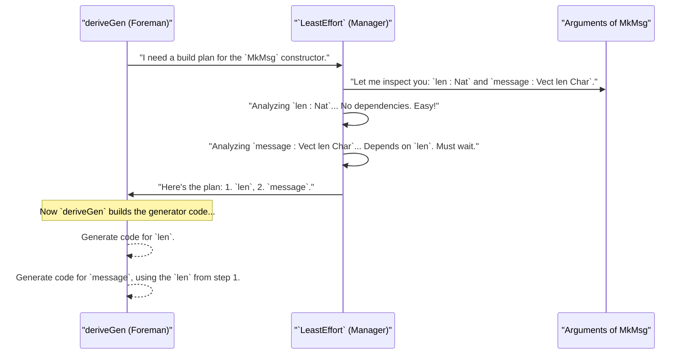

# Chapter 5: `LeastEffort` Derivation Strategy

In the [previous chapter](04_derivation_pipeline_interfaces_.md), we explored the inner workings of the `deriveGen` factory, viewing it as an assembly line with different "workstations" defined by interfaces. We learned that a set of implementations for these interfaces is called a "derivation strategy." It's the team of workers that actually builds the generator.

But who are these workers, and what rules do they follow? By default, `DepTyCheck` employs a very clever, yet simple, team called `LeastEffort`. This chapter introduces you to this default strategy and explains how it solves complex dependency puzzles for you automatically.

## The Problem: A Dependency Puzzle

Let's imagine you're defining a data type for a simple network message. A message has a length, and then the message content itself, which is a vector of characters of that exact length.

```idris
-- A message with its length encoded in the type
data SizedMessage = MkMsg (len : Nat) (message : Vect len Char)
```

This is a classic example of a dependent type. The type of the `message` field (`Vect len Char`) *depends on the value* of the `len` field.

Now, suppose we ask [`deriveGen`](02_derivegen__the_automatic_generator_factory_.md) to create a generator for `SizedMessage`:

```idris
genSizedMessage : Fuel -> Gen MaybeEmpty (n ** SizedMessage n) -- A simplified signature for this example
genSizedMessage = deriveGen
```

How does `deriveGen` know what to do? It can't generate the `message` first, because it wouldn't know what length the `Vect` should have. It absolutely *must* generate the `len` first, and then use that value to generate the `message`.

How does it figure out this correct order? This is the job of the `LeastEffort` strategy.

## `LeastEffort`: Your Smart Assembly Manager

`LeastEffort` is the default "brain" or "manager" for the `deriveGen` factory. Its job is to figure out the simplest possible order to generate the fields of a data structure.

Think of it like a chef preparing to cook a new recipe. The recipe lists ingredients: "chopped onions" and "sautéed onions". The chef knows, through common sense, that you must first chop the onions before you can sauté them. You can't do it the other way around.

`LeastEffort` applies this same common sense to your data types. It analyzes the arguments of a constructor (`len` and `message` in our case) and identifies their dependencies.

1.  It looks at `len : Nat`. It sees that the type `Nat` doesn't depend on any other fields in the `MkMsg` constructor. It labels this as an "easy" field that can be generated first.
2.  It looks at `message : Vect len Char`. It sees that its type mentions `len`, another field in the constructor. This means it *depends* on `len`. It labels this as a "harder" field that must be generated later.

Based on this analysis, it creates a build plan: "Step 1: Generate `len`. Step 2: Generate `message`." This strategy of doing the easiest, most independent parts first is why it's called `LeastEffort`.

## A Walkthrough: Building `SizedMessage`

Let's follow the `LeastEffort` strategy as it works on `SizedMessage`.



The amazing thing is that this all happens automatically behind the scenes. You just write `= deriveGen`, and `LeastEffort` does all this thinking for you, producing a generator that correctly generates a random `Nat` for `len`, and then a `Vect` of exactly that length.

## Under the Hood: How the Plan is Made

So how does `LeastEffort` technically perform this analysis? It's part of the "Parts Assembler" workstation we discussed in the last chapter, specifically the `DeriveBodyRhsForCon` interface. The `LeastEffort` implementation lives in `src/Deriving/DepTyCheck/Gen/ForOneTypeConRhs/Impl.idr`.

When `deriveGen` asks for the generator body for `MkMsg`, `LeastEffort` does the following:

1.  **Dependency Mapping:** It creates an internal data structure for each argument of the constructor. Let's call this a `DependencyInfo` record (the real name is `Determination`).

    For `len : Nat`, the record would look like this:
    ```
    // Simplified DependencyInfo for 'len'
    {
      name: "len",
      depends_on: [] // empty list!
    }
    ```

    For `message : Vect len Char`, it would look like this:
    ```
    // Simplified DependencyInfo for 'message'
    {
      name: "message",
      depends_on: ["len"] // depends on 'len'!
    }
    ```

2.  **Searching for an Order:** It then runs an algorithm to find the generation order. The real function is called `searchOrder`. Conceptually, it works like this:

    ```idris
    -- A very simplified idea of the searchOrder logic
    function searchOrder(remaining_fields):
      -- Find all fields that have NO dependencies left in `remaining_fields`
      let candidates = find_fields_with_zero_dependencies(remaining_fields);

      if candidates is empty:
        -- This means there's a circular dependency! Error.
        return error;
      else:
        -- Pick the best candidate (LeastEffort just picks the first one it finds)
        let chosen = pick_one(candidates);

        // Recursively find the order for the rest of the fields
        return [chosen] ++ searchOrder(remove(chosen, from: remaining_fields));
    ```
    It repeatedly finds an argument that has all of its dependencies met (or has no dependencies to begin with), adds it to the build plan, and then repeats the process until all arguments are planned. For `SizedMessage`, the process is:
    *   **Round 1:** Find fields with 0 dependencies. Only `len` matches. **Plan: `[len]`**.
    *   **Round 2:** Remove `len` from consideration. Now check `message`. Its dependency, `len`, has been planned. So `message` now has 0 *unplanned* dependencies. **Plan: `[len, message]`**.
    *   Done! The final order is `len`, then `message`.

This simple but robust algorithm is the heart of `LeastEffort`, allowing it to untangle even very complex dependency chains in your data types automatically.

## Conclusion

In this chapter, we've met the default "brain" of `deriveGen`, the `LeastEffort` derivation strategy.

You've learned that:
-   When data types have fields that depend on each other (like `Vect len Char`), the order of generation matters.
-   **`LeastEffort`** is the default strategy that automatically solves this dependency puzzle.
-   It works by identifying which fields have no dependencies, planning to generate them first, and then working its way up to the more complex, dependent fields.
-   This "easiest-first" approach is powerful, reliable, and handles a wide variety of dependent types without you needing to worry about it.

Now you understand *how* `deriveGen` decides on the generation order for a constructor's arguments. But what tools does `DepTyCheck` provide to let us see this analysis, or even influence it?

In the next chapter, we'll look at some of the utilities that expose this dependency information.

---

Next up: [Argument and Constructor Analysis Utilities](06_argument_and_constructor_analysis_utilities_.md)

---

Generated by [AI Codebase Knowledge Builder](https://github.com/The-Pocket/Tutorial-Codebase-Knowledge)