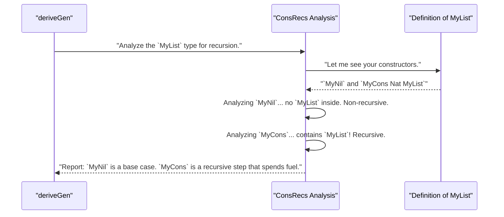

# Chapter 6: Argument and Constructor Analysis Utilities

In the [previous chapter](05__leasteffort__derivation_strategy_.md), we met the default derivation strategy, `LeastEffort`. We saw it as a smart manager that could figure out the correct order to build the parts of a complex data type by solving dependency puzzles.

But how does it get its information? How does it "see" the dependencies between a constructor's arguments? How does it know which parts of your data type are recursive? It can't just guess. The `deriveGen` factory is equipped with a suite of specialized analysis tools that act as its eyes and ears, inspecting your code to gather crucial intelligence.

This chapter introduces you to three of these core utilities. Think of them as the expert consultants that a factory manager relies on before starting the assembly line.

## The Problem: The Factory Needs Intelligence

Before [`deriveGen`](02_derivegen__the_automatic_generator_factory_.md) can build a generator, it needs answers to several critical questions:

1.  **Order:** For a constructor like `MkMsg (len : Nat) (message : Vect len Char)`, in what order must I generate the arguments? (`len` must come first).
2.  **Structure:** Is a type like `MyAlias = List Int` something I can actually build, or is it an abstract function type I can't generate?
3.  **Termination:** For a recursive type like `data Tree = Leaf | Node Tree Tree`, how do I avoid generating an infinitely deep tree?

These are not trivial questions. To answer them, `deriveGen` uses a toolbox of analysis utilities. Let's meet the team.

## `ArgsPerm`: The Logistics Officer

*   **Job:** Figures out how to reorder arguments based on dependencies.

`ArgsPerm` is the factory's logistics expert. After a strategy like [`LeastEffort`](05__leasteffort__derivation_strategy_.md) has analyzed the dependencies of a constructor's arguments and decided on a build order, `ArgsPerm` calculates the exact "shuffling" required.

Imagine the arguments to a constructor are delivered on a pallet in a fixed order. `LeastEffort` gives `ArgsPerm` a new blueprint for the assembly order. `ArgsPerm`'s job is to create instructions for the robot arm to pick items off the pallet in the new, correct order.

### How it Works

Let's say `LeastEffort` has determined that for a constructor with three arguments `(a, b, c)`, the correct build order is actually `(c, a, b)`. It tells `ArgsPerm` this. `ArgsPerm`, in turn, produces a "permutation vector"—a list of indices that maps the new order to the old one.

The permutation vector would be `[2, 0, 1]`, which means:
*   For the 1st position, take the item at index `2` (which is `c`).
*   For the 2nd position, take the item at index `0` (which is `a`).
*   For the 3rd position, take the item at index `1` (which is `b`).

This permutation vector is then used to generate code that wires up the generated values in the correct sequence. It's a simple, powerful tool for untangling dependencies. The core utility is a function that looks something like this:

```idris
-- From: src/Deriving/DepTyCheck/Util/ArgsPerm.idr

-- Reorders a vector `orig` according to a permutation `perm`.
reorder : (perm : Vect n (Fin n)) -> Vect n a -> Vect n a
reorder perm orig = perm <&> \i => index i orig
```

You won't call this directly, but it's working hard behind the scenes to make sure even the most complex dependent types are constructed correctly.

## `DeepConsApp`: The X-Ray Inspector

*   **Job:** Looks deep inside a type expression to see if it's built from data constructors.

`DeepConsApp` is the factory's quality control inspector, equipped with an X-ray machine. Its job is to look at a type expression, even a complex one involving type aliases or other definitions, and determine if it's ultimately made of "buildable" parts—that is, data constructors.

If you ask `deriveGen` to build a generator for `String`, `DeepConsApp` confirms that `String` is a data type with constructors (`StrCons` and `EmptyStr`), so it's buildable. If you ask it to build a generator for `Nat -> Nat` (a function), `DeepConsApp` will report that this is not an application of data constructors, and the derivation will fail (as you can't randomly generate *all possible functions*).

### How it Works

`DeepConsApp` recursively "unfolds" a type expression, peeling back layers of definitions until it hits fundamental building blocks.

```mermaid
graph TD
    A["Type: `Maybe (List Int)`"] -- DeepConsApp Inspects --> B{`Maybe`}
    B -- Is it a data type? --> B_Yes(Yes: `Just` / `Nothing`)
    B -- Inspects `Maybe`'s argument --> C{`List`}
    C -- Is it a data type? --> C_Yes(Yes: `::` / `[]`)
    C -- Inspects `List`'s argument --> D{`Int`}
    D -- Is it a data type? --> D_Yes(Yes: Built-in)

    subgraph "Analysis Result"
        direction LR
        Result("Conclusion: Build is possible!")
    end

    D_Yes --> Result
```

This deep analysis ensures that `deriveGen` only attempts to work on types that it can actually construct, preventing strange compile-time errors. The core logic for this lives in a function called `analyseDeepConsApp` within the `DeepConsApp.idr` file. It's one of the most complex pieces of the derivation machinery, acting as a gatekeeper for the entire process.

## `ConsRecs`: The Fuel Budget Advisor

*   **Job:** Analyzes how data types are recursive to manage the `Fuel` budget.

`ConsRecs` is the factory's recursion specialist and financial advisor. It examines every constructor of a data type and determines its relationship with recursion. This information is critical for correctly using the `Fuel` we saw in Chapter 2, ensuring that generators for recursive types don't run forever.

For a simple list type:

```idris
data MyList = MyNil | MyCons Nat MyList
```

`ConsRecs` produces a report:
*   `MyNil`: "This constructor is **not recursive**. Its 'weight' is constant."
*   `MyCons`: "This constructor is **recursive**. To generate it, you must spend a unit of `Fuel` for the `MyList` argument."

### How it Works Under the Hood

When `deriveGen` starts, it first consults `ConsRecs` to get a report on all known data types.



This information is stored in a record called `ConWeightInfo`. A simplified version of its definition shows the two possible outcomes:

```idris
-- From: src/Deriving/DepTyCheck/Gen/ConsRecs.idr

-- Simplified for clarity
data RecWeightInfo = SpendingFuel | StructurallyDecreasing

record ConWeightInfo where
  constructor MkConWeightInfo
  -- Either a constant weight (non-recursive)
  -- or recursive info.
  weight : Either Nat1 RecWeightInfo
```
*   `Left Nat1`: The constructor is not recursive. `deriveGen` can choose it freely.
*   `Right RecWeightInfo`: The constructor is recursive. `deriveGen` knows it must generate code that consumes `Fuel` when choosing this path.

This analysis is what allows `deriveGen` to automatically produce safe, terminating generators even for deeply recursive and complex data structures.

## Conclusion

In this chapter, we've pulled back the curtain and met the intelligence team that powers `deriveGen`. These are not tools you will typically use directly, but understanding their roles is key to understanding how `DepTyCheck` works so effectively.

You've learned about:
-   **`ArgsPerm`**, the logistics officer that correctly orders constructor arguments.
-   **`DeepConsApp`**, the deep inspector that verifies a type is buildable from constructors.
-   **`ConsRecs`**, the fuel advisor that analyzes recursion to prevent infinite loops.

Together, these utilities provide the foundation for robust, automatic generator derivation. They gather the raw intelligence about your code, which is then used by a strategy like [`LeastEffort`](05__leasteffort__derivation_strategy_.md) to build the final generator.

But what if the default analysis isn't quite what you want? What if you want to tell the factory to prefer one constructor over another, or to generate `Nat`s only in a certain range? How can we influence the outcome?

In the next chapter, we will explore how to fine-tune the derivation process.

---

Next up: [Derivation Tuning](07_derivation_tuning_.md)

---

Generated by [AI Codebase Knowledge Builder](https://github.com/The-Pocket/Tutorial-Codebase-Knowledge)