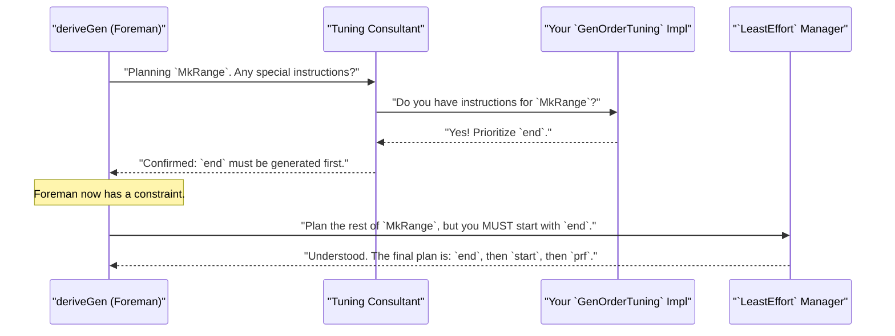

# Chapter 7: Derivation Tuning

In the [previous chapter](06_argument_and_constructor_analysis_utilities_.md), we met the behind-the-scenes analysis team that makes `deriveGen` so smart. We saw how strategies like [`LeastEffort`](05__leasteffort__derivation_strategy_.md) can automatically solve complex dependency puzzles. This automation is fantastic, but sometimes, the "smartest" default choice isn't exactly what we need for our tests.

Sometimes, we need to step in and give the factory manager some special instructions. What if we want to ensure some data shapes appear more often than others? Or what if we know a more efficient way to build a complex data type than the one the automatic strategy would choose?

This is where Derivation Tuning comes in. It's a suggestion box for the [`deriveGen`](02_derivegen__the_automatic_generator_factory_.md) factory, allowing you to fine-tune the generation process without having to write the entire generator yourself.

## Motivation: Giving Special Instructions

The automatic factory is great, but it works with limited information. Let's consider two scenarios where we might want to intervene.

**Scenario 1: Controlling Probability**
Imagine we are generating lists of numbers. By default, `deriveGen` gives an equal chance to picking `Nil` (the empty list) or `Cons` (adding an element). This means half of the generated lists will be empty! This might be okay, but for many tests, we might want to generate longer lists more frequently. We need a way to tell the factory, "Adjust the production rates! Make `Cons` more likely than `Nil`."

**Scenario 2: Controlling Order**
Consider a data type that represents a valid number range, where the start must be less than the end.

```idris
data Range = MkRange (start : Nat) (end : Nat) (prf : LT start end)
```

The `LeastEffort` strategy sees that `start` and `end` don't depend on each other, so it might choose to generate `start` first. Let's say it picks `start = 10`. Now it needs to generate an `end` that is greater than 10. This is easy.

But what if it picks `start = 10000`? Now finding a valid `end` is harder. What's a better strategy? Generate `end` first (e.g., `end = 50`), and then it's trivial to generate a `start` that's less than 50 (e.g., `start = 12`). We need a way to tell the factory, "I know a better way. Please assemble the `end` part before the `start` part."

Derivation Tuning provides the tools for both of these scenarios.

## `ProbabilityTuning`: The Production Rate Controller

Let's tackle our first scenario: making longer lists more common. We want to tell `deriveGen` to favor the `Cons` constructor over the `Nil` constructor. We can do this with the `ProbabilityTuning` interface.

Think of it as assigning "weights" to each constructor. By default, every constructor has a weight of 1. If a type has two constructors, they each have a 1 in 2 (50%) chance. If we give `Cons` a higher weight, it will be chosen more often.

Here's how we would tune our list generator to make `Cons` nine times more likely than `Nil`:

```idris
%language ElabReflection
import Deriving.DepTyCheck.Gen

data MyList = MyNil | MyCons Nat MyList

-- Give the 'MyCons' constructor a weight of 9.
ProbabilityTuning "MyCons".dataCon where
  isConstructor = itIsConstructor
  tuneWeight = const 9
```

Let's break this down:
1.  `ProbabilityTuning "MyCons".dataCon`: This line declares that we are providing tuning instructions for the constructor named `MyCons`. The `.dataCon` part is a little bit of Idris magic to get a unique name for the constructor.
2.  `isConstructor = itIsConstructor`: This is a crucial safety check. `itIsConstructor` is a macro that confirms at compile-time that `"MyCons"` is a real, valid constructor name. If you mistyped it as `"MyCon"`, your code would fail to compile!
3.  `tuneWeight = const 9`: This is the instruction. We're telling the factory that the relative weight for `MyCons` is `9`.

Now, when `deriveGen` builds a generator for `MyList`, it sees this instruction.
*   `MyNil` has the default weight of `1`.
*   `MyCons` has our specified weight of `9`.
*   The total weight is `1 + 9 = 10`.
*   `MyNil` will be chosen with a probability of 1/10.
*   `MyCons` will be chosen with a probability of 9/10 (if there's enough fuel).

This simple change gives us fine-grained control over the *distribution* of our test data.

## `GenOrderTuning`: The Assembly Line Foreman

Now for our second scenario: the `Range` data type. We need to tell `deriveGen` to generate the `end` argument before the `start` argument. We can do this with the `GenOrderTuning` interface.

This interface lets you provide a list of arguments that should be generated first, in the order you specify.

```idris
data Range = MkRange (start : Nat) (end : Nat) (prf : LT start end)

-- Tell deriveGen to generate `end` first for the MkRange constructor.
GenOrderTuning "MkRange".dataCon where
  isConstructor = itIsConstructor
  deriveFirst _ _ = [`{end}]
```

The structure is very similar to `ProbabilityTuning`:
1.  `GenOrderTuning "MkRange".dataCon`: We target the `MkRange` constructor.
2.  `isConstructor = itIsConstructor`: Again, our compile-time safety check.
3.  `deriveFirst _ _ = [\`{end}]`: This is the core instruction. We return a list of arguments to prioritize. Here, we're using a **name literal**, <code>`{end}</code>, to refer to the argument named `end`. We could also have used its index, `[1]`.

When the `LeastEffort` strategy plans the assembly for `MkRange`, it will first see our tuning. "Ah," it says, "I have special instructions to generate `end` first." It will then plan the rest of the generation around this constraint, correctly generating `start` and `prf` afterward.

## How Tuning Hooks In: The Expert Consultant

So, how does this work under the hood? Does tuning replace the `LeastEffort` strategy? No, it works *with* it. Think of the tuning interfaces as an "expert consultant" that `deriveGen` talks to before starting the main assembly process.

Here's the sequence of events when you `deriveGen` for a type that has tuning available:



The `deriveGen` process actively searches for any implementations of `GenOrderTuning` or `ProbabilityTuning` that match the constructor it's working on. If it finds one, it uses that information to guide or constrain the default derivation strategy.

### A Peek at the Interface Definitions

If you look inside the `DepTyCheck` source code in the file `src/Deriving/DepTyCheck/Gen/Tuning.idr`, you'll find the definitions for these interfaces. Here's a simplified look at `GenOrderTuning`:

```idris
-- From: src/Deriving/DepTyCheck/Gen/Tuning.idr

public export
interface GenOrderTuning (0 n : Name) where
  isConstructor : (con : IsConstructor n ** GenuineProof con)

  -- Returns a list of arguments to generate first.
  deriveFirst : (givenTyArgs : List ...) ->
                (givenConArgs : List ...) ->
                List (ConArg isConstructor.fst.conInfo)
```
-   The `(0 n : Name)` part is how the interface elegantly targets a specific constructor by its name.
-   The `deriveFirst` function is given information about which arguments might already be known (the `given...Args` parameters) and asks you to provide your preferred ordering.

This elegant design allows you to inject your expert knowledge directly into the automated process, getting the best of both worlds: automation and fine-grained control.

## Conclusion

In this chapter, you've learned how to go beyond the default behavior of `deriveGen` and provide your own expert guidance.

You've discovered:
-   Sometimes the default automated process isn't perfect for our specific testing needs.
-   The **`ProbabilityTuning`** interface lets you control the relative probability of choosing different constructors, influencing the *distribution* of your test data.
-   The **`GenOrderTuning`** interface lets you specify the generation order for a constructor's arguments, which is crucial for efficiency and for satisfying complex dependent-type constraints.
-   These "tuning" interfaces work by providing hints and constraints to the default derivation strategy, not by replacing it entirely.

You now have the power to not only generate data automatically but also to shape that data to be more effective for your tests. But how do we know if our generators, whether tuned or not, are doing a good job? Are we actually generating a good variety of data? Are we even exercising all the constructors of our data types?

In the next chapter, we'll explore how `DepTyCheck` can analyze the output of our generators and tell us exactly how well we're covering our data models.

---

Next up: [Model Coverage Analysis](08_model_coverage_analysis_.md)

---

Generated by [AI Codebase Knowledge Builder](https://github.com/The-Pocket/Tutorial-Codebase-Knowledge)