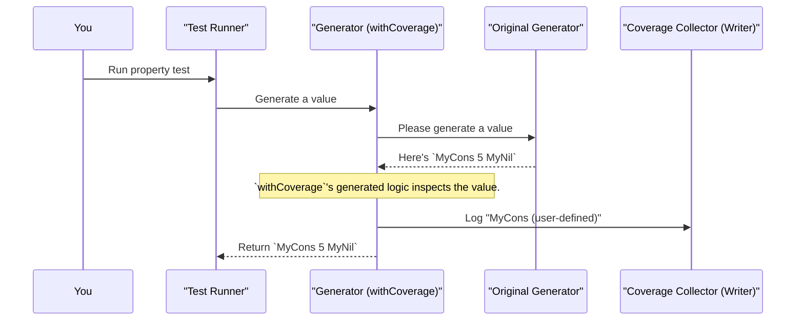

# Chapter 8: Model Coverage Analysis

In the [previous chapter](07_derivation_tuning_.md), we learned how to become a "factory foreman," giving special instructions to `deriveGen` using derivation tuning. We can now control probabilities and generation order to produce more effective test data.

This is great, but it raises a new question: How do we know if our generators are doing a good job? When we run our tests, are we actually producing a good variety of data? Are we even exercising all the different parts of our data types? If we have a `Tree` data type, are we only ever generating `Leaf`s and never `Node`s?

We need a way to answer the question: "Which parts of my data model did my tests actually *cover*?" This is where Model Coverage Analysis comes in.

## The Problem: Are We Testing Blind?

Imagine you've written a property-based test for a function that processes a `List`. You run your tests 100 times, and they all pass. Great! But what if, due to some fluke in the random generator, every single test case was an empty list (`Nil`)? Your function might be completely broken for non-empty lists, and you would have no idea.

We need a way to put "sensors" on the `deriveGen` factory's assembly line. These sensors would track every single item that comes off the line—every data type and every specific constructor—and give us a final report. This report would show us exactly what was generated and how often, immediately highlighting any blind spots.

`DepTyCheck` provides exactly this system, centered around a concept called `ModelCoverage`.

## Our New Tools: Sensors and Reports

The model coverage system has a few key parts that work together:

1.  **`withCoverage` (The Sensor):** This is a macro that you wrap around a generator. It's the equivalent of "installing a sensor" on a specific production line. A generator wrapped with `withCoverage` will now report what it produces.

2.  **`ModelCoverage` (The Raw Log):** This is a simple data structure that stores the raw output from the sensors. Think of it as a tally sheet, mapping a label like `"MyList.MyCons"` to a count of how many times it was seen.

3.  **`CoverageGenInfo` (The Final Report):** This is a structured, human-readable report. You start with a "blank report template" for the types you care about, feed it all your raw `ModelCoverage` logs, and it organizes everything into a clear summary.

Let's see how to use these tools to check the coverage of a simple list generator.

### Step 1: Installing the Sensor with `withCoverage`

First, let's define our list and its automatic generator.

```idris
%language ElabReflection
import Deriving.DepTyCheck.Gen

data MyList = MyNil | MyCons Nat MyList

genMyList : Fuel -> Gen MaybeEmpty MyList
genMyList = deriveGen
```

Now, we'll create a *new* generator that uses `withCoverage` to add the tracking sensor.

```idris
import Test.DepTyCheck.Gen.Coverage

-- genMyList, but with coverage tracking enabled.
genMyListWithCoverage : Fuel -> Gen MaybeEmpty MyList
genMyListWithCoverage fuel = withCoverage (genMyList fuel)
```

That's it! `genMyListWithCoverage` behaves just like `genMyList`, but every time it produces a value, it will also emit a small `ModelCoverage` log.

### Step 2: Running Tests and Collecting the Logs

When you run your tests, you'll now use `genMyListWithCoverage`. `DepTyCheck`'s test harness (which we'll see in the next chapter) will automatically collect all the `ModelCoverage` logs from every test run and combine them into one big log.

Let's imagine our test suite ran 100 times and produced 30 empty lists (`MyNil`) and 70 non-empty lists (`MyCons`). The final, combined `ModelCoverage` log would conceptually look like this:

```
// This is the combined ModelCoverage data after 100 runs.
{
  "MyList.MyNil": 30,
  "MyList.MyCons": 70,
  "Nat": 70, // Since every MyCons also generates a Nat
  ... other labels ...
}
```

### Step 3: Generating a Report

Now we have our raw log data. To make sense of it, we need to generate a `CoverageGenInfo` report.

First, we create a blank report template that knows about our `MyList` type using `initCoverageInfo`.

```idris
-- This creates a blank report card for the MyList type.
myListReportTemplate : CoverageGenInfo MyList
myListReportTemplate = initCoverageInfo (the (Gen _ MyList) genMyList)
```
*Note: The `the (Gen _ MyList)` part just helps Idris figure out you are interested in the `MyList` type by looking at what `genMyList` generates. You can ignore the details.*

Next, we feed our collected logs into this template using `registerCoverage`, which fills it out.

```idris
-- `allLogs` is the combined ModelCoverage from our test run.
allLogs : ModelCoverage

-- Fill out the report template with the data.
finalReport : CoverageGenInfo MyList
finalReport = registerCoverage allLogs myListReportTemplate
```

Finally, we can simply print the report!

```idris
-- In the REPL:
-- > printLn !finalReport
```

The output will be a colorful, organized summary like this:

```
MyList covered partially (100 times)
  - MyNil: covered (30 times)
  - MyCons: covered (70 times)
```

If we had a bug and never generated `MyNil`, the report would immediately warn us:

```
MyList covered partially (100 times)
  - MyNil: not covered
  - MyCons: covered (100 times)
```

This report makes blind spots instantly visible!

## How It Works Under the Hood

The magic behind this system is a clever combination of compile-time code generation and monads.

### The `withCoverage` Macro

When you write `withCoverage (genMyList fuel)`, the `withCoverage` macro springs into action at compile-time. It doesn't just "wrap" the generator; it builds a whole new piece of code.



`withCoverage` inspects the type `MyList` and generates a helper function that can look at a `MyList` value and figure out which constructor it was made with. It then uses the `label` function, which takes advantage of a `Writer` monad under the hood to "tell" a `Label` to the `CoverageCollector` without interrupting the main flow of generation.

A dive into `src/Test/DepTyCheck/Gen/Coverage.idr` shows how `withCoverage` is defined as a macro. A simplified version of the code it generates looks like this:

```idris
-- A simplified view of what `withCoverage genMyList` expands to.
label (fromString "MyList[?]") $ genMyList >>= \val =>
  -- `labellingFun` is a helper function generated by the macro
  -- that matches on `val` to get the constructor name.
  label (labellingFun val) (pure val)
```

This code first labels the general type (`MyList`) and then, once a value `val` is generated, it runs the special `labellingFun` on it to get the specific constructor label (`MyNil` or `MyCons`) and logs that too.

### The `CoverageGenInfo` Report

The `CoverageGenInfo` record, defined in `src/Test/DepTyCheck/Gen/Coverage.idr`, is essentially a collection of nested `SortedMap`s.

```idris
-- From: src/Test/DepTyCheck/Gen/Coverage.idr, simplified for clarity.
record CoverageGenInfo (0 g : k) where
  constructor MkCoverageGenInfo
  -- ... maps of type/constructor names to their info ...
  coverageInfo : SortedMap TypeInfo (Nat, SortedMap Con Nat)
```

The `coverageInfo` field holds the core data: it maps a `TypeInfo` (like the one for `MyList`) to a pair containing the total count for that type and another map from each `Con` (constructor) to its individual count.

The `registerCoverage` function simply iterates through the raw logs, parses the label strings (like `"MyNil"`), and updates the appropriate counters in these maps.

## Conclusion

In this chapter, you've learned how to bring observability to your data generation process. You are no longer testing blind.

You've discovered that:
-   **Model Coverage Analysis** helps you see which parts of your data model are actually being exercised by your tests.
-   You can add tracking to any generator by wrapping it with the **`withCoverage`** macro.
-   `withCoverage` works by emitting `ModelCoverage` logs every time a value is generated.
-   You can use **`initCoverageInfo`** and **`registerCoverage`** to process these logs into a `CoverageGenInfo` record, which provides a clear, human-readable report.
-   This system is your best tool for finding and fixing blind spots in your property-based tests.

Now that we know how to automatically generate data, tune it for our needs, and analyze its coverage, we have all the pieces. The final step is to put them all together into a structured test suite that can be run automatically.

In the next chapter, we'll explore how `DepTyCheck` provides a test harness to do just that.

---

Next up: [Test Suites and Harness](09_test_suites_and_harness_.md)

---

Generated by [AI Codebase Knowledge Builder](https://github.com/The-Pocket/Tutorial-Codebase-Knowledge)