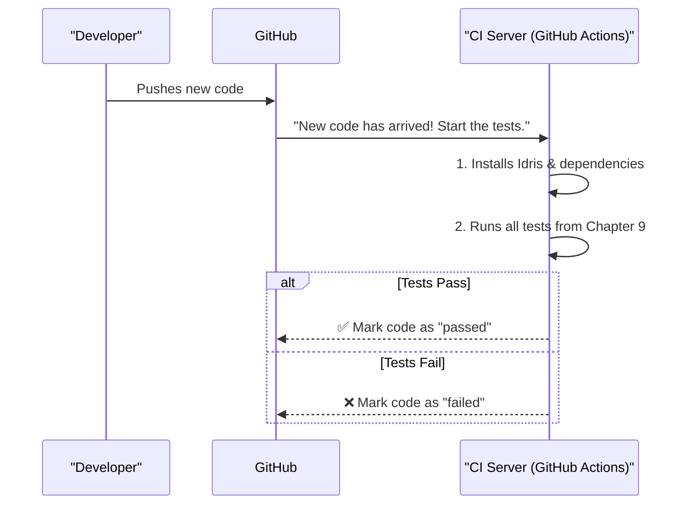

# Chapter 10: Project Configuration and Build System

Welcome to the final chapter of our tour through `DepTyCheck`! In the [previous chapter](09_test_suites_and_harness_.md), we saw how the project tests *itself* with an extensive quality assurance suite. We looked at the inspectors who check the generator factory for flaws.

Now, we're going to zoom out from the factory floor and look at the entire facility. How is the project organized? What tools are used to build, test, and manage it? Where is the user manual, and how is it published? This chapter explores the project's toolbox and operational manual—all the configuration files and scripts that make `DepTyCheck` a healthy, automated, and maintainable project.

## The Workshop and its Rulebook

A software project is much more than just its source code. Think of it like a well-organized mechanic's workshop. The source code is the car you're building, but you also need:

*   **An Inventory (`.ipkg`, `pack.toml`):** A list of all the parts you have and all the parts you need to order from suppliers.
*   **Workshop Rules (`.editorconfig`):** A set of rules to ensure everyone puts tools back in the right place and keeps the workspace tidy.
*   **Automated Testing Rigs (Continuous Integration):** A machine that automatically stress-tests every new component before it's approved for use.
*   **A Manual Publisher (`.readthedocs.yaml`):** A service that takes your blueprints and notes and automatically prints and publishes the official user manual.
*   **Custom Tools (Helper Scripts):** Special-purpose wrenches and gadgets you've built yourself for unique jobs.

Let's walk through the `DepTyCheck` workshop and meet each of these components.

### The Parts List: `deptycheck.ipkg` and `pack.toml`

Every Idris project needs to declare what it is, what code it contains, and what other libraries it depends on.

#### `deptycheck.ipkg`: The Core Package

The `.ipkg` file is the standard way to define a package in Idris. It's like the label on the box, telling you what's inside.

```idris
-- File: deptycheck.ipkg

package deptycheck

authors = "Denis Buzdalov"
sourcedir = "src"

modules = Deriving.DepTyCheck.Gen
        , Test.DepTyCheck.Gen
        , -- ... and many more

depends = ansi
        , elab-util-extra
        , -- ... other dependencies
```

Let's break this down:
*   `package deptycheck`: Declares the name of our project.
*   `sourcedir = "src"`: Tells the compiler to look for source code in the `src/` directory.
*   `modules = ...`: This is the list of all the public "parts" (modules) this package provides. We've seen many of these throughout the tutorial, like [`Gen`](01_gen__the_data_generator_.md).
*   `depends = ...`: This is the list of external libraries `DepTyCheck` needs to function.

#### `pack.toml`: The Dependency Manager

While `.ipkg` defines the package, `pack` is the tool used to fetch and manage its dependencies. `pack.toml` is its configuration file. It's especially useful for working with local dependencies, like the `elab-util-extra` library which is developed alongside `DepTyCheck`.

```toml
# File: pack.toml

[custom.all.deptycheck]
type = "local"
path = "."
ipkg = "deptycheck.ipkg"
test = "tests/tests.ipkg"
```

This section tells the `pack` tool: "There is a custom package named `deptycheck`. It's a `local` package found in the current directory (`.`), its definition is in `deptycheck.ipkg`, and its tests are defined in `tests/tests.ipkg`."

### The Workshop Rules: `.editorconfig`

When many people work on a project, code can get messy. Some people might use tabs, others might use spaces. Some might use 2-space indents, others 4. An `.editorconfig` file solves this by setting consistent rules that most modern code editors can automatically follow.

```ini
# File: .editorconfig

# Rules for all files
[*]
end_of_line = lf
insert_final_newline = true
trim_trailing_whitespace = true

# Rules just for Idris files
[*.{idr,ipkg}]
indent_style = space
indent_size = 2
```

This file acts as the workshop's "cleanliness policy." It ensures that every file has a consistent style, making the code easier to read and maintain for everyone.

### The Automated Inspector: Continuous Integration (CI)

How can we be sure that a new change doesn't accidentally break something? We run our entire test suite! But doing this manually for every single change is tedious.

This is where Continuous Integration (CI) comes in. `DepTyCheck` uses GitHub Actions for its CI. Though the `.github/` folder isn't in our provided context, the `README.md` file links to the CI server. When a developer pushes a new change to GitHub, a process is automatically triggered on a remote server.



This automated inspector ensures that the high quality bar of the project is maintained at all times.

### The Manual Publisher: `.readthedocs.yaml`

This tutorial and the rest of `DepTyCheck`'s documentation isn't just a collection of Markdown files. It's published as a professional-looking website. The service "Read the Docs" does this automatically. The `.readthedocs.yaml` file is our set of instructions for that service.

```yaml
# File: .readthedocs.yaml

version: 2

build:
  os: ubuntu-22.04
  tools:
    python: "3.10"

# Tell it where our documentation configuration is
sphinx:
  configuration: docs/source/conf.py
```

This file tells Read the Docs which operating system to use, which tools to install, and where to find the main configuration for building the documentation website. Every time a change is made to the docs, this system automatically rebuilds and publishes the updated site.

### The Custom Tools: Helper Scripts

Sometimes, a project has unique needs that aren't covered by standard tools. `DepTyCheck` has a few custom shell scripts to automate specific, tricky tasks.

#### The Module Renamer: `.rename`

Refactoring code often involves renaming a module. Doing a simple find-and-replace can be dangerous because you might accidentally change things you didn't mean to. The `.rename` script is a specialized tool for this.

```sh
# File: .rename

# ... script logic to safely find module names ...

echo "Renaming $FROM_MODULE to $TO_MODULE..."

# Use `sed` to replace the module name in all relevant files
sed -i -e "s/$FROM_MODULE\([^a-zA-Z_]\)/$TO_MODULE\1/g" "$r"
```

This is the custom-built wrench on the workbench, designed to do one specific job safely and reliably.

#### The Compiler Patcher: `.patch-chez-gc-handler`

This is the most advanced tool in the workshop. `DepTyCheck`'s heavy use of compile-time metaprogramming can sometimes push the Idris compiler to its limits, especially regarding memory usage. This script performs a very precise "surgery" on the underlying Chez Scheme compiler that Idris 2 uses, modifying its garbage collector (`gc`) to behave more efficiently for `DepTyCheck`'s specific workload.

This is an expert-level modification that demonstrates the depth of engineering required to keep the project performing well.

## Conclusion: The End of Our Tour

And with that, our journey through the `DepTyCheck` codebase comes to an end. We started in Chapter 1 by learning about the humble `Gen` type, the basic recipe for creating random data. We then traveled through the entire factory:

*   We saw how [`deriveGen`](02_derivegen__the_automatic_generator_factory_.md) acts as an automatic factory, using a [`GenSignature`](03_gensignature__the_generator_blueprint_.md) blueprint to build generators.
*   We peeked inside the factory's assembly line, discovering the [`Derivation Pipeline Interfaces`](04_derivation_pipeline_interfaces_.md) and the smart [`LeastEffort`](05__leasteffort__derivation_strategy_.md) strategy.
*   We met the [analysis utilities](06_argument_and_constructor_analysis_utilities_.md) that provide the intelligence for the factory.
*   We learned how to apply our own expertise with [`Derivation Tuning`](07_derivation_tuning_.md) and check our work with [`Model Coverage Analysis`](08_model_coverage_analysis_.md).
*   We saw how the tool itself is rigorously tested in the [`Test Suites and Harness`](09_test_suites_and_harness_.md).
*   Finally, we've now seen the full workshop, from the parts list to the custom-built tools that keep the project running smoothly.

You now have a complete, high-level understanding of how `DepTyCheck` is designed and built. You are well-equipped to use it for your own projects, understand its behavior, and maybe even contribute back to it. Happy testing

---

Generated by [AI Codebase Knowledge Builder](https://github.com/The-Pocket/Tutorial-Codebase-Knowledge)