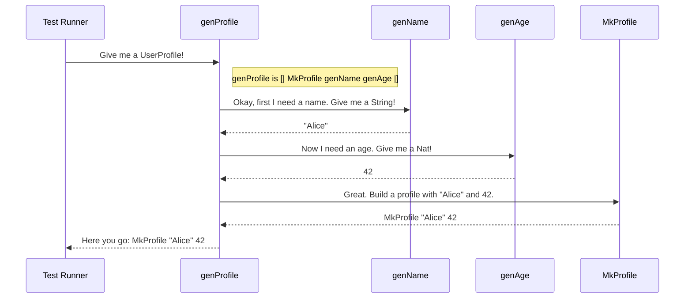

# Chapter 1: Test Data Generator (`Gen` Monad)

Welcome to `DepTyCheck`! This tutorial will guide you through the library, starting with its most fundamental building block. If you want to test your code, you need data to test it with. This chapter is all about how to create that data.

## What's a Generator? The Recipe Book Analogy

Imagine you're testing a function that processes user profiles. To do a good job, you don't want to test with just one hard-coded user. You want to test with *hundreds* of different, randomly generated users to find potential bugs.

But how do you create a random user profile? This is where `DepTyCheck`'s "Test Data Generator" comes in.

Think of a generator as a **recipe** for creating random data. `DepTyCheck` provides a special type called `Gen a`, which represents a recipe that can generate random values of type `a`.

- A `Gen String` is a recipe for creating random strings.
- A `Gen Nat` is a recipe for creating random natural numbers.
- A `Gen UserProfile` is a recipe for creating random user profiles.

This chapter will teach you how to write and combine these recipes to generate any kind of test data you need.

## Our Goal: Generating a User Profile

Throughout this chapter, our goal will be to create a generator for this simple `UserProfile` data type:

```idris
data UserProfile = MkProfile String Nat
```

A `UserProfile` has a name (a `String`) and an age (a `Nat`). To create a random `UserProfile`, we'll need to learn how to:
1.  Create a recipe for random names.
2.  Create a recipe for random ages.
3.  Combine these two recipes into a single recipe for `UserProfile`.

## The Building Blocks: Simple Generators

`DepTyCheck` comes with a few basic recipes to get you started.

### `elements`: Picking from a List

The `elements` function creates a generator that randomly picks one value from a list you provide. It's like drawing a name out of a hat.

Let's create a recipe for generating a user's name. We can limit the choices to a few common names.

```idris
import Test.DepTyCheck.Gen

-- This is a recipe that will randomly produce "Alice", "Bob", or "Charlie".
genName : Gen NonEmpty String
genName = elements ["Alice", "Bob", "Charlie"]
```

Here, `genName` is our recipe. The type `Gen NonEmpty String` tells us two things:
1.  `Gen ... String`: It generates values of type `String`.
2.  `NonEmpty`: It's a `NonEmpty` generator, meaning it's *guaranteed* to produce a value. (We'll see the alternative, `MaybeEmpty`, later).

### `choose`: Picking from a Range

The `choose` function creates a recipe for picking a random number within a specific range.

Let's create a recipe for a user's age, say between 18 and 65.

```idris
-- This is a recipe that will randomly produce a Nat between 18 and 65.
genAge : Gen NonEmpty Nat
genAge = choose (18, 65)
```

Just like `genName`, `genAge` is a `NonEmpty` generator, because it will always succeed in picking a number from that range.

## Combining Recipes: The Applicative `[| ... |]`

We now have two separate recipes: one for names (`genName`) and one for ages (`genAge`). How do we combine them to create a `UserProfile`?

We can use a special syntax, `[| ... |]`, which lets us plug our small recipes into a larger structure.

```idris
data UserProfile = MkProfile String Nat

genName : Gen NonEmpty String
genName = elements ["Alice", "Bob", "Charlie"]

genAge : Gen NonEmpty Nat
genAge = choose (18, 65)

-- Combine the recipes!
genProfile : Gen NonEmpty UserProfile
genProfile = [| MkProfile genName genAge |]
```

Think of `[| MkProfile genName genAge |]` as saying:
1.  "To make a `UserProfile`, you need a `String` and a `Nat`."
2.  "For the `String` part, use the `genName` recipe."
3.  "For the `Nat` part, use the `genAge` recipe."

`DepTyCheck` handles the rest! When this `genProfile` recipe is used, it will run `genName` to get a random name, run `genAge` to get a random age, and then put them together with `MkProfile`.

## Chaining Recipes: The `do` block

Sometimes, one recipe needs to depend on the result of a previous one.

Imagine we want to generate a pair containing a number `n` and a list of `n` booleans. The recipe for the list *depends on the value* generated for `n`. You can't do this with the `[| ... |]` syntax.

For this, we use a `do` block, which lets us write a sequence of steps.

Let's see an example. First, we'll generate a random length `n`. Then, we'll generate a list of that specific length.

```idris
import Data.Vect

-- A recipe for a random length between 1 and 5.
genLength : Gen NonEmpty Nat
genLength = choose (1, 5)

-- A sequence of steps to create a list of random booleans.
genRandomBools : Gen NonEmpty (Vect Nat Bool)
genRandomBools = do
  -- Step 1: Run genLength and name the result `n`.
  n <- genLength

  -- Step 2: Use `n` to create a new recipe for a Vect of size `n`,
  -- and run it.
  vectOf n chooseAny
```

This is the "monad" part of `Gen`. The `do` block lets you chain recipes together, where each step can use the values from the steps before it. This is incredibly powerful, especially for dependent types, where the type of one value often depends on another.

For example, `DepTyCheck` can generate a pair `(n ** Fin n)`, where `Fin n` is a number from `0` to `n-1`. The generator for `Fin n` clearly depends on the value of `n` generated in the first step.

```idris
-- A simplified example of what DepTyCheck can do
genAnyFin : Gen MaybeEmpty (n ** Fin n)
genAnyFin = do
  n <- genNat          -- First, generate a random number `n`
  f <- genFin n        -- Then, generate a `Fin` that depends on `n`
  pure (n ** f)      -- Return the pair
```

Notice the type `Gen MaybeEmpty`. What if `genNat` produces `0`? The type `Fin 0` has no values! In that case, `genFin 0` would be an "empty" generator that can't produce a value. That's why the result is `MaybeEmpty`—it might succeed, or it might be empty.

## Let's See It in Action!

So, we have these recipes. How do we actually run them to get data? You can use the `pick1` function.

If you have a `Gen NonEmpty a`, `pick1` will run it once and give you a value of type `a`.

```idris
-- In the Idris REPL, you could try this:
-- (The actual output will be random)

> :exec pick1 genProfile
MkProfile "Bob" 37 : UserProfile

> :exec pick1 genProfile
MkProfile "Alice" 25 : UserProfile
```
Every time you run it, the "recipe" is followed again, producing a new, random result.

## Under the Hood

You don't need to know the internals to use generators, but a quick peek can help.

The `Gen` type is defined in `src/Test/DepTyCheck/Gen.idr` as a data type with several constructors. Here's a simplified view:

```idris
-- A simplified view of the Gen data type
data Gen : Emptiness -> Type -> Type where
  Pure     : a -> Gen em a
  Raw      : RawGen a -> Gen em a
  OneOf    : ... -> Gen em a
  Bind     : ... -> Gen em a
  Labelled : ... -> Gen em a
```

*   `Pure x`: The simplest recipe. It always produces the exact value `x`.
*   `Raw`: A wrapper for a function that performs actual random generation (like `choose` or `elements`).
*   `OneOf`: Represents a choice between several other generators.
*   `Bind`: This is the power behind `do` blocks. It links one generator to a function that produces the *next* generator in the chain.

When you run a generator like our `genProfile`, `DepTyCheck` walks through this structure to produce a value. Here's what that looks like:



## Conclusion

In this chapter, you've learned the fundamentals of `DepTyCheck`'s test data generators.

- A `Gen a` is a **recipe** for generating random values of type `a`.
- You can create simple recipes using `elements` and `choose`.
- You can **combine** recipes using `[| ... |]` when they are independent.
- you can **chain** recipes using `do` blocks when one depends on another.

Writing these recipes by hand for every data type would be a lot of work. What if the computer could do it for us? In the next chapter, we'll explore one of `DepTyCheck`'s most powerful features: automatically creating generators just from looking at a type's definition.

Next up: [Chapter 2: Automatic Generator Derivation](02_automatic_generator_derivation_.md)

---

Generated by [AI Codebase Knowledge Builder](https://github.com/The-Pocket/Tutorial-Codebase-Knowledge)