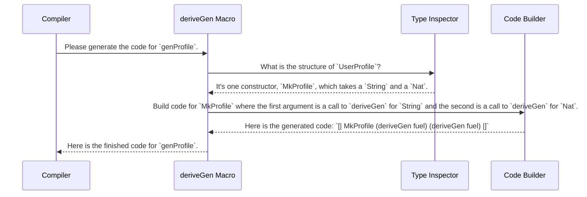

# Chapter 2: Automatic Generator Derivation

In [Chapter 1: Test Data Generator (`Gen` Monad)](01_test_data_generator___gen__monad__.md), we learned how to write recipes (`Gen`) to create random data. We carefully crafted a `genProfile` recipe by combining smaller recipes for names and ages. This is great for simple types, but what if you have a data type with dozens of fields? Writing a generator for it by hand would be long and tedious.

This is where `DepTyCheck` unveils its magic wand.

## The Problem: Tedious Manual Labor

Remember our `UserProfile` from the last chapter?

```idris
data UserProfile = MkProfile String Nat
```

We wrote a generator for it by hand:

```idris
genName : Gen NonEmpty String
genName = elements ["Alice", "Bob", "Charlie"]

genAge : Gen NonEmpty Nat
genAge = choose (18, 65)

-- Manually combining the recipes
genProfile : Gen NonEmpty UserProfile
genProfile = [| MkProfile genName genAge |]
```

This was easy enough. But now imagine a `BlogPost` type:

```idris
data BlogPost = MkPost
  { title : String
  , author : UserProfile
  , content : String
  , tags : List String
  , isPublished : Bool
  }
```

Writing a generator for this would involve writing and combining five different recipes. It's doable, but it's boilerplate code. We can do better. Wouldn't it be great if the computer could just look at `BlogPost` and figure out how to generate it on its own?

## The Magic Wand: `deriveGen`

`DepTyCheck` provides a powerful tool called `deriveGen` that does exactly this. It's a "macro"—a special piece of code that writes *other code* for you at compile time.

It's like an auto-chef. You show it the list of ingredients (your type definition), and it instantly creates a full cooking procedure (the generator) without you having to write it step-by-step.

Let's see it in action on our `UserProfile`.

```idris
import Deriving.DepTyCheck.Gen
import Data.Fuel

data UserProfile = MkProfile String Nat

-- This line enables the `deriveGen` macro
%language ElabReflection

-- The auto-chef in action!
genProfile : Fuel -> Gen MaybeEmpty UserProfile
genProfile = deriveGen
```

That's it! Just one line. Let's break down what's new here.

1.  `%language ElabReflection`: This is a special command for the Idris compiler that turns on the "reflection" tools that `deriveGen` needs to inspect your types. You just need to add it once at the top of your file.

2.  `Fuel -> ...`: The signature now starts with a `Fuel` argument. Think of `Fuel` as a "generation budget." For simple types it doesn't do much, but if you have a recursive type (like a tree that contains other trees), `Fuel` prevents the generator from running forever in an infinite loop. `deriveGen` uses this budget pattern for all types to be consistent.

3.  `Gen MaybeEmpty ...`: The generator is now `MaybeEmpty`. This is related to `Fuel`. If the generator runs out of fuel while trying to create a complex value, it will fail, producing an "empty" result. So, the result is `MaybeEmpty`.

With that one line, `deriveGen` automatically creates a generator that knows it needs to generate a random `String` and a random `Nat` and combine them with `MkProfile`.

## How Does It Know?

At compile time, when the Idris compiler sees `genProfile = deriveGen`, it stops and lets the `deriveGen` macro take over. The macro then performs a series of steps:

1.  **Inspect:** It looks at the type it needs to generate: `UserProfile`.
2.  **Analyze:** It finds the definition: `data UserProfile = MkProfile String Nat`. It sees that to create a `UserProfile`, it needs a `String` and a `Nat`.
3.  **Recurse:** It thinks, "Okay, how do I generate a `String`? I'll use `deriveGen` for `String`! How do I generate a `Nat`? I'll use `deriveGen` for `Nat`!" The library already knows how to derive generators for basic types like `String`, `Nat`, `Bool`, etc.
4.  **Construct:** It assembles the final code, which looks something like what we wrote by hand: `[| MkProfile (derivedGenForString fuel) (derivedGenForNat fuel) |]`.

This all happens invisibly, writing the best-practice boilerplate for you.

## Handling Choices

What if your data type has multiple options? `deriveGen` handles that too! Consider a type representing a network protocol.

```idris
data Protocol = TCP | UDP
```

How would you derive a generator for it? Just the same way!

```idris
-- Remember to add %language ElabReflection

genProtocol : Fuel -> Gen MaybeEmpty Protocol
genProtocol = deriveGen
```

When `deriveGen` inspects `Protocol`, it sees two constructors: `TCP` and `UDP`. So, it generates code that makes a random choice between them. The code it writes for you is logically equivalent to this:

```idris
-- This is what deriveGen builds for you behind the scenes
genProtocol_manual : Fuel -> Gen MaybeEmpty Protocol
genProtocol_manual fuel = oneOf [ [| TCP |], [| UDP |] ]
```

## The Real Magic: Dependent Types

The true power of `deriveGen` shines when dealing with dependent types, where the type of one value depends on another. In Chapter 1, we saw an example of generating `(n ** Fin n)`—a pair of a number `n` and another number guaranteed to be smaller than `n`.

Writing this by hand required a `do` block to chain the steps:

```idris
-- Manual version from Chapter 1
genAnyFin : Gen MaybeEmpty (n ** Fin n)
genAnyFin = do
  n <- genNat          -- Step 1: Generate a random number `n`
  f <- genFin n        -- Step 2: Use `n` to generate a `Fin n`
  pure (n ** f)      -- Return the pair
```

This manual chaining is a potential source of bugs. With `deriveGen`, you can just state your goal:

```idris
import Data.Fin

-- file: tests/derivation/least-effort/run/gadt/002 gadt/DerivedGen.idr

%language ElabReflection

genAnyFin : Fuel -> Gen MaybeEmpty (n ** Fin n)
genAnyFin = deriveGen
```

`deriveGen` is smart enough to analyze the dependent type `(n ** Fin n)`. It understands that `n` must be generated first and that its value must be used to generate the `Fin n`. It automatically writes the correct `do` block logic for you, saving you from complex manual implementation.

## Under the Hood

You don't need to know the internals to use `deriveGen`, but seeing how the magic trick works can build confidence. The process uses a powerful Idris 2 feature called "Elaborator Reflection".

Here is a simplified step-by-step of what happens when the compiler sees `genProfile = deriveGen`:



The core logic for this process lives in the file `src/Deriving/DepTyCheck/Gen.idr`. The main function is `deriveGenExpr`, which takes a type and returns the finished code for its generator. It uses helper functions to perform the inspection (`checkTypeIsGen`) and construction.

While the real code is complex to handle all the edge cases of the Idris type system, the principle is as simple as the diagram above: inspect, recurse, and build.

## Conclusion

In this chapter, you've learned about `DepTyCheck`'s most powerful convenience feature: automatic generator derivation.

-   **`deriveGen`** is a compile-time macro that automatically writes a `Gen` for your data type.
-   It saves you from writing tedious and error-prone boilerplate code.
-   It works by **inspecting** your type's definition and building a recipe from its structure.
-   It's smart enough to handle product types (like `UserProfile`), sum types (like `Protocol`), and even complex **dependent types**.

`deriveGen` is the default tool you should reach for when you need a generator. But what if the default, automatically generated data isn't quite what you need? For example, what if you want all generated user profiles to have an age over 18? The default `deriveGen` for `Nat` will generate any number. How can we influence or "tune" the derivation process?

That's exactly what we'll cover in the next chapter.

Next up: [Chapter 3: Derivation Tuning](03_derivation_tuning_.md)

---

Generated by [AI Codebase Knowledge Builder](https://github.com/The-Pocket/Tutorial-Codebase-Knowledge)