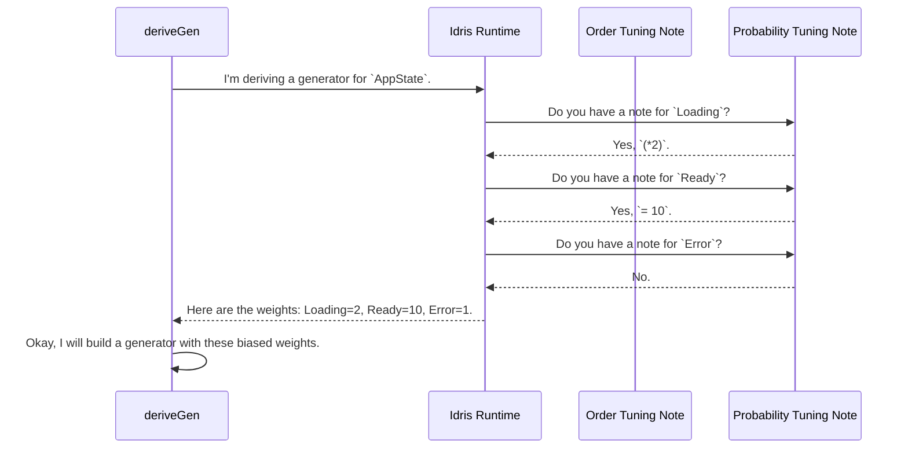

# Chapter 3: Derivation Tuning

In [Chapter 2: Automatic Generator Derivation](02_automatic_generator_derivation_.md), we met `deriveGen`, the powerful "auto-chef" that can automatically create test data recipes for us. It's fantastic for getting started quickly. But what happens when the auto-chef's default choices aren't quite right?

Sometimes, you're the head chef, and you need to give more specific instructions. Maybe you need the frosting prepared *before* the cake, not after. Or maybe your recipe calls for twice as much sugar as usual.

This chapter is about how you can leave these special notes for `deriveGen` to guide its work. We call this "Derivation Tuning."

## The Problem: When the Auto-Chef Needs a Hint

The `deriveGen` auto-chef is smart, but it can run into two common situations where it needs your guidance.

### 1. The "Which Comes First?" Dilemma

Consider this slightly tricky data type `Y`. It holds a value of type `X`, but the type of `X` depends on a number `n`, which is also part of `Y`'s type.

```idris
-- A simple type that just holds a number.
data X : Nat -> Type where
  MkX : (v : Nat) -> X v

-- A more complex type that uses X.
data Y : Nat -> Type where
  MkY : (a : X n) -> (b : Nat) -> Y n
```

To create a `Y n`, `deriveGen` needs to create an `X n` and a `Nat`. The `X n` is tricky. Its type depends on `n`. The auto-chef looks at the arguments `a` and `b`. By default, it might try to generate them in the order they appear: `a` first, then `b`.

For this simple case, `deriveGen` is smart enough to figure it out. But for more complex types with many inter-dependencies, it might get confused. It's like a chef trying to make sauce with an ingredient that's still locked in the pantry. If the order is wrong, the whole recipe fails. We need a way to tell the chef, "Unlock the pantry first!"

### 2. The "I Want More of This!" Problem

Imagine you're testing an application that can be in one of three states: `Loading`, `Ready`, or `Error`.

```idris
data AppState = Loading | Ready | Error
```

If you use `deriveGen`, it will treat all three constructors equally. It will generate `Loading`, `Ready`, and `Error` states with roughly the same probability (1/3 each).

```idris
-- This will produce a mix of all three states.
genAppState : Fuel -> Gen MaybeEmpty AppState
genAppState = deriveGen
```

But what if, in the real world, your application is in the `Ready` state 99% of the time? To write realistic tests, you might want your generated data to reflect that. You want to tell the auto-chef, "Make a lot of `Ready` dishes, and only a few `Loading` or `Error` ones."

## The Solution: Leaving Notes on the Recipe

`DepTyCheck` allows you to provide hints to the derivation engine using special `interface` implementations. Think of them as sticky notes you attach to the main recipe. `deriveGen` will read these notes and adjust its strategy.

There are two kinds of notes you can leave:
1.  **`GenOrderTuning`:** Controls the *order* in which constructor arguments are generated.
2.  **`ProbabilityTuning`:** Controls the *likelihood* of each constructor being chosen.

Let's see how to use them.

### `GenOrderTuning`: Controlling the Steps

`GenOrderTuning` tells the auto-chef which ingredients to prepare first. This is crucial for complex dependent types where one argument's type depends on another's value.

Let's imagine a slightly more complex version of our `Y` type where the order *really* matters.

```idris
data Y : Nat -> Type where
  MkYComplex : (before : Nat) -> (item : X n) -> (after : Nat) -> Y n
```

Let's pretend `deriveGen` gets confused and tries to generate `before` first. This won't work well because the most constrained part is `item : X n`, which determines `n`. We need to tell `deriveGen`: "Generate `item` first!"

Here's how you write that note:

```idris
%language ElabReflection -- Don't forget this!

-- The "note" for the MkYComplex constructor.
GenOrderTuning "{MkYComplex}.dataCon" where
  isConstructor = itIsConstructor
  deriveFirst _ _ = [`{item}]
```

Let's break this down:
- `GenOrderTuning "{MkYComplex}.dataCon"`: This targets your note to a specific constructor. `{...}.dataCon` is the magic syntax for this.
- `isConstructor = itIsConstructor`: This is a sanity check. If you misspell the constructor name, the compiler will give you an error here. Just copy it as is.
- `deriveFirst _ _ = [`{item}]`: This is the core instruction. It returns a list of arguments that should be generated first. Here, `` ` {item} `` is a special way to refer to the argument named `item`.

Now, when you use `deriveGen` for `Y`, it will first see this note. It will generate the `item` argument, which figures out `n`, and only then will it generate `before` and `after`.

### `ProbabilityTuning`: Changing the Mix

`ProbabilityTuning` lets you tell the auto-chef to prefer certain constructors over others. Let's go back to our `AppState`.

```idris
data AppState = Loading | Ready | Error
```

By default, each constructor has a "weight" of 1. The probability of being chosen is `(its weight) / (total weight)`. So here, each is 1/3.

Let's say we want `Ready` to be much more likely, and `Loading` to be a bit more likely than `Error`.
- We want `Ready` to be 10 times more likely than `Error`.
- We want `Loading` to be twice as likely as `Error`.

We can write notes for this!

```idris
-- Make 'Ready' much more likely.
ProbabilityTuning "{Ready}.dataCon" where
  isConstructor = itIsConstructor
  tuneWeight _ = 10

-- Make 'Loading' more likely.
ProbabilityTuning "{Loading}.dataCon" where
  isConstructor = itIsConstructor
  tuneWeight = (*2)
```

- `tuneWeight _ = 10`: This sets the weight of the `Ready` constructor to a fixed value of `10`.
- `tuneWeight = (*2)`: This takes the original weight (which was 1) and multiplies it by 2. So the new weight for `Loading` is `2`.

The `Error` constructor has no note, so it keeps its default weight of `1`.

Now, the total weight is `10 (Ready) + 2 (Loading) + 1 (Error) = 13`. The new probabilities will be:
- **Ready:** 10/13 (~77%)
- **Loading:** 2/13 (~15%)
- **Error:** 1/13 (~8%)

When you use `deriveGen` on `AppState`, it will now produce data that matches this new, biased distribution.

## Under the Hood

How does `deriveGen` find and use these "notes"? It's all thanks to Idris's `interface` system.

When you write `GenOrderTuning "..." where ...`, you are defining an implementation of the `GenOrderTuning` interface for that specific constructor name. When `deriveGen` starts its work for a type, it performs an extra step.

Here's the simplified process:



The interfaces are defined in `src/Deriving/DepTyCheck/Gen/Tuning.idr`. Let's look at a simplified version of `ProbabilityTuning`.

```idris
-- A simplified view from Tuning.idr
public export
interface ProbabilityTuning (0 n : Name) where
  isConstructor : (con : IsConstructor n ** GenuineProof con)
  tuneWeight : Nat1 -> Nat1
```

- `interface ProbabilityTuning (0 n : Name)`: Defines an interface that is "indexed" by a `Name`. This is how it targets a specific constructor.
- `tuneWeight : Nat1 -> Nat1`: This is the function you implement. It takes the default weight (a `Nat1`, a number greater than 0) and returns the new weight you want.

When `deriveGen` is about to choose between constructors, it uses a process called "interface resolution" to look for any implementations of `ProbabilityTuning` that match the constructors' names. If it finds one, it uses the `tuneWeight` function to adjust its calculations. The same logic applies to `GenOrderTuning` and its `deriveFirst` function.

## Conclusion

You've learned how to go from a consumer of `deriveGen` to its director. The auto-chef is a great assistant, but with Derivation Tuning, you are always in control.

-   **Derivation Tuning** allows you to provide hints to `deriveGen` to customize its output.
-   **`GenOrderTuning`** fixes generation problems in complex dependent types by letting you specify the **order** in which arguments are generated.
-   **`ProbabilityTuning`** lets you create more realistic test data by changing the **probability** of different constructors being generated.

So far, we've treated `deriveGen` as a bit of a magic box that we can poke and prod with tuning. But what if we want to understand the machine inside the box? In the next chapter, we'll open it up.

Next up: [Chapter 4: The Derivation Engine](04_the_derivation_engine_.md)

---

Generated by [AI Codebase Knowledge Builder](https://github.com/The-Pocket/Tutorial-Codebase-Knowledge)