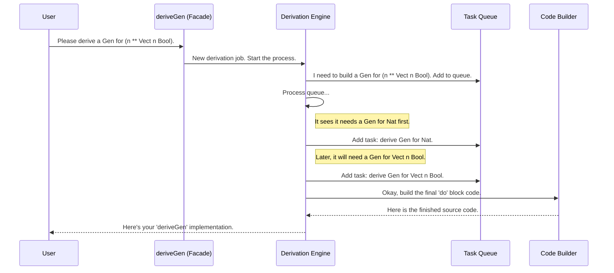

# Chapter 4: The Derivation Engine

In the last chapter, [Derivation Tuning](03_derivation_tuning_.md), we learned how to act as a "head chef," giving specific instructions to `deriveGen` to control argument order and constructor probabilities. We saw that `deriveGen` is more than a simple macro; it's a sophisticated system that can adapt to our hints.

But what is that system? How does it actually work? In this chapter, we're going to pop the hood and look at the complex machinery that powers the `deriveGen` magic wand: **The Derivation Engine**.

## The Auto-Factory Analogy

Think of `deriveGen` as the "start" button on a fully automated car factory. You, the user, just tell it what kind of car you want (the type you want to generate), and a moment later, a brand new, randomly assembled car (a generator function) rolls off the line.

The Derivation Engine is that factory. It's not one single machine, but a whole assembly line with different stations, each with a specific job:
1.  **Analysis Station:** Reads the blueprint for the car (`UserProfile`) and figures out all the parts it needs (a `String` and a `Nat`).
2.  **Planning Station:** Creates a step-by-step assembly plan. For a `UserProfile`, the order isn't critical. But for a more complex car where the chassis must be built before the engine is installed, this station is crucial.
3.  **Sub-Assembly Stations:** These are smaller factories-within-the-factory. The main line requests a "random engine" and a "random transmission" from them. These stations recursively use the same factory process to build those parts.
4.  **Final Assembly Station:** Puts all the finished parts together on the main chassis according to the plan.

This multi-stage process is what allows `deriveGen` to handle everything from simple data types to incredibly complex, dependently-typed structures.

## A Walkthrough: Building a `Vect` Generator

Let's trace the factory process for a slightly more interesting type: `(n ** Vect n Bool)`. This is a pair containing a number `n`, and a vector of booleans that has exactly length `n`.

When you write `deriveGen` for this type, the Derivation Engine kicks into gear.

1.  **Analysis:** The engine looks at `(n ** Vect n Bool)`. It sees it's a pair. The first part is `n : Nat`. The second part is a `Vect`, whose type `Vect n Bool` *depends on the value* of the first part.
2.  **Planning:** The planner immediately sees the dependency. "I can't build the `Vect n Bool` until I know what `n` is! Therefore, the plan must be: Step 1, generate `n`. Step 2, use that `n` to generate the `Vect`." This is the same logic we used manually with `do` blocks in [Chapter 1: Test Data Generator (`Gen` Monad)](01_test_data_generator___gen__monad__.md).
3.  **Recursive Construction:** The engine follows the plan.
    *   "Okay, Step 1: get a `Nat`. I'll make a recursive call to the factory to build a generator for `Nat`."
    *   "Step 2: get a `Vect n Bool`. Once Step 1 gives me a value for `n`, I'll make another recursive call to the factory to build a generator for `Vect n Bool`."
4.  **Final Assembly:** The engine takes the results of the sub-assemblies and writes the final code. It knows that because the steps are dependent, it must use a `do` block. The code it generates for you looks like this:

```idris
-- This is what the Derivation Engine builds for you.
do
  n <- deriveGen fuel      -- Result of the "Nat" sub-assembly
  vec <- deriveGen fuel  -- Result of the "Vect n Bool" sub-assembly
  pure (n ** vec)        -- Final assembled product
```

## Under the Hood: The Code That Runs the Factory

This process is orchestrated by several interacting modules within `DepTyCheck`. You don't need to understand them to use the library, but seeing the main components can make the magic feel more real.

Here's a simplified diagram of how a call to `deriveGen` flows through the engine:



The engine cleverly uses a **task queue** to manage all the recursive sub-problems it needs to solve. Let's look at the key pieces of code that correspond to this flow.

### The Entry Point: `runCanonic`

The whole process is kicked off by a function called `runCanonic`. It sets up the "factory floor" with all the necessary state, including the empty task queue and a list of any external generators you've provided.

```idris
-- File: src/Deriving/DepTyCheck/Gen/ForAllNeededTypes/Impl.idr

-- Simplified view of the main entry point
export
runCanonic : ... -> (forall m. DerivationClosure m => m a) -> Elab (a, List Decl)
runCanonic exts calc = do
  -- 1. Sets up the context, including external generators (`exts`)
  -- 2. Creates the initial state (empty task queue, etc.)
  -- 3. Calls the main calculation (`calc`)
  -- 4. Returns the final generated declarations (the `List Decl`)
  ...
```

This function acts as the main controller, starting the assembly line and collecting the final product.

### The To-Do List: `deriveAll`

Inside the engine, work is managed by `deriveAll`. It's a simple loop: as long as there are tasks in the queue, it pulls one off and works on it. When generating the code for one type creates a need for another generator (a sub-assembly), that new task is simply added to the queue.

```idris
-- File: src/Deriving/DepTyCheck/Gen/ForAllNeededTypes/Impl.idr

-- Simplified view of the main work loop
deriveAll : m ()
deriveAll = do
  toDerive <- get {stateType=List _}  -- Get tasks from the queue
  put {stateType=List _} []           -- Clear the queue for this round
  for_ toDerive deriveOne             -- Process each task
  when (not $ null toDerive) $        -- If new tasks were added...
    assert_total $ deriveAll          -- ...loop again!
```
This queue-based approach is what allows the engine to untangle complex, mutually-recursive data types without getting stuck.

### The Planner: `searchOrder`

The most intelligent part of the factory is the planning station. The `searchOrder` function in `ForOneTypeConRhs/Impl.idr` is responsible for this. It analyzes all the arguments of a constructor to figure out their dependencies.

```idris
-- File: src/Deriving/DepTyCheck/Gen/ForOneTypeConRhs/Impl.idr

-- A conceptual view of the planning logic
searchOrder : (dependencies : Map Arg (Set OtherArgs)) ->
              List Arg -- The final, ordered plan!
searchOrder dependencies = ...
  -- 1. Analyzes the dependency graph.
  -- 2. Checks for hints from GenOrderTuning.
  -- 3. Finds arguments with no dependencies (can be generated first).
  -- 4. Creates an ordered list of arguments to generate.
```

This function builds a dependency graph and performs a topological sort to find a valid generation order. This is the "brain" that automatically does what we used to do by hand with `do` blocks.

### The Final Assembler: `consGenExpr`

Once the plan (`theOrder`) is ready, `consGenExpr` takes over. It iterates through the plan and generates the code for each step, chaining them together.

```idris
-- File: src/Deriving/DepTyCheck/Gen/ForOneTypeConRhs/Impl.idr

-- Simplified view of the code assembler
consGenExpr sig con givs fuel = do
  -- ... many steps to prepare ...

  -- Get the final plan from the planner
  let theOrder = ... searchOrder ...

  -- Generate the code by applying each step in the plan
  genForOrder theOrder
```
This is the robot on the assembly line that physically welds the parts together, producing the final `do` block or `[| ... |]` expression.

## Conclusion

In this chapter, we lifted the curtain on `deriveGen` and explored the powerful Derivation Engine. We learned that it's not a single piece of magic, but a well-designed, multi-stage process akin to an automated factory.

-   The engine works in stages: **Analysis**, **Planning**, **Recursive Construction**, and **Final Assembly**.
-   It uses a **task queue** to manage complex, recursive derivations.
-   The **Planning** stage is the most critical, as it automatically figures out the correct order to generate arguments for dependent types.

The engine relies heavily on its ability to inspect and understand Idris types. The "Analysis" stage uses a suite of helper functions to pull apart types, find constructor definitions, and analyze their arguments. What are these tools? How do they work? We'll explore them next.

Next up: [Chapter 5: Type and Signature Analysis Utilities](05_type_and_signature_analysis_utilities_.md)

---

Generated by [AI Codebase Knowledge Builder](https://github.com/The-Pocket/Tutorial-Codebase-Knowledge)