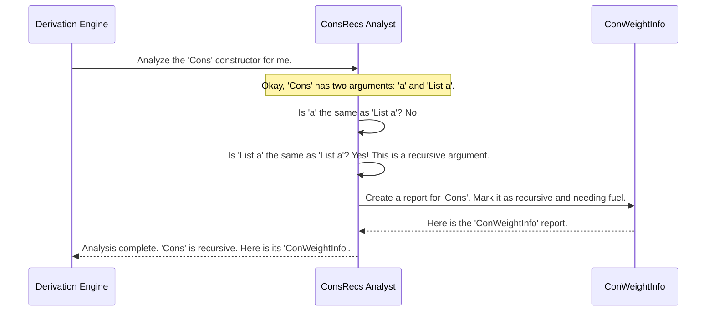

# Chapter 5: Type and Signature Analysis Utilities

In [Chapter 4: The Derivation Engine](04_the_derivation_engine_.md), we opened the hood of the `deriveGen` "auto-factory" and saw the assembly line that builds generators. We learned that the engine has different stations for analysis, planning, and assembly.

But how does the "Analysis Station" do its job? When it looks at a type like `(n ** Vect n Bool)`, how does it *know* that the `Vect` depends on `n`? How does it know that a `List` is recursive and needs `Fuel`?

The engine doesn't have a brain; it has a toolbox full of precision instruments. This chapter is about those instruments: the **Type and Signature Analysis Utilities**. These are the specialized scanners, rulers, and gauges the engine uses to measure and understand Idris code.

## The Problem: How to Read a Blueprint?

Imagine the Derivation Engine is a factory manager looking at a new blueprint (an Idris type). To build it, the manager needs answers to a few key questions:

1.  **What's the final product?** What is the exact type we are trying to build?
2.  **What are the main assembly steps?** If the type has multiple constructors (like `Nil` and `Cons` for `List`), which one are we using?
3.  **Does this step require smaller versions of the same part?** Is this constructor recursive (like `Cons`), meaning we'll need to manage our `Fuel`?
4.  **Do the parts depend on each other?** Must we build the chassis before installing the engine? (Does one argument's type depend on another's value?)

The analysis utilities are designed to answer exactly these questions by inspecting the raw code representation that Idris provides to the macro system.

## The Instruments in the Toolbox

Let's meet the three main precision instruments the Derivation Engine uses.

### 1. `GenSignature`: The Work Order

Before the factory starts any job, it needs a clear work order. This is what `GenSignature` is. It's a simple, standardized data structure that describes a generator.

A `GenSignature` answers the question: "What are we building?" It contains two key pieces of information:

-   `targetType`: The type we want to generate (e.g., `UserProfile`).
-   `givenParams`: A list of any type arguments that are already known. For example, when generating a `List Int`, the `Int` part is a "given parameter."

Here is a simplified view of the `GenSignature` record from its definition:

```idris
-- File: src/Deriving/DepTyCheck/Gen/Signature.idr

public export
record GenSignature where
  constructor MkGenSignature
  targetType : TypeInfo -- The type to generate, like 'List a'
  givenParams : SortedSet (Fin targetType.args.length)
  -- A set of indices telling us which arguments are already known.
  -- e.g., for 'List Int', the 'a' parameter at index 0 is known.
```

This record acts as a clear, machine-readable "spec sheet" that is passed around inside the Derivation Engine to define the various sub-tasks it needs to perform.

### 2. `DeepConsApp`: The Blueprint Scanner

`DeepConsApp` is a powerful scanner that can read a type expression and break it down into its fundamental parts. Its main job is to figure out how a type is built from its constructors. The "Deep" in its name means it can look inside nested structures.

For example, if it scans the type `Maybe (List Int)`, it won't just see `Maybe`. It will scan deeply and report back: "This type is built using the constructor `Maybe`, which is applied to another type built with the constructor `List`, which is applied to the type `Int`."

```idris
-- File: src/Deriving/DepTyCheck/Util/DeepConsApp.idr

-- A very simplified idea of what DeepConsApp does.
-- It takes an expression and tells you the names of constructors inside it.
analyseDeepConsApp : (analysedExpr : TTImp) -> List Name
```
*   `TTImp` is the raw representation of a piece of Idris code.
*   The function returns a `List Name` of all the constructors it found.

This utility is how the engine understands dependencies. By scanning an argument's type, it can see if that type uses any of the *other* arguments as parameters, which tells the Planning Station that a `do` block is needed.

### 3. `ConsRecs`: The Recursion Analyst

`ConsRecs` is the specialized analyst that checks for recursion. When the Derivation Engine looks at a `data` type, it sends each constructor to `ConsRecs` for inspection.

`ConsRecs` answers the question: "Does this constructor build the part by using a smaller version of the same part?"

-   For `data List a = Nil | Cons a (List a)`, it inspects `Cons`. It sees that the second argument is `List a`—the very type it belongs to! It flags `Cons` as **recursive**.
-   For `data UserProfile = MkProfile String Nat`, it inspects `MkProfile`. It sees the arguments are `String` and `Nat`, neither of which is `UserProfile`. It flags `MkProfile` as **not recursive**.

This information is stored in another record:

```idris
-- File: src/Deriving/DepTyCheck/Gen/ConsRecs.idr

-- A simplified view of the information stored for each constructor.
public export
record ConWeightInfo where
  constructor MkConWeightInfo
  weight : Either Nat1 RecWeightInfo -- Either a simple weight...
  -- ...or info about its recursiveness.
```
If a constructor is recursive (`RecWeightInfo`), this tells the engine that it must be careful and use `Fuel` to avoid an infinite generation loop. If it's not recursive (a simple `Nat1` weight), the engine knows it's safe to generate directly.

## Under the Hood: The Tools in Action

Let's see how the Derivation Engine uses these tools to analyze `data List a = Nil | Cons a (List a)`.

The engine wants to build a generator for `List a`. It first looks at the `Cons` constructor.



The engine receives the `ConWeightInfo` report from `ConsRecs`. Now it knows that whenever it generates a value using the `Cons` constructor, it must:
1.  Decrement the `Fuel`.
2.  Make a recursive call to `deriveGen` to generate the `List a` argument.

The other tools play a similar role. `GenSignature` is used to create the work order for that recursive call (`"Job: generate a 'List a'"`), and `DeepConsApp` could be used to analyze the types of complex arguments to check for hidden dependencies.

Together, these utilities provide the Derivation Engine with all the information it needs to make smart decisions. They are the "senses" of the factory, allowing it to perceive and understand the structure of any type you give it.

## Conclusion

In this chapter, we've looked into the Derivation Engine's toolbox. We've seen that its "intelligence" comes from a suite of focused and powerful analysis utilities.

-   **`GenSignature`** acts as a standardized **work order** or spec sheet, defining each generation task.
-   **`DeepConsApp`** is a **blueprint scanner** that deciphers how types are built from constructors, revealing dependencies.
-   **`ConsRecs`** is a **recursion analyst** that inspects constructors to see if they are recursive, telling the engine when to use `Fuel`.

These tools work together to dissect and understand your code, allowing the [Derivation Engine](04_the_derivation_engine_.md) to automatically build correct and efficient generators.

Now that we understand how `DepTyCheck` can generate data, how can we use that data to learn something about our code? What if we could use these same analysis tools to see which parts of our data models are being tested and which are being missed?

Next up: [Chapter 6: Model Coverage Analysis](06_model_coverage_analysis_.md)

---

Generated by [AI Codebase Knowledge Builder](https://github.com/The-Pocket/Tutorial-Codebase-Knowledge)