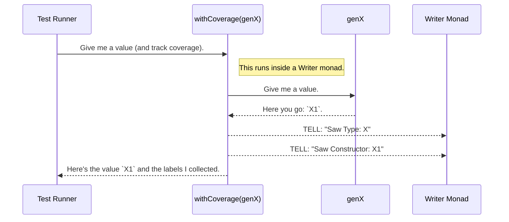

# Chapter 6: Model Coverage Analysis

In the previous chapter, [Type and Signature Analysis Utilities](05_type_and_signature_analysis_utilities_.md), we saw the precision tools the Derivation Engine uses to understand your code. We learned that `DepTyCheck` can automatically analyze your data types to figure out their structure, constructors, and recursive properties.

But what if we could turn these powerful analysis tools towards a different goal? Instead of just *building* generators, what if we could use them to check how well our generators are doing their job? This chapter introduces a feature that does exactly that.

## The Problem: Are We Testing Everything?

Imagine you've written a generator for a simple data type representing a network request status.

```idris
data RequestStatus = Success | Pending | Error String
```

You create a generator for it, maybe using `deriveGen` or by hand. You run your tests, and they all pass. Fantastic!

But how do you know your generator actually produced all three kinds of `RequestStatus`? What if, due to some subtle configuration, it *only ever* created `Success` and `Pending` values? This would mean your `Error` handling code was never tested at all! You have a blind spot in your testing, and you don't even know it.

This is like a chef who has a recipe book with 100 recipes but only ever cooks the first two. They can't be sure the other 98 recipes even work. We need a way to get a report card on our testing, to see which parts of our data "recipe book" we've actually used.

## The Solution: A Checklist for Your Data

`DepTyCheck`'s Model Coverage Analysis is this report card. It helps you see how well your testing covers your data structures.

When you run a generator, you can wrap it in a special function called `withCoverage`. This wrapper acts like an inspector watching the production line. Every time a value is generated, the inspector makes a tally mark:
- "Okay, one `RequestStatus` was just made."
- "Specifically, it was a `RequestStatus.Success`."

After running your generator many times, you can ask the inspector for its clipboard. It will show you a full report:
- `RequestStatus`: used 100 times.
    - `Success`: used 45 times.
    - `Pending`: used 55 times.
    - `Error`: used **0 times**.

Seeing this, you'd immediately know there's a gap in your testing that you need to fix.

## A Practical Example: Finding the Gaps

Let's see this in action. We'll use a simple data type `X` and intentionally write a generator that misses one of its constructors.

```idris
-- Our simple data type
data X = X1 | X2 Nat | X3 String
```

Now, let's write a generator for `X`. Notice that we've "forgotten" to include `X2` in our generator's choices.

```idris
import Test.DepTyCheck.Gen

-- A generator that only ever produces X1 or X3.
genX : Fuel -> Gen NonEmpty X
genX fl = oneOf
  [ pure X1
  , [| X3 "some string" |]
  ]
```

Without a coverage tool, we might never notice this omission. Let's see how `DepTyCheck` can help us spot it.

### Step 1: Wrap the Generator in `withCoverage`

To enable coverage tracking, we wrap our generator call in `withCoverage`. This function doesn't change what the generator produces, but it adds the "inspector" that tracks what's happening.

```idris
import Test.DepTyCheck.Gen.Coverage

-- A new generator with coverage tracking enabled.
genX_withCoverage : Fuel -> Gen NonEmpty X
genX_withCoverage fl = withCoverage (genX fl)
```

### Step 2: Initialize, Run, and Register

Now, in our main `IO` block, we'll perform three steps:
1.  **Initialize:** Create an empty "scorecard" for our generator using `initCoverageInfo`. It inspects the `X` type and creates an entry for `X`, `X1`, `X2`, and `X3`, all with a count of 0.
2.  **Run & Collect:** Run the generator many times (e.g., 100 times) using `unGenTryND`. This function returns the generated values *and* the coverage data collected by the inspector.
3.  **Register:** Feed the collected coverage data into our scorecard using `registerCoverage`. This updates the counts on the scorecard.

```idris
import System.Random.Pure.StdGen

main : IO ()
main = do
  -- 1. Initialize an empty scorecard for our generator.
  let ci = initCoverageInfo genX_withCoverage

  -- 2. Run the generator 100 times and collect coverage data.
  let coverageSamples = unGenTryND 100 someStdGen $ genX_withCoverage (limit 10)
  let modelCoverages = mapMaybe fst coverageSamples

  -- 3. Update the scorecard with the results.
  let final_ci = foldl (flip registerCoverage) ci modelCoverages

  -- 4. Print the final report!
  putStrLn $ show final_ci
```
*Note: In a real test-suite, this boilerplate can be integrated into your test-runner.*

### Step 3: Read the Report

When you run this program, it will print a beautifully formatted report that immediately highlights the problem.

```
X covered partially (100 times)
  - X1: covered (50 times)
  - X2: not covered
  - X3: covered (50 times)
```
*(The exact numbers may vary, but the structure will be the same. The coloured output in a real terminal is even clearer!)*

The report clearly shows that the `X` type was "covered partially." Looking at the details, it's obvious why: `X2` was **not covered**. We've found our testing blind spot!

## Under the Hood: The Labelling System

How does this magic work? It's a clever combination of a `Writer` monad and the macro system we've been learning about.

Here's a simplified step-by-step of what happens when you run a generator with coverage.



1.  **The Wrapper:** `withCoverage` is a macro. When the compiler sees `withCoverage (genX fl)`, it expands this into more complex code. This new code does two things: it still calls the original `genX` generator, but it also wraps it in a way that lets it add "labels" to the result.

2.  **Labels:** What's a label? It's just a string. The macro generates code that says "when you get a value, add a label for its type name and a label for its constructor name."
    ```idris
    -- File: src/Test/DepTyCheck/Gen/Labels.idr
    -- A label is just a tagged string.
    data Label : Type where
      StringLabel : String -> Label
    ```

3.  **The Collector:** The generator is run inside a special environment (a `WriterT` monad) that has a "bag" for collecting all these labels. Every time `withCoverage`'s injected code adds a label, it's thrown into this bag.
    ```idris
    -- File: src/Test/DepTyCheck/Gen/Coverage.idr
    -- The collector just holds a map of labels to their counts.
    record ModelCoverage where
      constructor MkModelCoverage
      unModelCoverage : SortedMap Label Nat
    ```
    The `unGenTryND` function is what sets up this `Writer` environment and gives you back both the generated value and the bag of collected `ModelCoverage`.

4.  **The Reporter:** `initCoverageInfo` uses the same [Type and Signature Analysis Utilities](05_type_and_signature_analysis_utilities_.md) as `deriveGen` to create the initial empty report structure. The `registerCoverage` function then iterates through the collected labels (e.g., `"X"`, `"X1"`) and increments the corresponding counters in the report.

In short, `withCoverage` turns your generator into a tattletale. It reports every single type and constructor it creates, and the coverage report summarizes all that gossip for you.

## Conclusion

In this chapter, you've learned how to gain confidence in your property-based tests using Model Coverage Analysis.

-   Coverage analysis helps you find **blind spots** in your testing by showing which parts of your data models are never generated.
-   You can enable it by wrapping a generator in `withCoverage`.
-   The process involves **initializing** a report, **running** the generator to collect data, and **registering** the results to produce a final report.
-   It works by having the `withCoverage` macro inject code that **labels** generated data, which is then collected and summarized.

`DepTyCheck` is a powerful and flexible library for property-based testing in Idris 2. Throughout this tutorial, we've journeyed from the basic `Gen` monad to automatic derivation, tuning, and finally, analyzing the effectiveness of our generators. You are now equipped with the core concepts to start writing more robust and reliable Idris applications. Happy testing

---

Generated by [AI Codebase Knowledge Builder](https://github.com/The-Pocket/Tutorial-Codebase-Knowledge)