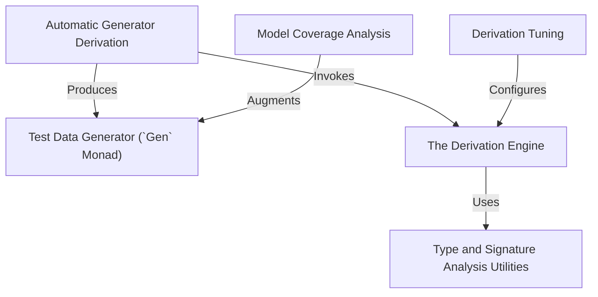

# Tutorial: DepTyCheck

This project is an Idris 2 library for *property-based testing* with a special focus on **dependent types**.
Its main feature is the ability to automatically **derive** test data *generators* (`Gen`) for complex data types using a macro called `deriveGen`.
This saves developers from writing a lot of boilerplate code for creating random, valid test inputs.

**Source Repository:** [None](None)

## Chapters

1. [Test Data Generator (`Gen` Monad)
](01_test_data_generator___gen__monad__.md)
2. [Automatic Generator Derivation
](02_automatic_generator_derivation_.md)
3. [Derivation Tuning
](03_derivation_tuning_.md)
4. [The Derivation Engine
](04_the_derivation_engine_.md)
5. [Type and Signature Analysis Utilities
](05_type_and_signature_analysis_utilities_.md)
6. [Model Coverage Analysis
](06_model_coverage_analysis_.md)

---

Generated by [AI Codebase Knowledge Builder](https://github.com/The-Pocket/Tutorial-Codebase-Knowledge)