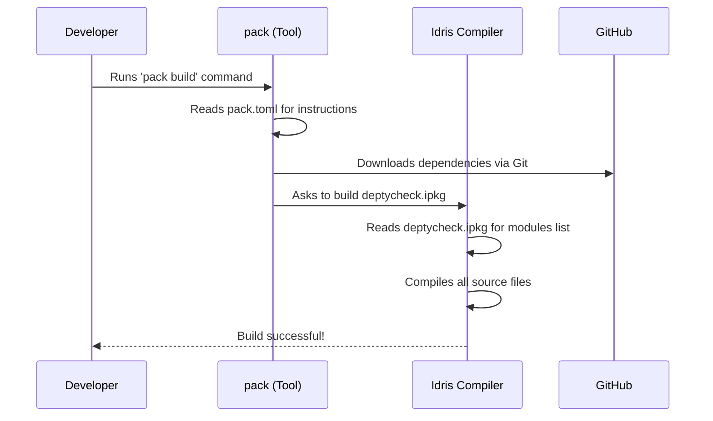

# Chapter 1: Project Configuration and Tooling

Welcome to the `DepTyCheck` tutorial! Before we dive into the exciting world of property-based testing with dependent types, let's start with a tour of the workshop. Every great project, whether it's a skyscraper or a software library, needs a solid foundation, clear blueprints, and a well-organized set of tools. This chapter is all about that—the essential "behind-the-scenes" files that help us build, test, and maintain `DepTyCheck`.

Think of these files as the project's administrative team. They don't write the main story (the library's logic), but they make sure the authors can write it efficiently, the final book is assembled correctly, and it's easy for everyone to read and contribute.

Let's explore some of these key files.

### The Master Blueprint: `deptycheck.ipkg`

Every Idris project has a special file ending in `.ipkg`. This is the master blueprint that tells the Idris compiler everything it needs to know to build our library.

It answers questions like:
*   What is the name of this package? (`package deptycheck`)
*   What other libraries does it need to work? (`depends = ...`)
*   Which source code files are part of it? (`modules = ...`)

Let's look at a small part of `deptycheck.ipkg`:

```idris
-- File: deptycheck.ipkg

package deptycheck

authors = "Denis Buzdalov"
brief = "Property-based testing with dependent types"
license = "MPL-2.0"

-- other settings...
```

This first section is like the title block of a blueprint. It gives the project's name (`deptycheck`), its author, and a brief description.

```idris
-- File: deptycheck.ipkg (continued)

modules = Deriving.DepTyCheck.Gen
        , Deriving.DepTyCheck.Gen.Tuning
        -- ... many more modules

depends = ansi
        , best-alternative
        , random-pure
        -- ... and other dependencies
```

This part is the most critical for building the project.
*   `modules`: This is a list of all the individual Idris source code files (called modules) that make up our library.
*   `depends`: This lists all the external libraries that `DepTyCheck` uses. The Idris compiler will make sure these are available before trying to build our code.

### Managing Supplies: `pack.toml`

So, `deptycheck.ipkg` says we *need* other libraries, but how do we get them? That's where `pack`, the Idris package manager, and its configuration file, `pack.toml`, come in.

`pack.toml` is like our project's supply manager. It holds a list of all our dependencies and tells `pack` exactly where to find them—whether on our local disk or on a Git repository like GitHub.

```toml
# File: pack.toml

[custom.all.deptycheck]
type = "local"
path = "."
ipkg = "deptycheck.ipkg"
```

This entry tells `pack` about our main `DepTyCheck` library itself. It's a `local` package, meaning its source code is right here in the current directory (`path = "."`).

```toml
# File: pack.toml (continued)

[custom.nightly-251007.fin-lizzie]
type   = "git"
url    = "https://github.com/buzden/idris2-fin-lizzie"
commit = "latest:master"
ipkg   = "fin-lizzie.ipkg"
```

This entry, on the other hand, describes an external dependency. It tells `pack` to get it from a `git` repository at the specified `url`. This ensures that anyone building the project gets the exact same version of the code, making builds reliable and repeatable.

### The Style Guide: `.editorconfig`

When many people work on a project, their code can start to look a little different. Some might use tabs for indentation, others might use spaces. `DepTyCheck` uses an `.editorconfig` file to create a consistent style guide that most modern code editors can automatically follow.

It's like agreeing that all documents should use the same font and margin size, making them easier to read.

```ini
# File: .editorconfig

# Defaults for every file
[*]
end_of_line = lf
insert_final_newline = true
trim_trailing_whitespace = true

# Idris source files
[*.{idr,ipkg}]
indent_style = space
indent_size = 2
```

This configuration sets some simple rules:
*   `[*]` applies to all files. For example, `trim_trailing_whitespace = true` automatically removes any extra spaces at the end of lines.
*   `[*.{idr,ipkg}]` applies only to Idris source and package files. It says, "For these files, please use spaces for indentation, and make each indent level 2 spaces wide."

### Workshop Power Tools: Helper Scripts

Good projects often come with helper scripts to automate common, repetitive tasks. Think of these as custom-built power tools in our workshop. `DepTyCheck` has several, like `.rename` and `.patch-chez-gc-handler`. Let's look at a simple use case for the `.rename` script.

Imagine you want to rename a file from `src/Old/Name.idr` to `src/New/BetterName.idr`. You could do it manually, but you would also have to find every single place in the entire project that uses the old module `Old.Name` and update it to `New.BetterName`. This is tedious and error-prone!

The `.rename` script automates this. You just run:
`./.rename src/Old/Name.idr src/New/BetterName.idr`

And like magic, it renames the file and updates all its uses across the project. Here is a tiny piece of the script that does the replacement:

```sh
# File: .rename (simplified)

# Find all files that use the old module name...
grep -l -r "$FROM_MODULE" |
  # ...and for each file...
  while read -r r; do
    echo "  - usage in $r..."
    # ...replace the old module name with the new one.
    sed -i -e "s/$FROM_MODULE/$TO_MODULE/g" "$r"
  done
```
This little tool saves a lot of time and prevents silly mistakes.

### How It All Fits Together

So how do these files interact? Let's trace a common scenario: a developer wants to build the `DepTyCheck` library for the first time.



1.  **Developer** initiates the build using the `pack` tool.
2.  **`pack`** reads `pack.toml` to understand the project and its dependencies.
3.  It sees dependencies stored on **GitHub**, so it downloads them.
4.  Once dependencies are ready, `pack` tells the **Idris Compiler** to build the project, pointing it to `deptycheck.ipkg`.
5.  The **Idris Compiler** reads `deptycheck.ipkg` to find the list of source files (`modules`) and compiles them one by one.
6.  If everything succeeds, the developer gets a working library!

### Conclusion

In this chapter, we took a tour of the `DepTyCheck` project's "scaffolding and tooling." We learned that files like `deptycheck.ipkg`, `pack.toml`, and `.editorconfig` aren't just clutter; they are essential tools that make development smoother, more consistent, and more reliable. They handle dependency management, define the project's structure, and enforce a clean coding style, letting developers focus on the fun part: writing the actual code.

Now that we're familiar with the project layout and how it's put together, we are ready to start exploring the core ideas of the library.

In the next chapter, we will begin our journey by looking at the fundamental building block for generating test data: the [`Gen` Monad](02__gen__monad_.md).

---

Generated by [AI Codebase Knowledge Builder](https://github.com/The-Pocket/Tutorial-Codebase-Knowledge)