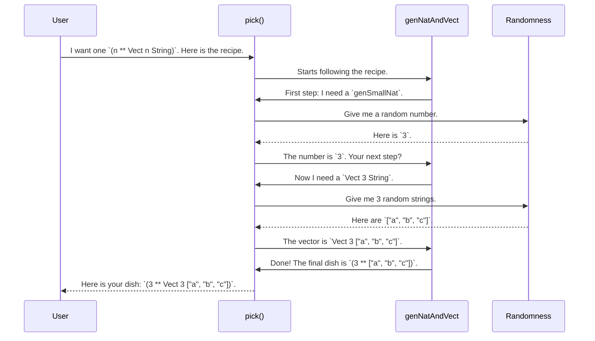

# Chapter 2: `Gen` Monad

In our [last chapter](01_project_configuration_and_tooling_.md), we toured the workshop, looking at the blueprints and tools that keep the `DepTyCheck` project organized. Now that we're familiar with the setup, it's time to pick up our first and most important tool: the one for creating random test data.

Property-based testing is all about checking if our code holds true for *many, many* randomly-generated inputs. But how do we "generate" this data, especially when dealing with complex, dependent types? The answer lies in a powerful abstraction called `Gen`.

## The Magical Cookbook for Random Data

Imagine you have a magical cookbook. Instead of recipes for food, it contains recipes for generating random values.

*   A simple recipe might be: "Generate a random whole number between 1 and 100."
*   Another could be: "Pick a random string from the list `["cat", "dog", "mouse"]`."

This is exactly what a `Gen a` is: a "recipe" for generating a random value of type `a`. It doesn't hold a value itself; it's the *description* of how to create one.

Let's look at a couple of simple recipes `DepTyCheck` provides.

### Recipe 1: Pick from a List

The `elements` function creates a recipe to pick one item uniformly from a list.

```idris
-- This is a recipe for generating a single String
genSomeString : Gen NonEmpty String
genSomeString = elements ["hello", "world", "idris"]
```

Here, `genSomeString` isn't the string `"hello"` or `"world"`; it's the *instruction* to randomly pick one of them when we later "run" the recipe.

You might notice the `NonEmpty` in `Gen NonEmpty String`. This is a guarantee that our recipe will *always* produce a value. If we gave `elements` an empty list, it wouldn't be able to produce anything! For cases where a recipe might fail (like asking for an element from an empty list), we use `Gen MaybeEmpty a`. Think of it as a recipe that might not produce a dish.

### Recipe 2: The Monadic Power for Dependent Data

Now, for the real magic. Simple recipes are great, but what if one part of our data *depends* on another?

**Use Case:** Let's say we want to test a function that works on vectors. To do this, we need to generate a vector with a random length, `n`, and then fill it with `n` random elements. The type of the vector, `Vect n String`, depends on the value of `n` we generate first!

This is where the "Monad" part of `Gen` Monad becomes a superstar. A monad allows us to chain recipes together, where the result of the first recipe can be used to decide what the second recipe does.

Let's write a recipe to generate `(n ** Vect n String)`—a pair containing a random number `n` and a vector of that exact length.

```idris
import Data.Vect

-- Assume 'genSmallNat' and 'genAnyString' are existing recipes
genNatAndVect : Gen NonEmpty (n ** Vect n String)
genNatAndVect = do
  -- Step 1: Run the "get a small number" recipe, call the result 'n'
  n <- genSmallNat
  -- Step 2: Use 'n' to create and run a new recipe!
  v <- vectOf n genAnyString
  -- Step 3: Package the results
  pure (n ** v)
```

Let's break down this `do` block:
1.  `n <- genSmallNat`: "Cook" the `genSmallNat` recipe and name the resulting number `n`.
2.  `v <- vectOf n genAnyString`: This is the key insight! We use the `n` we just got to build the *next* recipe: `vectOf n genAnyString` (a recipe for a `Vect` of length `n`). Then we cook *that* recipe and name the result `v`.
3.  `pure (n ** v)`: `pure` is the simplest recipe of all. It just says "take this final value and you're done."

This ability to chain dependent steps is what makes `Gen` so powerful and essential for testing software written with dependent types.

## How are Recipes "Cooked"?

So, `Gen a` is a recipe, but who does the cooking? Functions like `pick` or `unGenTryN` are the chefs. They take a recipe, a source of randomness (like a random number generator seed), and produce an actual value.

When we run `genNatAndVect`, here's what might happen behind the scenes:



## A Peek Inside the `Gen` Data Type

If we lift the lid on the `Gen` type, we can see how these recipes are structured. The actual definition in `src/Test/DepTyCheck/Gen.idr` is complex, but we can understand it from a few key constructors.

```idris
-- A simplified view of the Gen data type
data Gen : Emptiness -> Type -> Type where
  -- A recipe that is just a fixed value.
  Pure  : a -> Gen em a

  -- A recipe that is a basic random action, like "get a random number".
  Raw   : RawGen a -> Gen em a

  -- The heart of the Monad: A two-step recipe.
  -- Step 1: A simple random action that produces a 'c'.
  -- Step 2: A function that takes 'c' to produce the *next recipe*.
  Bind  : RawGen c -> (c -> Gen biem a) -> Gen em a

  -- A recipe that is guaranteed to produce nothing.
  Empty : Gen MaybeEmpty a
```

*   `Pure x`: This is the `pure` we used. It's the simplest recipe: "the result is `x`."
*   `Raw`: This wraps a primitive random-generating function, like `getRandomR` (get random in range).
*   `Bind`: This is the `do` notation we saw! `n <- genSmallNat` corresponds to the `RawGen c` part, and the rest of the `do` block is the `(c -> Gen biem a)` function that creates the next part of the recipe.
*   `Empty`: This represents a recipe that can never produce a value. It's crucial for types that have no inhabitants, like `Fin 0` (a number in the range `0..-1`). A correct generator for `Fin n` *must* be able to represent this empty case.

```idris
-- From the README: a generator for Fin n
genFin : (n : Nat) -> Gen MaybeEmpty (Fin n)
genFin Z     = empty -- The recipe for Fin 0 is... nothing!
genFin (S n) = elements' (allPossibleFins n) -- For n > 0, pick one.
```
This shows how we use the `MaybeEmpty` emptiness flag to handle cases that are impossible to generate, which is a common occurrence in the world of dependent types.

## Conclusion

In this chapter, we've unwrapped the `Gen` monad, the fundamental building block for creating random test data in `DepTyCheck`. We learned that:

*   A `Gen a` is like a **magical recipe** for generating a random value of type `a`.
*   Simple recipes like `elements` can be combined to make more complex ones.
*   The "monad" part gives us superpowers, allowing us to **chain recipes dependently**. This is the key to generating values for dependent types, where the *shape* of data depends on its *values* (like a `Vect` of length `n`).
*   We also saw how `DepTyCheck` thoughtfully handles cases where generation is impossible using `Gen MaybeEmpty`.

We now know how to write these recipes by hand. But what if our data types are large and complex? Writing generators for them manually would be tedious and error-prone. What if the compiler could just read our type definition and write the recipe for us?

That's exactly what we'll explore in the next chapter on [Automatic Generator Derivation](03_automatic_generator_derivation_.md).

---

Generated by [AI Codebase Knowledge Builder](https://github.com/The-Pocket/Tutorial-Codebase-Knowledge)