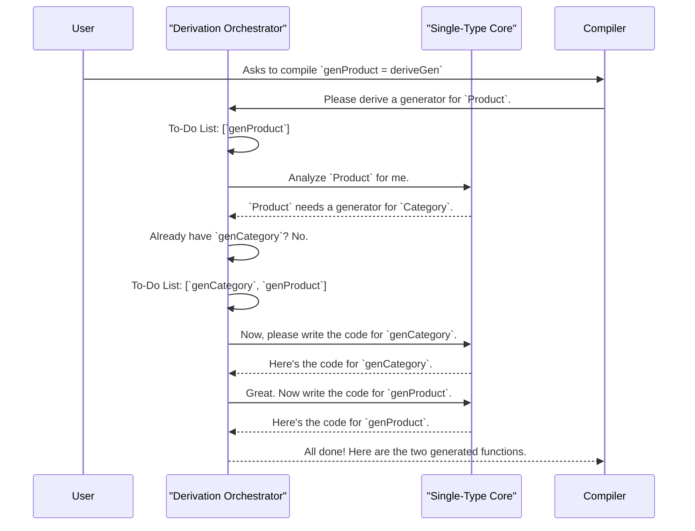

# Chapter 4: Derivation Orchestrator

In the [previous chapter](03_automatic_generator_derivation_.md), we discovered the magic of `deriveGen`, our "auto-chef" that can create a random data generator for a type like `Nat` just by looking at its definition. It's an incredible time-saver!

But our example, `Nat`, was simple and self-contained. The `S` constructor only referred back to `Nat` itself. What happens when our data types are more interconnected?

### The Challenge: A Chain of Dependencies

Let's imagine we're building a system to model products in a catalog. We might have these two types:

```idris
-- A product has a name, a category, and a price
data Product = MkProduct String Category Int

-- A product's category can be one of these
data Category = Electronics | Books | Apparel
```

Now, suppose we want to automatically generate random `Product` values for our tests. We write:

```idris
%language ElabReflection

genProduct : Fuel -> Gen MaybeEmpty Product
genProduct = deriveGen
```

When `deriveGen` starts working, it sees `MkProduct`. It knows it needs to generate a `String` and an `Int`—those are built-in, so that's easy. But then it sees it also needs a `Category`. `Category` is our own custom type! How can `deriveGen` create a `Product` if it doesn't first know how to create a `Category`?

It can't. The request to generate a `Product` implicitly creates a new sub-task: "generate a `Category`." This is where a more sophisticated system is needed to manage the entire chain of derivations.

### The Solution: The Head Chef in the Kitchen

Meet the **Derivation Orchestrator**. Think of it as the head chef of a very busy kitchen. When a big, complex order comes in (like `deriveGen` for `Product`), the head chef doesn't cook everything at once. Instead, it:

1.  **Reads the Main Order:** "I need to make a `Product`."
2.  **Breaks It Down:** "Okay, to make a `Product`, I need a `String`, an `Int`, and a `Category`."
3.  **Creates a To-Do List:** It jots down on a notepad: "Task 1: Make a `Category` generator."
4.  **Delegates the Work:** It hands off the individual tasks ("Make `Category` generator", "Make `Product` generator") to sous-chefs ([Single-Type Derivation Core](05_single_type_derivation_core_.md)) who specialize in one dish at a time.
5.  **Assembles the Final Meal:** Once all the helper generators are ready, it assembles the final code.

The Derivation Orchestrator is this behind-the-scenes project manager that ensures every single dependency for your derivation request is discovered, generated, and put in the right place, recursively.

Let's see how this plays out for our `Product` and `Category` example.



The Orchestrator's job isn't to write the code for any single generator. Its job is to manage the *entire process*, ensuring that by the end, every required generator has been built. It finds all the puzzle pieces and makes sure they're all on the table before assembly begins.

### A Look Under the Hood: The Orchestrator's Notebook

The magic of the Orchestrator is managed within the state of the compiler's elaborator. It keeps track of everything it needs to do in a state that we can conceptually call the `ClosuringContext`.

This "context" is like the head chef's notebook. It holds several key lists, managed by code in `src/Deriving/DepTyCheck/Gen/ForAllNeededTypes/Impl.idr`.

Let's look at a simplified view of this notebook:

*   **A "To-Do" List:** A queue of generators that still need to be created.
    *   `queue of gens to be derived : List (GenSignature, Name)`
*   **A "Done" List:** A map of generators that have already been requested, so we don't do the same work twice.
    *   `gens already asked to be derived : SortedMap GenSignature Name`
*   **The Final Manuscript:** A place to collect all the finished code.
    *   `writer : (List Decl, List Decl)`

When a generator for a specific type (like `Category`) is needed, the system calls a function conceptually similar to `callGen`.

```idris
-- Simplified logic for requesting a generator
callGen sig fuel values = do
    -- Check the "Done" list first
    let Nothing = SortedMap.lookup sig !get
      | Just name => pure (callTheExistingGenerator name) -- Found it! Just use it.

    -- Not found. It's a new task.
    let name = nameForGen sig      -- Give it a unique internal name.
    modify $ insert sig name       -- Add it to the "Done" list (so we don't ask again).
    modify $ (::) (sig, name)     -- Add it to the "To-Do" list.

    -- ... logic to start the derivation loop ...

    -- Return the code to call the function that will be generated
    pure (callTheNewGenerator name)
```
This function is the heart of the Orchestrator's logic. It checks if the work is already in progress or done. If not, it adds the task to the to-do list (`queue`) and records that it's being handled (`gens already asked`).

Once tasks are on the list, another piece of logic, `deriveAll`, works through them.

```idris
-- Simplified logic for processing the to-do list
deriveAll : m ()
deriveAll = do
  -- Get the current to-do list
  toDerive <- get {stateType=List _}
  put [] -- Clear the list for this round

  -- For each item, delegate to the single-type specialist
  for_ toDerive deriveOne

  -- Did the specialist add *new* tasks to the list?
  newTasks <- get {stateType=List _}
  -- If so, run again until the to-do list is empty!
  when (not $ null newTasks) $ assert_total deriveAll
```
This `deriveAll` function is like the chef processing their order slips one by one. It picks a task, gives it to a sous-chef (`deriveOne`), and then checks if that work created *new* dependencies. It keeps looping until the to-do list is completely empty, meaning all required generators, at all levels of the dependency tree, have been built.

### Conclusion

In this chapter, we've pulled back the curtain on the **Derivation Orchestrator**, the master project manager behind `deriveGen`. We learned that:

*   When deriving a generator for a type `T`, `deriveGen` must also create generators for any custom types `U` and `V` that `T` depends on.
*   The Orchestrator manages this complex, recursive process.
*   It acts like a **head chef**, discovering all necessary sub-tasks, creating a to-do list, and delegating the actual code-writing.
*   It intelligently avoids duplicate work by keeping track of which generators have already been requested.
*   This system ensures that even for very complex, interconnected data models, a single `deriveGen` call is enough to produce all the necessary helper generators automatically.

The Orchestrator is the manager, but who are the specialists it delegates to? In the next chapter, we'll meet the "sous-chef" responsible for handling one generator at a time: the [Single-Type Derivation Core](05_single_type_derivation_core_.md).

---

Generated by [AI Codebase Knowledge Builder](https://github.com/The-Pocket/Tutorial-Codebase-Knowledge)