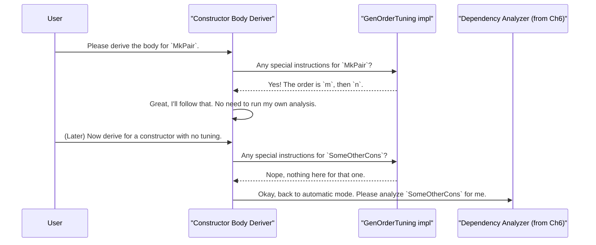

# Chapter 7: Derivation Tuning

In the previous chapters, we've seen the incredible power of `deriveGen`. It acts like an "auto-chef" that can automatically cook up random data generators for even our most complex data types by working through the [Derivation Orchestrator](04_derivation_orchestrator_.md), the [Single-Type Derivation Core](05_single_type_derivation_core_.md), and the [Constructor Body Derivation](06_constructor_body_derivation_.md).

But what if the auto-chef's default recipe isn't quite right for our specific test case? What if we want to give it some expert advice, like "add the ingredients in this exact order" or "use a lot more of this one ingredient"?

This is where **Derivation Tuning** comes in. It provides a set of dials and knobs for you to finely control the automated derivation process, helping you focus your tests on exactly the scenarios you care about most.

### The Problem: When the Auto-Chef Needs a Hint

Let's imagine two scenarios where the default behavior might not be enough.

**Scenario 1: Tricky Dependencies**

Consider a type that represents a pair of numbers where the first must be strictly less than the second.

```idris
data RangePair : Type where
  MkPair : (n : Nat) -> (m : Nat) -> (prf : LT n m) -> RangePair
```

The auto-chef from the [Constructor Body Derivation](06_constructor_body_derivation_.md) chapter might try to generate the arguments in order:
1.  Generate a random `n`.
2.  Generate a random `m`.
3.  Try to generate a proof that `n < m`.

This often fails! If `n` is `5` and `m` is `2`, it's impossible to prove `5 < 2`. A much smarter strategy is:
1.  Generate `m` first (say, `10`).
2.  Generate `n` as a number specifically less than `m` (e.g., a random number from `0` to `9`).
3.  Now, the proof is easy to construct!

We need a way to tell the auto-chef this specific assembly order.

**Scenario 2: Skewing the Data**

Remember our old friend `Nat`?

```idris
data Nat = Z | S Nat
```

The auto-deriver uses a `frequency` generator that favors the base case `Z` to prevent numbers from getting too large. But what if you're testing a function that only behaves interestingly with *large* numbers? You might want to tell the chef, "Go easy on the `Z`s and give me more `S`s!"

### The Solution: Giving Specific Instructions

`DepTyCheck` provides two special "instruction manuals" (Idris interfaces) that you can implement to guide the auto-chef: `GenOrderTuning` and `ProbabilityTuning`.

#### `GenOrderTuning`: Specify the Assembly Order

`GenOrderTuning` lets you tell the auto-chef the exact order to generate a constructor's arguments. Let's solve our `RangePair` problem.

First, we define our `RangePair` type. Then, right below it, we provide our special instructions using the `GenOrderTuning` interface.

```idris
-- File: src/Deriving/DepTyCheck/Gen/Tuning.idr (Conceptual Interface)
interface GenOrderTuning (0 n : Name) where
  isConstructor : (con : IsConstructor n ** GenuineProof con)
  deriveFirst : -- ... context info ...
                -> List (ConArg isConstructor.fst.conInfo)
```

This interface asks you to prove you're targeting a real constructor (`isConstructor`) and then provide a list of arguments to generate first (`deriveFirst`).

Here is how we use it to guide the `MkPair` generator:

```idris
-- Our tuning implementation for the 'MkPair' constructor
GenOrderTuning "MkPair".dataCon where
  isConstructor = itIsConstructor
  deriveFirst _ _ = [`{m}, `{n}]
```

Let's break this down:
*   `GenOrderTuning "MkPair".dataCon`: We declare that we are providing tuning instructions for the constructor named `MkPair`.
*   `isConstructor = itIsConstructor`: This is a magic line that confirms to the compiler that `MkPair` is indeed a real constructor. If you misspell it, you'll get a compile-time error.
*   `deriveFirst _ _ = [`{m}, `{n}]`: This is the crucial instruction! It tells the auto-chef: "For the `MkPair` constructor, please generate the argument named `m` first, and then the argument named `n` second." Arguments are specified as name literals (e.g., `` `{m} ``).

With this hint, the auto-chef will now generate a `do` block that first generates `m`, then `n`, making it much easier to satisfy the `LT n m` proof later.

#### `ProbabilityTuning`: Adjusting the Weight

`ProbabilityTuning` lets you adjust the "weight" of a constructor, making it appear more or less frequently. Let's make our `Nat` generator produce larger numbers.

Here is the conceptual interface:

```idris
-- File: src/Deriving/DepTyCheck/Gen/Tuning.idr
interface ProbabilityTuning (0 n : Name) where
  isConstructor : (con : IsConstructor n ** GenuineProof con)
  tuneWeight : Nat1 -> Nat1
```

`tuneWeight` takes the default weight (a `Nat1`, a number greater than 0) and returns the new weight you want to use.

The default weight for the recursive `S` constructor is `1`. Let's crank it up to `10`!

```idris
import Data.Nat1

-- Our tuning for the 'S' constructor of Nat
ProbabilityTuning "S".dataCon where
  isConstructor = itIsConstructor
  -- The default weight is passed in, but we'll ignore it.
  -- We'll return a big new weight of 10.
  tuneWeight _ = fromInteger 10
```

Now, when the [Single-Type Derivation Core](05_single_type_derivation_core_.md) builds its `frequency` generator for `Nat`, it will see this instruction. Instead of the default `frequency [(2, genZ), (1, genS)]`, it will generate something like `frequency [(2, genZ), (10, genS)]`. This makes it much more likely to pick the `S` constructor, leading to the generation of larger numbers on average.

### How It Works: The Chef Checks the Recipe Notes

How does the `deriveGen` machinery use these instructions? It's simple: **it looks for them first.** Before falling back on its own automatic logic, it checks if you've provided any specific tuning implementations.

Here's a look at the thought process for our `RangePair` example:



The system prioritizes your manual tuning, giving you the final say in how generators are constructed.

### A Peek at the Implementation

This "check for instructions" logic is woven into the derivation core.

1.  **For `GenOrderTuning`**, the [Constructor Body Derivation](06_constructor_body_derivation_.md) component will perform this check before it runs its own `searchOrder` algorithm. You are effectively providing a pre-computed answer for the ordering.

2.  **For `ProbabilityTuning`**, the logic lies in `src/Deriving/DepTyCheck/Gen/ConsRecs.idr`. When `deriveGen` is figuring out the weights for each constructor, it explicitly searches for a tuning implementation.

```idris
-- Simplified from: src/Deriving/DepTyCheck/Gen/ConsRecs.idr

-- For a specific constructor 'con'...
getConsRecs = do
  -- ... try to find a custom ProbabilityTuning implementation for it.
  tuneImpl <- search $ ProbabilityTuning con.name

  w <- case isRecursive con of
    False => pure $ Left $
      -- If an implementation is found, use it! Otherwise, use 1.
      maybe one (\impl => tuneWeight @{impl} one) tuneImpl
    True => -- ... similar logic for recursive case ...
```
This snippet shows the `search $ ProbabilityTuning con.name` line, which is the compiler's way of looking for your custom instruction manual. If it finds one (` Just impl`), it uses it (`tuneWeight @{impl}`); otherwise, it falls back to the default (`one`).

### Conclusion

In this chapter, we've learned how to go from a passenger to a co-pilot in the automatic derivation process. **Derivation Tuning** allows us to provide expert guidance to the "auto-chef".

*   `GenOrderTuning` lets us specify the **exact order** for generating a constructor's arguments, which is crucial for satisfying complex dependent proofs.
*   `ProbabilityTuning` lets us adjust the **relative frequency** of constructors, allowing us to skew the generated data toward scenarios we want to test more heavily.
*   These tuning mechanisms are seamlessly integrated into the derivation process, allowing the system to use your hints whenever you provide them.

By mastering these tuning tools, you gain precise control over your test data generation, enabling you to craft more focused, effective, and powerful property-based tests.

Now that we can generate all this wonderfully specific data, a new question arises: how do we know if our tests are actually exercising all the interesting parts of our functions? In the next chapter, we'll explore an exciting tool for answering that very question: [Test Coverage Analysis](08_test_coverage_analysis_.md).

---

Generated by [AI Codebase Knowledge Builder](https://github.com/The-Pocket/Tutorial-Codebase-Knowledge)