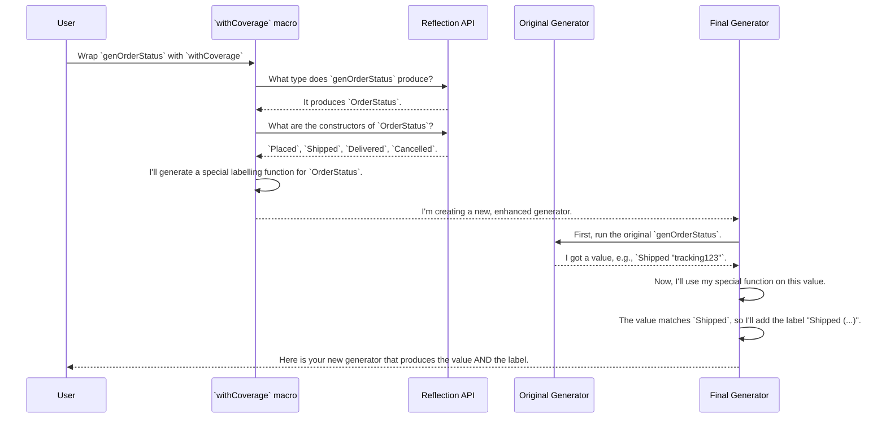

# Chapter 8: Test Coverage Analysis

In our last chapter on [Derivation Tuning](07_derivation_tuning_.md), we learned how to become a co-pilot, guiding the "auto-chef" to generate test data that perfectly fits our needs. We can now create a huge variety of random data. But this leads to a new, crucial question: after running a property-based test with 100 or 1,000 random inputs, how do we know if we actually tested all the interesting parts of our data types?

Imagine a test passes with flying colors, but deep inside your code, a bug is lurking in a corner that your random generator never happened to visit. You have a false sense of security. `DepTyCheck` provides a powerful tool to prevent this: **Test Coverage Analysis**.

### The Problem: Are You Testing What You Think You're Testing?

Let's say we're building an e-commerce platform, and we have a simple data type to represent the status of an order:

```idris
data OrderStatus = Placed | Shipped String | Delivered | Cancelled
```

We write a property-based test for a function that handles these statuses. We generate 100 random `OrderStatus` values, and the test passes. We're happy!

But what if, by pure chance, the random generator only ever created `Placed` and `Delivered` values? Our test would have never run the code for `Shipped` or `Cancelled` statuses. A bug in the logic for handling cancellations could go completely unnoticed. We need a quality control inspector.

### The Solution: The Quality Control Inspector

Test Coverage Analysis is exactly this inspector. After a test run, it can give you a neat report that says:
*   "You generated 50 `Placed` values."
*   "You generated 48 `Delivered` values."
*   "Warning! You generated 2 `Shipped` values."
*   "**Critical! You generated 0 `Cancelled` values!**"

This information is priceless. It tells you exactly where the gaps are in your testing, helping you ensure your property tests are truly comprehensive.

### Using the Coverage Tools

Achieving this is a simple, three-step process:
1.  **Tag** your generator to add coverage labels.
2.  **Run** the generator and collect the labels.
3.  **Report** on what was and wasn't covered.

#### Step 1: Tagging with `withCoverage`

First, take your existing generator (whether handwritten or derived with `deriveGen`) and wrap it in the `withCoverage` helper.

```idris
%language ElabReflection

-- Our automatically derived generator
genOrderStatus : Fuel -> Gen MaybeEmpty OrderStatus
genOrderStatus = deriveGen

-- The same generator, now with coverage enabled
genOrderStatusWithCoverage : Fuel -> Gen MaybeEmpty OrderStatus
genOrderStatusWithCoverage = withCoverage genOrderStatus
```

The `withCoverage` function is a macro that enhances your generator. It doesn't change the *values* it produces, but it "tags" each generated value with hidden labels that identify which type and constructor were used. Think of it as putting a tiny, invisible sticker on each `OrderStatus` value that says "I am a `Placed`" or "I am a `Shipped`".

#### Step 2: Running and Collecting Coverage Data

Now we need to run our tagged generator and collect all those stickers. We use a function called `unGenTryND`. It takes a number `n`, a random seed, and a generator, and produces a list of `n` generated values, each paired with its `ModelCoverage` (the collection of stickers).

First, we need a "blueprint" of our type to hold the coverage results. `initCoverageInfo` automatically creates this for us.

```idris
-- This creates a data structure to track all constructors of OrderStatus
initialReport : CoverageGenInfo OrderStatus
initialReport = initCoverageInfo
```

Next, we run the generator and fold the results into our report.

```idris
import Data.List.Lazy

-- Run the generator 100 times and get a lazy list of (coverage, value) pairs
results : LazyList (ModelCoverage, OrderStatus)
results = unGenTryND 100 someSeed (genOrderStatusWithCoverage More)

-- Combine all the individual coverage results into our main report
finalReport : CoverageGenInfo OrderStatus
finalReport = foldl (\report, (mc, _) => registerCoverage mc report)
                  initialReport
                  results
```
In this snippet, `registerCoverage` is the function that takes the pile of stickers (`mc`) from one generated value and updates the counts in our main `finalReport`.

#### Step 3: Printing the Report

The final step is to display our findings. You can just print the `finalReport` variable. With the `Colourful` interface, you'll get a beautiful, color-coded summary in your console.

```idris
-- Assuming this is inside a main function
main : IO ()
main = putStrLnLn $ show {a = Colourful} finalReport
```

If your generator was well-behaved, your output might look like this (with nice colors):

```
OrderStatus covered fully (100 times)
  - Placed: covered (25 times)
  - Shipped: covered (24 times)
  - Delivered: covered (26 times)
  - Cancelled: covered (25 times)
```

But if your generator was biased and never produced a `Cancelled` status, you'd see this clear warning:

```
OrderStatus covered partially (100 times)
  - Placed: covered (34 times)
  - Shipped: covered (32 times)
  - Delivered: covered (34 times)
  - Cancelled: not covered
```

Now you know you need to go back and maybe use [Derivation Tuning](07_derivation_tuning_.md) to ensure the `Cancelled` constructor is generated!

### How It Works: A Look Inside the `withCoverage` Macro

The magic starts with the `withCoverage` macro. It's not a regular function; it's a piece of code that runs at compile-time to write *new code* for you. Here's what it does behind the scenes:



The "special labelling function" that `withCoverage` generates for `OrderStatus` would be conceptually equivalent to this:

```idris
-- This is what `withCoverage` writes for you automatically!
labellingFun : OrderStatus -> Label
labellingFun Placed       = fromString "Placed (user-defined)"
labellingFun (Shipped _)  = fromString "Shipped (user-defined)"
labellingFun Delivered    = fromString "Delivered (user-defined)"
labellingFun Cancelled    = fromString "Cancelled (user-defined)"
```

This is done using the `deriveMatchingCons` helper from `src/Test/DepTyCheck/Gen/Coverage.idr`. The `withCoverage` macro then wires this function into your original generator, creating a new generator that looks something like this:

```idris
-- A simplified view of the final generator produced by `withCoverage`
newGen = do
  -- First, run the original generator to get a value
  val <- genOrderStatus
  -- Now, add a label for the type itself
  label (fromString "OrderStatus[?]")
  -- Then, use our new function to add a label for the specific constructor
  label (labellingFun val)
  -- Finally, return the original value
  pure val
```

This clever compile-time process gives you powerful coverage analysis capabilities without requiring you to change your data types or manually write any labelling code.

### Conclusion

In this chapter, we've added a crucial quality control step to our property-based testing workflow. We learned that:

*   **Test Coverage Analysis** is essential for ensuring our random tests are actually exploring all the different shapes of our data.
*   The `withCoverage` helper is a macro that automatically **tags** generated values with labels identifying their type and constructor.
*   We can use `initCoverageInfo`, `unGenTryND`, and `registerCoverage` to run a generator multiple times and collect the tags into a final, readable **report**.
*   This report gives us confidence that our tests are thorough and highlights any blind spots in our data generation.

We now have a full suite of tools to create, tune, and verify our data generators. But we've glossed over one detail: how does the [Derivation Orchestrator](04_derivation_orchestrator_.md) find the right generators to call in the first place? When it needs to generate a `String`, how does it find a `genString` function?

In the next chapter, we will investigate the clever system `DepTyCheck` uses to find and manage available generators: [Generator Signature Analysis](09_generator_signature_analysis_.md).

---

Generated by [AI Codebase Knowledge Builder](https://github.com/The-Pocket/Tutorial-Codebase-Knowledge)