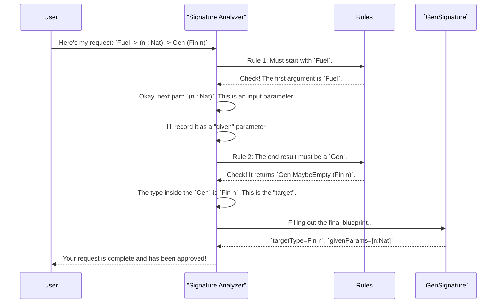

# Chapter 9: Generator Signature Analysis

In our [last chapter on Test Coverage Analysis](08_test_coverage_analysis_.md), we saw how to verify that our automatically generated test data is exercising all parts of our code. The whole system, from the `deriveGen` macro to the coverage tools, seems to work like magic. But how does that magic begin?

When you write `genMyType = deriveGen`, the `deriveGen` macro's very first job is to look at the type signature you wrote for `genMyType` and understand what you're asking for. This crucial first step—reading and validating your request—is handled by a component called **Generator Signature Analysis**.

### The Problem: Reading the User's Mind

Imagine you're ordering a custom-built computer. You give the engineer a sheet of specifications:
*   "CPU: Fast one"
*   "Memory: 16GB"
*   "Storage: SSD, but also a normal one"
*   "Video Card: use the one from my friend's build"

This is a mess! The engineer needs a clear, structured form to understand the request. They need to know *exactly* which parts you're providing, which parts they need to choose, and what the final product should look like.

`deriveGen` is that engineer. The type signature you write is your specification sheet. A signature like this:

```idris
genFin : Fuel -> (n : Nat) -> Gen MaybeEmpty (Fin n)
```

...is much better than the computer spec, but the system still needs a formal process to "read" it. It needs to answer questions like:
*   Does this signature follow the rules for a generator? (e.g., Does it take `Fuel`?)
*   Which parts are inputs provided by the user (like `n : Nat`)?
*   What is the final data type we're trying to generate (like `Fin n`)?
*   Are there any special instructions, like using another generator?

### The Solution: The Strict-but-Helpful Librarian

Think of Generator Signature Analysis as a librarian at a very organized library. When you submit a request for a book, the librarian doesn't just glance at it; they check it against a strict set of rules to make sure it's valid and complete.

1.  **Reads Your Request Form:** It takes the raw type signature you wrote.
2.  **Checks for Mandatory Fields:** It checks if the first argument is `Fuel`.
3.  **Categorizes Information:** It separates the "given" parameters you provide (like `n`) from the type to be "generated" (`Fin n`).
4.  **Identifies External Resources:** If your signature includes other generators (using `=>`), it notes them down as "external dependencies."
5.  **Fills Out a Standardized Internal Form:** If everything is correct, it translates your request into a clean, structured data record called a `GenSignature`. If not, it gives you a clear error message explaining which rule you broke.

This `GenSignature` record is the official, unambiguous "blueprint" that the rest of the derivation machinery, like the [Derivation Orchestrator](04_derivation_orchestrator_.md), will use to build your generator.

Let's walk through how our librarian would process the `genFin` signature.



### A Look Under the Hood: The `checkTypeIsGen` Function

The code that acts as our librarian lives in `src/Deriving/DepTyCheck/Gen.idr` in a function called `checkTypeIsGen`. This function uses Idris's reflection capabilities to deconstruct the type signature at compile time.

Let's peek at a few (heavily simplified) snippets of its logic.

First, it checks for the mandatory `Fuel` argument.

```idris
-- Simplified from: src/Deriving/DepTyCheck/Gen.idr

-- Deconstruct the signature into its arguments and result
let (sigArgs, sigResult) = unPi sig

-- Get the first argument
let (firstArg::_) = sigArgs
  | [] => fail "No arguments in the signature, at least Fuel is required!"

-- Check if its type is Fuel
unless !(firstArg.type `isSameTypeAs` `{Data.Fuel.Fuel})
  $ fail "The first argument must be of type `Fuel`"
```
This piece of code ensures that every generator signature starts correctly. If not, the `fail` call stops the compilation and gives you a helpful error message.

Next, it inspects the return type to make sure it's a `Gen` and extracts the target type we want to generate.

```idris
-- Simplified from: src/Deriving/DepTyCheck/Gen.idr

-- Check if the result type is an application of Gen
let IApp _ (IVar _ gen) targetType = sigResult
  | _ => fail "Result must be of type `Gen MaybeEmpty ...`"

-- 'targetType' now holds the expression for what we want to generate, e.g., `Fin n`
```
This part identifies the core "goal" of the generator.

Finally, it sorts the remaining arguments into different categories. Explicit named arguments like `(n : Nat)` are treated as "given" parameters. Auto-implicit arguments (`=>`) are treated as "external generators".

```idris
-- Simplified Conceptual Logic

givenParams : List ConArg -- For arguments like `(n : Nat)`
autoImplArgs : List TTImp -- For arguments like `Gen Y =>`

for arg in sigArgs:
  if isExplicitNamed arg then
    add arg to givenParams
  if isAutoImplicit arg then
    add arg to autoImplArgs -- These are external generators!
  -- ... other cases
```
This sorting process is what allows the system to distinguish between parameters you provide and helper generators that must be found or derived.

### The Final Blueprint: `GenSignature`

After the analysis is complete, all the extracted information is stored in a clean data structure. A simplified version of it is `GenSignature` from `src/Deriving/DepTyCheck/Gen/Signature.idr`.

```idris
-- A simplified view of the blueprint data type
record GenSignature where
  constructor MkGenSignature
  -- The type family we're generating for (e.g., `Fin`)
  targetType : TypeInfo
  -- The set of parameters provided by the caller (e.g., `n` in `Fin n`)
  givenParams : SortedSet (Fin targetType.args.length)
```
The real `ExternalGenSignature` also contains information about argument names, order, and explicitness. This structured record is the perfect, unambiguous input for the rest of the derivation pipeline. It's the official work order that the [Derivation Orchestrator](04_derivation_orchestrator_.md) uses to start building.

### Conclusion

In this chapter, we've uncovered the "front door" of the `deriveGen` process: **Generator Signature Analysis**. We learned that:

*   It acts as a **librarian or rule-checker** for generator type signatures.
*   It parses the raw signature you write to identify the `Fuel` argument, **"given" parameters**, the **target type**, and any **external generators**.
*   This analysis is performed by the `checkTypeIsGen` function, which uses reflection to inspect your code at compile time.
*   The result is a structured blueprint (`GenSignature`) that serves as the unambiguous starting point for the entire automatic derivation process.

This component is what makes `deriveGen` both powerful and safe. It ensures that your requests are valid before any code is generated, leading to clearer error messages and more predictable behavior.

But the analysis doesn't stop here. Once we have a plan for a constructor, `deriveGen` sometimes needs to look even deeper into the types of its arguments. For instance, how does it know how to build a proof like `LT n m`? That requires an even more focused analysis.

In our next and final chapter, we'll explore this with [Deep Constructor Application Analysis](10_deep_constructor_application_analysis_.md).

---

Generated by [AI Codebase Knowledge Builder](https://github.com/The-Pocket/Tutorial-Codebase-Knowledge)