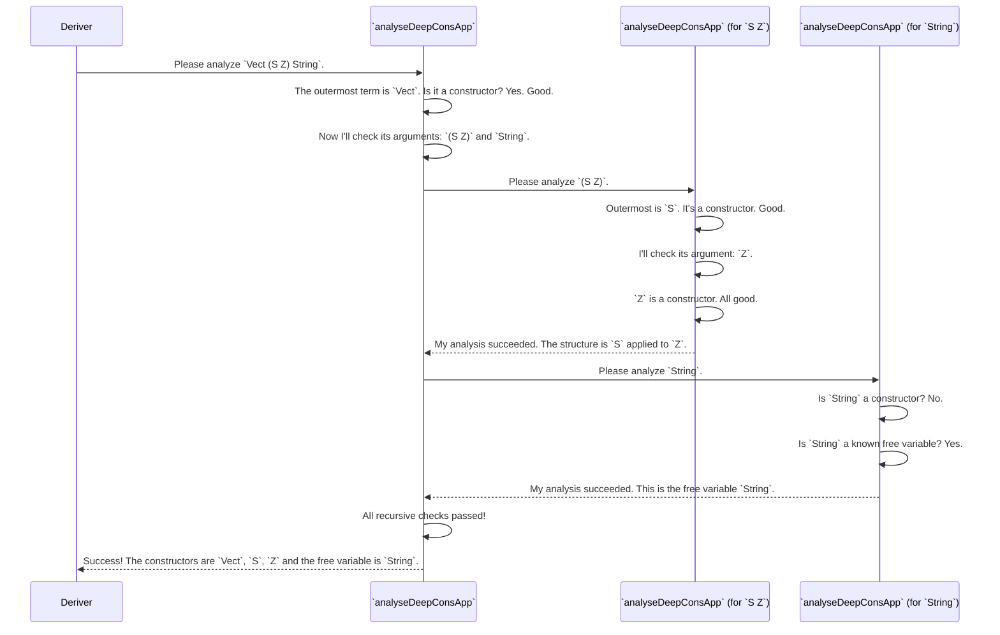

# Chapter 10: Deep Constructor Application Analysis

In our [last chapter on Generator Signature Analysis](09_generator_signature_analysis_.md), we saw how `deriveGen` acts like a librarian, carefully reading the type signature of a generator to understand exactly what the user wants to build. This gives the auto-derivation system a clear "work order."

But what happens when that work order contains a very complex part? Imagine a task like "build a `Vect` of a very specific length" or "construct a proof that `n < m`". The system can't just guess how to do this. It needs to look closer. It needs to get out its magnifying glass and inspect the very structure of the types themselves.

This is the job of our final component: **Deep Constructor Application Analysis**.

### The Problem: Understanding Complex Type Structures

Let's go back to an example from our chapter on [Derivation Tuning](07_derivation_tuning_.md).

```idris
data RangePair : Type where
  MkPair : (n : Nat) -> (m : Nat) -> (prf : LT n m) -> RangePair
```

When the [Constructor Body Derivation](06_constructor_body_derivation_.md) system is trying to build a `RangePair`, it knows it needs to generate `n`, then `m`, and finally a proof `prf` of type `LT n m`.

But what *is* `LT n m`? Is it a data type we can construct? Is it a function we need to call? How can the system know that `LT` is a data constructor, and `n` and `m` are just placeholders for the values it has already generated? It needs to analyze the expression `LT n m` to understand its anatomy.

### The Solution: The Geologist of Types

Think of **Deep Constructor Application Analysis** as a geologist for Idris types. A geologist examines a rock, chipping away at it to see its different layers and identify any embedded fossils. Our analysis tool, a function called `analyseDeepConsApp`, does the same for a type expression.

It takes a type like `Vect (S (S Z)) String` and recursively breaks it down to answer a simple question: "Is this type just a tree of nested data constructors applied to some 'free variables' (like fossils)?"

For `Vect (S (S Z)) String`, the geologist's report would look like this:
*   **Rock Type:** "This is a valid constructor application."
*   **Layers Found (Constructors):** I see `Vect`, then a layer of `S`, another `S`, and finally `Z`.
*   **Fossils Found (Free Variables):** I found one fossil, `String`.
*   **Structure:** They are assembled like this: `Vect` is applied to (`S` applied to (`S` applied to `Z`)) and `String`.

This analysis is essential for the derivation engine. It confirms how a complex type is built, giving the engine the confidence to try to construct it piece by piece.

### How It Works: A Recursive Descent

The `analyseDeepConsApp` function works by recursively descending into a type expression. Let's trace how it would analyze `Vect (S Z) String`, assuming `String` is a known "free variable."



If at any point the analyzer found something that wasn't a constructor or a known free variable (like a function call), the whole analysis would fail. This "all or nothing" check is exactly what the derivation engine needs.

### A Look Under the Hood: The `analyseDeepConsApp` Function

The logic for this type geologist lives in `src/Deriving/DepTyCheck/Util/DeepConsApp.idr`. The core of its implementation is a recursive function. Let's look at a heavily simplified version of its thought process.

```idris
-- Simplified logic from analyseDeepConsApp

-- This is the recursive core of the analysis
isD : (analysedExpr : TTImp) -> m Result
isD e = do
  -- Step 1: Break the expression into the function and its arguments.
  -- e.g., for `Vect (S Z) String`, this gives `Vect` and `[S Z, String]`
  let (function, args) = unAppAny e

  -- Step 2: Check what the function is.
  let IVar _ name = function
    | _ => throwError "not an application to a variable"

  -- Step 3: Is it a free variable?
  if contains name freeNames
    then pure (result for a single free variable)
    else do
      -- Step 4: Is it a constructor?
      let Just con = lookupCon name
        | Nothing => throwError "not a constructor"

      -- Step 5: If it is, recurse on all arguments!
      deepArgs <- for args (\arg => isD arg.getExpr)
      -- Combine the results from the recursive calls...
      pure (combined result)
```

This code follows our geologist's logic perfectly:
1.  It breaks the expression apart (`unAppAny`).
2.  It checks if the main part is a "fossil" (`contains name freeNames`).
3.  If not, it checks if it's a "rock layer" (`lookupCon name`).
4.  If it's a constructor, it recursively calls itself (`isD`) on all the arguments.

If any of these steps fail, the `throwError` stops the process immediately.

### Why This Matters: Back to `LT n m`

Now we can see how this tool helps the derivation engine solve our original problem.

When the [Constructor Body Derivation](06_constructor_body_derivation_.md) needs to generate a value for `(prf : LT n m)`, it doesn't just guess. It calls `analyseDeepConsApp` on the type `LT n m`, telling it that `n` and `m` are known "free variables."

The analysis runs:
1.  It sees `LT` applied to `n` and `m`.
2.  `LT` is not a free variable, but it **is a data constructor**. Success.
3.  It checks `n`. It **is a free variable**. Success.
4.  It checks `m`. It **is a free variable**. Success.

The final report comes back: "Success! `LT n m` is a direct application of the constructor `LT` to the free variables `n` and `m`."

This report gives the derivation engine a crucial piece of information: it can attempt to construct the proof `prf` *directly* by calling the `LT` constructor. If the analysis had failed, the engine would know that `LT n m` is something more complex, and it cannot be built so simply.

### Conclusion

In this final chapter, we've met the **Deep Constructor Application Analysis** tool, the expert "geologist" of the `DepTyCheck` system. We've learned that:

*   It is a specialized parser, `analyseDeepConsApp`, that recursively inspects a type expression.
*   Its goal is to determine if a type is purely a **tree of nested data constructors** applied to known free variables.
*   This analysis is crucial for the derivation engine to understand how to build complex values, especially **GADT indices and dependent proofs**.
*   By confirming the structure of a type, it gives the engine the green light to attempt to construct it directly, making `deriveGen` smarter and more capable.

Throughout this tutorial, we've journeyed from the high-level project setup all the way down to the intricate details of the derivation machinery. You've met the `Gen` monad, the `deriveGen` auto-chef, the orchestrator, the specialists for types and constructors, and now, the geologist. You are now equipped with a deep understanding of how `DepTyCheck` works, empowering you to write more powerful and reliable property-based tests for your dependently typed programs. Happy testing

---

Generated by [AI Codebase Knowledge Builder](https://github.com/The-Pocket/Tutorial-Codebase-Knowledge)