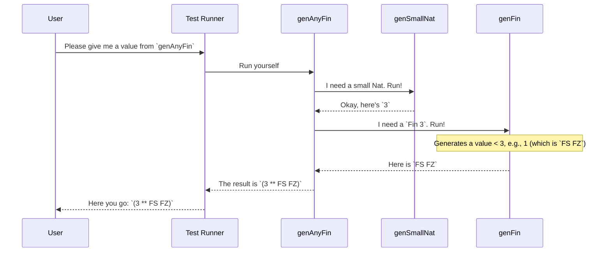

# Chapter 1: `Gen` (Test Data Generator)

Welcome to the `DepTyCheck` tutorial! We're excited to guide you through the powerful world of property-based testing with dependent types.

Let's start with a fundamental question: when you're testing your code, how do you come up with test data? Usually, you might write a few examples by hand.

```idris
-- A function to test
double : Nat -> Nat
double n = n + n

-- A unit test
testDouble : double 5 = 10
testDouble = Refl
```

This is great, but what if you miss an edge case? Property-based testing flips this around. Instead of writing individual tests, you state a *property* that should hold true for *all* valid inputs. For example, "for any natural number `n`, `double n` should equal `n + n`."

To check this property, we need a way to generate hundreds of random `Nat` values to throw at our function. This is where our first and most central concept comes in: the **`Gen`**.

## What is a `Gen`?

A `Gen` is the core abstraction of `DepTyCheck`. Think of it as a **recipe** or a **blueprint** for creating random data. You define the recipe (`Gen`), and then the testing framework can use it to produce as many random values as it needs.

These recipes can be very simple:
*   "Always produce the number 5."
*   "Pick a random number between 1 and 100."

Or they can be complex, built by combining other recipes:
*   "Create a pair of strings, where the first string is 'hello' or 'goodbye', and the second is a randomly chosen word from a dictionary."

Let's see how to write these recipes.

### Simple Generators: The Building Blocks

The simplest generators produce basic values.

A generator that always produces the same value is made with `pure`. It's not random, but it's a useful starting point.

```idris
-- A generator that only ever produces the value 42
genTheAnswer : Gen NonEmpty Nat
genTheAnswer = pure 42
```
*   `Gen` is the type for our generator recipes.
*   `NonEmpty` is a tag that tells us this generator will *always* succeed in producing a value.
*   `Nat` is the type of value this generator produces.

A more useful generator, `elements`, picks one item randomly from a list.

```idris
-- A generator that produces one of "red", "green", or "blue"
genColor : Gen NonEmpty String
genColor = elements ["red", "green", "blue"]
```
When we run this generator, we'll get one of the three strings, with each having an equal chance of being picked.

### Combining Generators

The real power of `Gen` comes from combining simple recipes to make more interesting ones.

You can use `oneOf` to create a new generator that chooses one of several other generators to run.

```idris
genFruit : Gen NonEmpty String
genFruit = elements ["apple", "banana"]

genVegetable : Gen NonEmpty String
genVegetable = elements ["carrot", "broccoli"]

-- A generator that produces either a fruit or a vegetable
genFood : Gen NonEmpty String
genFood = oneOf [genFruit, genVegetable]
```
When `genFood` is run, it will first randomly pick either `genFruit` or `genVegetable` (with a 50/50 chance), and then run the chosen generator.

You can also combine generators to build up records or custom data types. `DepTyCheck` provides a handy `[| ... |]` syntax for this.

Let's define a simple record for a `User`.

```idris
data User = MkUser Nat String

genUsername : Gen NonEmpty String
genUsername = elements ["alex", "brian", "charlie"]

genAge : Gen NonEmpty Nat
genAge = choose (18, 65) -- generates a Nat between 18 and 65

-- Combine recipes to generate a User
genUser : Gen NonEmpty User
genUser = [| MkUser genAge genUsername |]
```
This `genUser` recipe works by running `genAge` to get a random age, running `genUsername` to get a random username, and then plugging the results into the `MkUser` constructor.

### Dependent Generators: The Secret Sauce

Here's where `DepTyCheck` truly shines, especially with Idris's dependent types. Sometimes, the *type* of data you want to generate depends on a *value* you generated earlier.

A classic example is `Fin n`, the type representing numbers from `0` to `n-1`. To generate a `Fin n`, you first need a value for `n`!

`Gen` is a **monad**, which is a fancy way of saying you can chain generation steps together, where each step can use the results of the previous one. We do this using `do` notation.

Let's write a generator that first generates a random number `n` (between 1 and 5), and *then* generates a valid `Fin n`.

```idris
-- First, a generator for a Nat from 1 to 5
genSmallNat : Gen NonEmpty Nat
genSmallNat = choose (1, 5)

-- A generator for Fin n, which takes n as an input
genFin : (n : Nat) -> Gen MaybeEmpty (Fin n)
-- ... implementation details ...

-- Now, let's chain them!
genAnyFin : Gen NonEmpty (n ** Fin n) -- (n ** Fin n) is a dependent pair
genAnyFin = do
  n <- genSmallNat
  f <- genFin n
  pure (n ** f)
```
Let's break down `genAnyFin`:
1.  `n <- genSmallNat`: Run `genSmallNat` to get a random number, and call it `n`.
2.  `f <- genFin n`: Now that we have `n`, use it to call `genFin n`, which returns a recipe for a `Fin n`. Run that recipe and call the result `f`.
3.  `pure (n ** f)`: Package the `n` and `f` we generated into a pair.

Notice that `genFin` produces a `Gen MaybeEmpty`. This is because a generator might not be able to produce a value. For `Fin 0`, there are no possible values, so `genFin 0` would be an "empty" generator. `DepTyCheck` is smart enough to handle this.

## How `Gen` Works Under the Hood

A `Gen` itself doesn't hold a value; it's just the instructions. To get a value, you need a "generator runner" to execute the instructions.

Let's visualize the execution of our `genAnyFin` example.



Internally, the `Gen` type is defined in `src/Test/DepTyCheck/Gen.idr` as a data structure that represents these recipes. A simplified view looks like this:

```idris
data Gen : Emptiness -> Type -> Type where
  -- A recipe that can never produce a value.
  Empty : Gen MaybeEmpty a

  -- A recipe for a single, constant value.
  Pure  : a -> Gen em a

  -- A recipe for choosing between other recipes. Used by `oneOf`.
  OneOf : (gs : GenAlternatives True alem a) -> Gen em a

  -- The key to dependent generation. Used by `do` notation.
  Bind  : RawGen c -> (c -> Gen biem a) -> Gen em a

  -- ... and a few others for raw random values, etc.
```
*   `Pure` is the constructor for the `pure` function we saw.
*   `OneOf` represents a choice between multiple generator alternatives.
*   `Bind` is the magic behind the monad. It holds a generator and a function to create the *next* generator. This is exactly what we needed for `genAnyFin`!

## Running a Generator to Get a Value

A recipe is no good if you can't cook with it! To get an actual value from a `Gen`, you need to run it. `DepTyCheck` provides functions like `pick` and `pick1` for this.

`pick1` is for `Gen NonEmpty` generators—the ones that are guaranteed to produce a value.

```idris
import System.Random -- Needed for random number generation

main : IO ()
main = do
  -- genUser is the recipe we defined earlier
  aUser <- pick1 genUser
  putStrLn $ "Generated user: " ++ show aUser
```
When you run this program, `pick1` will execute the `genUser` recipe once, using a source of randomness to make its choices.

**Example Output:**
```
Generated user: MkUser 25 "charlie"
```
If you run it again, you'll likely get a different result!

## Conclusion

You've just learned the most important concept in `DepTyCheck`! Let's recap:
*   A `Gen` is a **recipe** for generating random test data.
*   You can create **simple** generators (`pure`, `elements`, `choose`) and **combine** them to build complex data (`oneOf`, `[|...|]`).
*   `Gen` is a **monad**, allowing you to create **dependent generators** where the type of data you generate depends on a previously generated value.

Writing these recipes by hand gives you incredible control. But what if you didn't have to? What if the compiler could look at your data type and write a generator for you automatically?

That's exactly what we'll explore in the next chapter.

Next up: [**`deriveGen` (Automatic Generator Derivation)**](02__derivegen___automatic_generator_derivation__.md)

---

Generated by [AI Codebase Knowledge Builder](https://github.com/The-Pocket/Tutorial-Codebase-Knowledge)