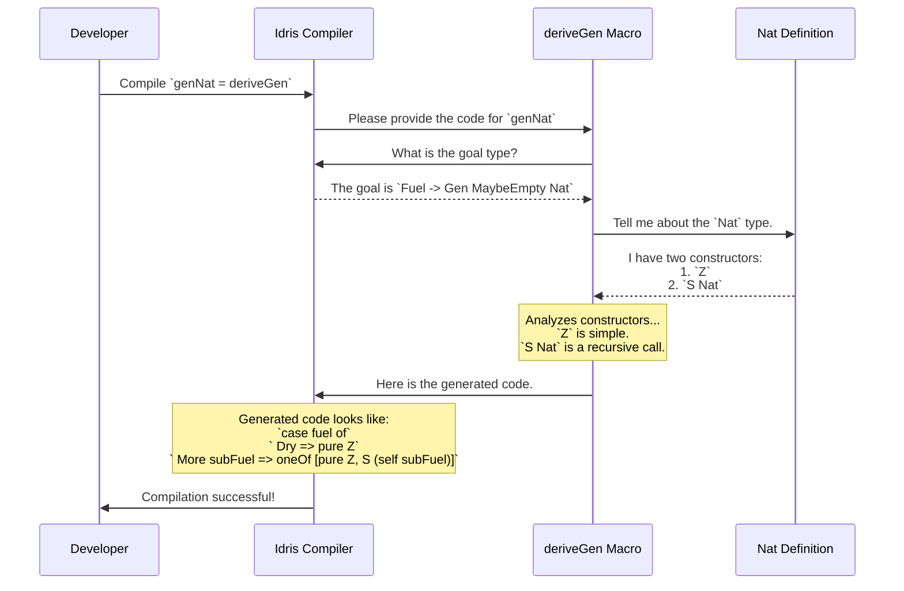

# Chapter 2: `deriveGen` (Automatic Generator Derivation)

In [Chapter 1: `Gen` (Test Data Generator)](01__gen___test_data_generator__.md), we learned how to write our own recipes, called `Gen`s, to produce random data. We saw that writing these by hand gives us a lot of control, but it can also be a bit repetitive, especially for complex data types.

Wouldn't it be great if we could just point at our data type and have a generator magically appear?

This is where `deriveGen` comes in. It's the "magic wand" of `DepTyCheck`.

## The Problem: So Much Boilerplate!

Let's look at `Nat`, the type of natural numbers, which is defined recursively: a `Nat` is either `Z` (zero) or `S` (the successor) of another `Nat`.

```idris
data Nat = Z | S Nat
```

If we wanted to write a generator for `Nat` by hand, we'd have to write a recursive function. It might look something like this:

```idris
-- A manually written generator for Nat
genNatManual : Nat -> Gen NonEmpty Nat
genNatManual 0 = pure Z
genNatManual k = oneOf [ pure Z, [| S (genNatManual (k - 1)) |] ]
```

This isn't terribly complicated, but it's boilerplate code. We had to think about the base case (`Z`) and the recursive case (`S`). Now imagine doing this for a much larger data type, like a syntax tree for a programming language. The amount of manual code would explode!

## `deriveGen`: The Auto-Chef for Generators

`deriveGen` is a macro that writes this generator code for you at compile time. Think of it as an "auto-chef": you show it your data type (the dish), and it automatically figures out the recipe (`Gen`) to make it.

Here's how you use it to generate a `Nat` generator.

First, we need to enable a special Idris 2 feature called "elaborator reflection". This is what gives `deriveGen` its superpowers. Just add this line to the top of your file:

```idris
%language ElabReflection
```

Next, we import the necessary tools:

```idris
import Deriving.DepTyCheck.Gen
```

Now, we can define our generator. We give it a type signature, and for the implementation, we just write `= deriveGen`.

```idris
genNat : Fuel -> Gen MaybeEmpty Nat
genNat = deriveGen
```

And that's it! The `deriveGen` macro will inspect the `Nat` type and automatically generate the body of the `genNat` function for you.

### What is `Fuel`?

You might have noticed the `Fuel` argument in the type signature. What is that?

Because `Nat` is a recursive type, a generator could try to create an infinitely large number (`S (S (S ...))`), causing your program to hang. To prevent this, derived generators require a "fuel" supply.

*   `Fuel` is like a budget. Each time the generator follows a recursive path (like choosing `S` instead of `Z`), it spends some fuel.
*   Once the fuel runs out, it can only choose non-recursive options. For `Nat`, this means it can only produce `Z`.

This guarantees that the generator will always finish and produce a value. All generators created with `deriveGen` will have a `Fuel` argument as their first parameter.

## How Does `deriveGen` Work?

The magic happens entirely at **compile time**. When the Idris compiler sees `genNat = deriveGen`, it pauses and runs the `deriveGen` macro.

Here’s a step-by-step walkthrough of what happens behind the scenes:



1.  **Analyze the Goal:** `deriveGen` first asks the compiler what it's trying to build. It sees the target is `Gen MaybeEmpty Nat`.
2.  **Inspect the Data Type:** It then inspects the definition of `Nat`. It finds two constructors: `Z` and `S`.
3.  **Create a Recipe for Each Constructor:**
    *   For `Z`, the recipe is simple: `pure Z`.
    *   For `S Nat`, it sees a recursion. The recipe is "I need another `Nat`". So, it creates a recipe that calls itself (`genNat`) but with *less fuel*.
4.  **Combine the Recipes:** It combines the recipes for `Z` and `S` using a function like `oneOf`, which means "randomly choose one of these options". To handle the fuel, it generates a `case` expression.
5.  **Generate Code:** Finally, it translates this plan into actual Idris code and hands it back to the compiler. The compiler plugs this generated code into the body of `genNat` as if you had written it yourself.

This is all made possible by a powerful Idris 2 feature called **Elaborator Reflection**. This lets code inspect other code and generate new code during compilation. The core logic can be found in the file `src/Deriving/DepTyCheck/Gen.idr`. The main entry point `deriveGenExpr` coordinates this process.

```idris
-- Simplified view from src/Deriving/DepTyCheck/Gen.idr

deriveGenExpr : ... -> (signature : TTImp) -> Elab TTImp
deriveGenExpr signature = do
  -- 1. Analyze the 'signature' of the function to be generated.
  checkResult <- checkTypeIsGen DerivationTask signature

  -- 2. Build the body of the function by analyzing constructors.
  (callExpr, locals) <- runCanonic ... $ callMainDerivedGen ...

  -- 3. Return the final Idris code expression.
  pure (local locals callExpr)
```

## Deriving for Dependent Types

The real power of `deriveGen` shines with dependently-typed data structures. Let's consider `Vect n a`, the type of lists with a compile-time-guaranteed length `n`.

```idris
data Vect : Nat -> Type -> Type where
  Nil : Vect Z a
  (::) : a -> Vect n a -> Vect (S n) a
```

What if we want a generator that produces a `Vect` of a *randomly generated length*? The type of such a value would be a dependent pair: `(n ** Vect n a)`.

Writing this by hand would be tricky! You'd first have to generate a `Nat`, then use that `Nat` to generate a vector of the correct length. But with `deriveGen`, it's still just one line.

```idris
-- A generator for a Vect of some random length, containing random Ints.
-- {auto genInt ...} tells deriveGen how to make the elements.
genAnyVect : {auto genInt : Fuel -> Gen MaybeEmpty Int} =>
             Fuel -> Gen MaybeEmpty (n ** Vect n Int)
genAnyVect = deriveGen
```

Here's what `deriveGen` does in this more complex case:
1.  It sees the target is `(n ** Vect n Int)`. It understands that it must first generate a value for `n`. It uses its own built-in knowledge to create a `Nat` generator for this.
2.  Once it has a value for `n`, it needs to construct a `Vect n Int`. It analyzes the `Vect` constructors.
3.  It notices that the `(::)` constructor requires an `Int`. It doesn't know how to make an `Int` out of thin air.
4.  However, it sees the `{auto genInt : ...}` argument in the signature. This is you, the developer, telling it: "If you ever need an `Int`, use this `genInt` generator I'm providing."
5.  It then correctly generates the code to build up the vector element by element, using `genInt` for the contents and decrementing fuel at each `(::)` step.

## Conclusion

You've now seen the "magic" of `DepTyCheck`. Let's recap:
*   `deriveGen` is a **macro** that automatically writes `Gen` recipes for you at **compile time**.
*   It saves you from writing tons of **boilerplate code**, especially for recursive and complex data types.
*   It works by using **Elaborator Reflection** to inspect your type definitions.
*   For recursive types, it automatically adds a `Fuel` argument to prevent infinite loops.
*   It's smart enough to handle **dependent types**, figuring out how to generate values that other types depend on.

Automatic derivation is incredibly powerful, but sometimes the default recipe isn't exactly what you want. What if you want to generate more small numbers than large ones? Or ensure that generated lists are never empty? For that, you need to be able to fine-tune the process.

Next up: [**Generator Tuning**](03_generator_tuning_.md)

---

Generated by [AI Codebase Knowledge Builder](https://github.com/The-Pocket/Tutorial-Codebase-Knowledge)